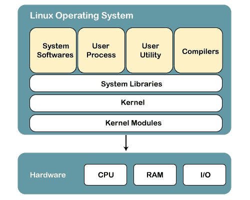
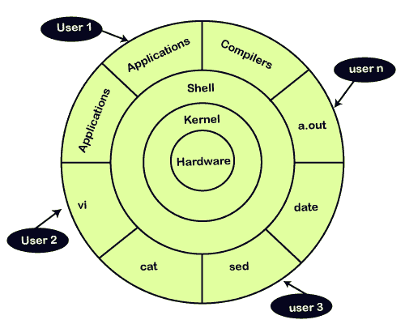
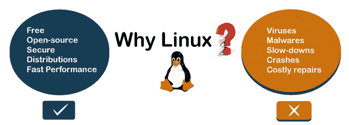

# 什么是 Linux

> 原文：<https://www.javatpoint.com/what-is-linux>

Linux 和其他操作系统如微软 [Windows](https://www.javatpoint.com/windows) 、苹果 Mac OS、iOS、谷歌安卓等一样，都是开源操作系统。操作系统是实现计算机硬件和软件之间通信的软件。它传送输入，由处理器处理，并将输出带到硬件上显示。这是操作系统的基本功能。虽然它执行许多其他重要任务，但我们不要谈论它。

从 90 年代中期开始，Linux 就在我们身边。它可以用于从手表到超级计算机。它在我们的手机、笔记本电脑、个人电脑、汽车甚至冰箱里随处可见。它在开发者和普通计算机用户中非常有名。

### Linux 操作系统的演进

[Linux 操作系统](https://www.javatpoint.com/linux-tutorial)是由**莱纳斯·托瓦兹**在 **1991** 开发的，它是作为一个改进 UNIX 操作系统的想法而产生的。他建议进行改进，但遭到了 UNIX 设计师的拒绝。因此，他想推出一个操作系统，其设计方式可以被用户修改。

如今，Linux 是发展最快的操作系统。几乎所有主要硬件设备都使用它，从手机到超级计算机。

## Linux 操作系统的结构

操作系统是软件的集合，每个软件都是为特定功能而设计的。

Linux 操作系统有以下组件:

## 1)内核

Linux 内核是操作系统的核心部分。它在设备和软件之间建立通信。此外，它还管理系统资源。它有四项职责:

*   **设备管理:**一个系统连接了很多设备，比如 CPU、一个内存设备、声卡、显卡等。内核将与所有设备相关的所有数据存储在设备驱动程序中(没有这个内核将无法控制设备)。因此，内核知道一个设备能做什么，以及如何操作它来实现最佳性能。它还管理所有设备之间的通信。内核有一些规则，所有设备都必须遵守。
*   **内存管理:**内核要管理的另一个功能是内存管理。内核跟踪已使用和未使用的内存，并确保进程不应该使用虚拟内存地址操纵彼此的数据。
*   **进程管理:**在进程中，管理内核在将 CPU 处理给其他进程之前，会给进程分配足够的时间并赋予优先级。它还处理安全性和所有权信息。
*   **处理系统调用:**处理系统调用是指程序员可以编写查询或要求内核执行任务。

## 2)系统库

系统库是帮助访问内核特性的特殊程序。必须触发内核来执行任务，这种触发是由应用完成的。但是应用必须知道如何进行系统调用，因为每个内核都有一组不同的系统调用。程序员开发了一个与内核通信的标准程序库。每个操作系统都支持这些标准，然后这些标准被传递给该操作系统的系统调用。

Linux 最著名的系统库是 Glibc (GNU C 库)。

## 3)系统工具

Linux 操作系统有一套实用工具，通常是简单的命令。这是一个 GNU 项目根据他们的开源许可编写和发布的软件，因此软件对每个人都是免费的。

在命令的帮助下，您可以访问文件、编辑和操作目录或文件中的数据、更改文件的位置或任何事情。

## 4)开发工具

有了以上三个组件，您的操作系统就可以运行和工作了。但是为了更新您的系统，您有额外的工具和库。这些额外的工具和库由程序员编写，称为工具链。工具链是开发人员用来生成工作应用的重要开发工具。

## 5)最终用户工具

这些终端工具使系统对用户来说是独一无二的。操作系统不需要终端工具，但用户需要终端工具。

终端工具的一些例子是图形设计工具、办公套件、浏览器、多媒体播放器等。

## 为什么要用 Linux？

这是关于 Linux 系统问得最多的问题之一。如果我们有一个像 Windows 这样简单的操作系统，为什么我们要使用一个不同的有点复杂的操作系统呢？所以 Linux 系统的各种[特性使其完全不同，也是最常用的操作系统之一。如果你想摆脱病毒、恶意软件、减速、崩溃、昂贵的修复、和更多，Linux 可能是一个完美的操作系统*。此外，它比其他操作系统*](https://www.javatpoint.com/linux-features)提供了各种[优势，我们不必为此付费。让我们来看看它的一些特殊功能，这些功能会吸引您切换操作系统。](https://www.javatpoint.com/advantages-of-linux)

### 自由和开源操作系统

大多数操作系统采用编译格式，这意味着主要源代码已经通过一个名为编译器的程序运行，编译器将源代码翻译成计算机已知的语言。

修改这些编译过的代码是一项艰巨的工作。

另一方面，开源完全不同。源代码包含在编译版本中，任何有知识的人都可以修改。它给了我们运行程序的自由，根据我们的使用改变代码的自由，重新分发其副本的自由，以及分发由我们修改的副本的自由。

*简而言之，Linux 是一个“为民所用，为民所用”的操作系统*

我们可以在不付出任何代价的情况下潜入 Linux。我们可以在多台机器上安装它，无需支付任何费用。

### 它是安全的

Linux 支持各种安全选项，可以让你免于病毒、恶意软件、速度变慢、崩溃。此外，它将保护您的数据。它的安全特性是它对开发者最有利的选择的主要原因。它并不完全安全，但它比其他人不那么脆弱。每个应用都需要由管理员用户授权。在管理员提供访问密码之前，病毒无法执行。Linux 系统不需要任何防病毒程序。

### 开发商的有利选择

Linux 适合开发者，因为它支持几乎所有最常用的编程语言，如 [C](https://www.javatpoint.com/c-programming-language-tutorial) / [C++](https://www.javatpoint.com/cpp-tutorial) 、 [Java](https://www.javatpoint.com/java-tutorial) 、 [Python](https://www.javatpoint.com/python-tutorial) 、 [Ruby](https://www.javatpoint.com/ruby-tutorial) 等等。此外，它有助于开发大量有用的应用。

开发人员发现 Linux 终端比视窗命令行好得多，所以，他们更喜欢终端而不是视窗命令行。Linux 系统上的包管理器帮助程序员理解事情是如何完成的。 [Bash 脚本](https://www.javatpoint.com/bash)也是程序员的一个功能特性。此外，SSH 支持有助于快速管理服务器。

### 灵活的操作系统

Linux 是一个灵活的操作系统，因为它可以用于桌面应用、嵌入式系统和服务器应用。它可以用于从手表到超级计算机。它在我们的手机、笔记本电脑、个人电脑、汽车甚至冰箱里随处可见。此外，它支持各种定制选项。

## Linux 发行版

许多机构修改了 Linux 操作系统，并制作了他们的 Linux 发行版。市场上有许多 Linux 发行版。它为用户提供了不同风格的 Linux 操作系统。我们可以根据自己的需要选择任何配送方式。一些流行的发行版有 Ubuntu、Fedora、Debian、Linux Mint、Arch Linux 等等。

对于初学者来说，Ubuntu 和 Linux Mint 被认为是有用的，对于熟练的开发人员来说，Debian 和 Fedora 将是一个不错的选择。要获取发行版列表，请访问 [Linux 发行版](https://www.javatpoint.com/linux-distributions)。

## Linux 是如何工作的？

Linux 是一个类似 UNIX 的操作系统，但是它支持从手机到超级计算机的一系列硬件设备。每个基于 Linux 的操作系统都有 Linux 内核和一套软件包来管理硬件资源。

此外，Linux 操作系统包括一些核心的 GNU 工具，以提供管理内核资源、安装软件、配置安全设置和性能等多种方式。所有这些工具都打包在一起，构成了一个功能性的操作系统。

## 如何使用 Linux？

我们可以通过交互式用户界面以及终端(命令行界面)来使用 Linux。不同的发行版有稍微不同的用户界面，但是几乎所有的命令对所有的发行版都有相同的行为。要从终端运行 Linux，请按“CTRL+ALT+T”键。要了解它的功能，请按下桌面左下角的应用按钮。

* * *