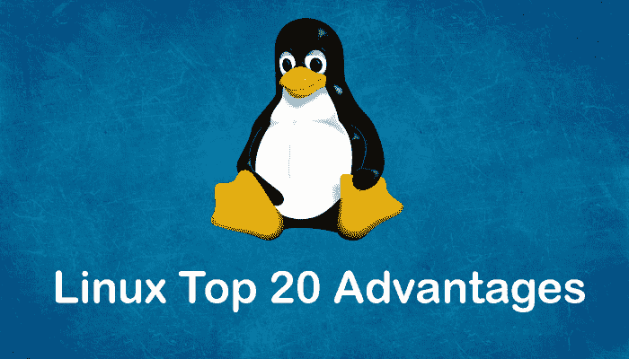

# Linux 的优势

> 原文：<https://www.javatpoint.com/advantages-of-linux>

Linux 是一个像 Windows 和 MacOS 一样的开源操作系统。不仅仅局限于操作系统，如今也作为平台运行**桌面、服务器、嵌入式系统**。它提供各种发行版和变体，因为它是开源的，并且具有模块化设计。**内核** *是*Linux 系统的核心部分。

Linux 系统用于管理**进程调度、应用程序调度、基本外围设备、文件系统等各种服务**。 [Linux](https://javatpoint.com/linux-tutorial) 相对于 Windows、macOS 等其他操作系统提供了各种优势。因此，它几乎被用于每个领域，从汽车到家用电器和智能手机到服务器(超级计算机)。

在本节中，我们将看到 Linux 系统的一些主要优势。此外，我们将看到 Linux 相对于其他操作系统的优势，并将确定为什么它比其他操作系统更好。

## 为什么 Linux 比其他操作系统好？

Linux 操作系统的许多特性表明它比其他操作系统更好。然而，在一些预期中，其他操作系统可能比 Linux 更有用。让我们看看 Linux 操作系统的 20 大优势。

## Linux 的 20 大优势

以下是 Linux 操作系统的 20 大优势:

### 1.钢笔来源

由于它是开源的，它的源代码很容易获得。任何有编程知识的人都可以定制操作系统。人们可以为任何目的贡献、修改、分发和增强代码。

### 2.安全

Linux 的安全特性是它对开发人员最有利的主要原因。它并不完全安全，但它比其他人不那么脆弱。每个应用程序都需要由管理员用户授权。在管理员提供访问密码之前，病毒不会被执行。Linux 系统不需要任何防病毒程序。

### 3.自由的

当然，Linux 系统最大的优点是可以自由使用。我们可以很容易地下载它，不需要为它购买许可证。它是在 GNU GPL(通用公共许可证)下分发的。相比之下，我们必须为其他操作系统的许可证支付巨额费用。

### 4.轻量级选手

Linux 是轻量级的。运行 Linux 的要求比其他操作系统低很多。在 Linux 中，内存占用和磁盘空间也更低。一般来说，大多数 Linux 发行版只需要 128 兆内存，大约相当于磁盘空间。

### 5.稳定性

Linux 比其他操作系统更稳定。Linux 不需要重启系统来维持性能水平。它很少挂机或减速。它有很大的上升时间。

### 6.表演

Linux 系统通过不同的网络提供高性能。它能够同时处理大量用户。

### 7.灵活性

Linux 操作系统非常灵活。它也可以用于桌面应用程序、嵌入式系统和服务器应用程序。它还为特定的计算机提供了各种限制选项。我们只能为系统安装必要的组件。

### 8.软件更新

在 Linux 中，软件更新由用户控制。我们可以选择所需的更新。有大量系统更新可用。这些更新比其他操作系统快得多。因此，系统更新可以轻松安装，不会遇到任何问题。

### 9.发行版/发行版

市场上有许多 Linux 发行版。它为用户提供了不同的 Linux 选项和风格。我们可以根据需要选择任何发行版。一些流行的发行版有 **Ubuntu、Fedora、Debian、Linux Mint、Arch Linux、**等等。

对于初学者来说，Ubuntu 和 Linux Mint 会很有用，对于熟练的程序员来说，Debian 和 Fedora 会是不错的选择。

### 10\. Live CD/USB

几乎所有的 Linux 发行版都有**实时光盘/USB** 选项。它允许我们在不安装的情况下尝试或运行 Linux 操作系统。

### 11.图形用户界面

Linux 是一个基于命令行的操作系统，但是它提供了一个像[窗口](https://www.javatpoint.com/windows)一样的交互式用户界面。

### 12.适合程序员

它支持几乎所有最常用的编程语言，如 [C](https://www.javatpoint.com/c-programming-language-tutorial) / [C++](https://www.javatpoint.com/cpp-tutorial) 、 [Java](https://www.javatpoint.com/java-tutorial) 、 [Python](https://www.javatpoint.com/python-tutorial) 、 [Ruby](https://www.javatpoint.com/ruby-tutorial) 等等。此外，它为开发提供了大量有用的应用程序。

比起 Windows 命令行，程序员更喜欢 Linux 终端。Linux 系统上的包管理器帮助程序员理解事情是如何完成的。 [Bash 脚本](https://www.javatpoint.com/bash)也是程序员的一个功能特性。它还支持 SSH，这有助于快速管理服务器。

### 13.社区支持

Linux 提供了大量的社区支持。我们可以从各种来源找到支持。网上有很多论坛可以帮助用户。此外，来自各种开源社区的开发人员随时准备帮助我们。

### 14.隐私

Linux 总是关注用户隐私，因为它从不从用户那里获取太多隐私数据。相比之下，其他操作系统需要用户的私人数据。

### 15.建立关系网

Linux 通过对网络的强大支持来提供便利。客户端-服务器系统可以很容易地设置为 Linux 系统。它提供了各种命令行工具，如 ssh、ip、邮件、telnet 等，用于与其他系统和服务器的连接。网络备份等任务比其他任务快得多。

### 16.和睦相处

Linux 与大量的文件格式兼容，因为它支持几乎所有的文件格式。

### 17.装置

Linux 安装过程比 Windows 等其他操作系统花费的时间少。此外，它的安装过程非常简单，因为它需要更少的用户输入。它不需要更多的系统配置，甚至可以很容易地安装在配置较少的旧机器上。

### 18.多桌面支持

Linux 系统为其增强使用提供了多桌面环境支持。可以在安装过程中选择桌面环境选项。我们可以选择任何桌面环境，如 **GNOME (GNU 网络对象模型环境)**或 **KDE (K 桌面环境)**，因为两者都有其特定的环境。

### 19.多任务处理

它是一个多任务操作系统，因为它可以同时运行多个任务，而不会影响系统速度。

### 20.为初学者编写的大量文档

有许多命令行选项提供关于命令、库、标准(如手动页面和信息页面)的文档。此外，互联网上还有大量不同格式的文档，如 [Linux 教程](https://www.javatpoint.com/linux-tutorial)、Linux 文档项目、Serverfault 等。为了帮助初学者，有几个社区可以使用，如**询问乌班图**、Reddit 和 **StackOverflow。**

更多 Linux 系统的面对面对比，请访问 [Linux 对比 Windows](http://javatpoint.com/Linux-vs-windows) 。

* * *