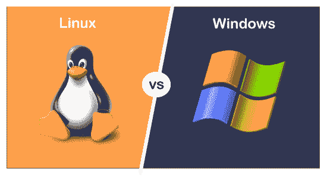
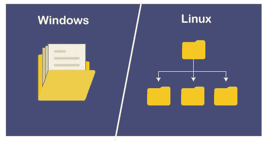
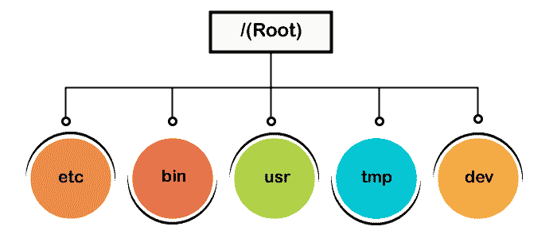

# Linux 与 Windows

> 原文：<https://www.javatpoint.com/linux-vs-windows>

Linux vs. Windows 一直是与操作系统相关的最常见问题之一。用户经常会对哪一个更适合自己感到困惑。用户之间存在差异，因为大多数用户更喜欢图形用户界面和大多数命令行界面。用户之间有很多分歧和尖刻的行为，似乎永远都是这样。

在本节中，我们将通过考虑几个参数来讨论 Linux 和 Windows 之间的差异，例如**性能、可用性、安全性、易用性等，以便清楚地了解两种操作系统的使用情况。**进一步，我们将看到 Linux 相对于其他操作系统如 Windows 和 Mac OS 的优势。这将帮助你决定哪一个更适合你。

## Linux 和 Windows 操作系统的区别

为了理解 [Linux](https://javatpoint.com/linux-tutorial) 和 [Windows](https://www.javatpoint.com/windows) 的区别，我们来看一下这两个操作系统的简介。稍后我们将讨论它们的特性和安全选项。

### 什么是 Windows 操作系统？

Windows 是由**微软**开发销售的图形化操作系统。它也被称为微软视窗。市场上已经推出了几个版本的 Windows 目前的版本是 **Windows 10。**第一版 Windows 于 1985 年 11 月 20 日**推出，**作为 MS-DOS 的图形化操作系统。

微软视窗是各种操作系统的家族。它有两个版本，即 64 位和 32 位。它方便了客户端和服务器版本。最新的客户端版本是 Windows 10，服务器版本是 Windows server 2019。

Windows 是一个简单明了的工具。一般是为没有编程知识的*用户设计的。*所以， ***多用于商业和替代工业用途。***

### 什么是 Linux 操作系统

Linux 是一个**开源**操作系统。由于它是开源的，所以它是特殊的，不同于其他操作系统，这意味着您可以通过编辑源代码来定制它。*它提供编程和图形用户界面。* Linux 是由 **Linux Torvalds** 打造的，因为他想打造一个任何人都可以使用的免费操作系统内核。

Linux 是基于 Linux **内核**的操作系统的集合。Linux 的第一个版本于 1991 年在**发布。**服务器最常用的是 Linux 系统；但是，它也有桌面版本。

**Ubuntu、Devian、**和 **Fedora** 是一些流行的 Linux 发行版。此外，我们还有 **SUSE Linux 企业服务器(SLES)** 和**红帽企业** Linux，用于 Linux 的商业发行。由于它是开源的，我们可以修改源代码，并在操作系统中进行修改。

让我们讨论一些特性和参数，以了解两种操作系统之间的区别:

*   **文件系统**

Windows 使用**不同的驱动器，如 C、D、E** 等，有一些文件夹来存储文件。

但是 Linux 使用**树结构来存储和组织文件**。Linux 文件结构从根目录开始，它被认为是文件系统的起点。它由正斜杠(/)表示。在 Linux 中， ***所有的东西(目录、设备和文件)都被认为是一个文件。***

Linux 系统中有三种类型的文件。

*   **通用文件**
*   **目录文件**
*   **设备文件**

Unix 的通用文件系统如下:

**一般文件:**一般文件或普通文件是包含图像、文本或程序的文件。这些文件为 [ASCII](https://www.javatpoint.com/ascii-full-form) 文本或二进制格式。通用文件在任何 Linux 系统中都是最常见的。

**目录文件:**目录文件是其他文件的存放处。目录中可以有子目录文件。对于 Windows，我们可以把它们理解为文件夹。

**设备文件:** Windows 将外部设备(Pendrives、硬盘和光盘)表示为字母，如 E: F:但是，Linux 将设备表示为文件，如硬盘的分区表示为 **dev/sda1、dev/sda2** 等(取决于分区数量)。所有设备文件都在/dev 目录下。

*   **文件的命名约定**

Linux 文件区分大小写；因此，我们可以有两个同名的文件；一个在大写，另一个在小写。相比之下，Windows 文件不区分大小写；我们不能有两个同名的文件。

*   **用户**

Windows 支持四种类型的用户:

*   管理人
*   标准
*   儿童
*   客人

相比之下，Linux 支持三种类型的用户:

*   规则的
*   管理(根)
*   服务

**普通用户**

在 Linux 中，当我们在系统上安装 ubuntu 时，会创建一个常规帐户用户。默认情况下，我们所有的文件都保存在主目录(/home/)中。普通用户不能访问其他用户的目录。

**根用户**

除了常规用户帐户之外，在安装过程中还会创建一个根用户帐户。根帐户也被称为**超级用户**作为*，它可以访问受限文件，安装软件和其他实用程序，并拥有管理权限*。为了安装软件或编辑系统文件或任何其他管理任务，我们需要 root 访问权限。对于创建文件、玩游戏、浏览互联网等一般任务，我们不需要 root 访问权限。

**服务用户**

Linux 系统被广泛用作**服务器操作系统**。Apache、Squid、email 等领先的服务提供商都有自己的服务帐户来提高安全性。Linux 服务用户可以根据服务类型允许或拒绝对各种资源的访问。

#### 注意:Ubuntu 桌面版没有服务账号，常规账号称为标准账号。

*   **主目录**

Linux 操作系统有一个单独的用户主目录。用户创建的文件和目录存储在特定的主目录下。用户不能将文件存储在任何其他用户的目录下，因为不允许访问其他用户的目录。例如，用户**‘Alex’**的主目录在安装时自动创建为 **"/home/alex/"** 。

对于不同的用户，Windows 操作系统也有不同的主目录。为“ **C:\文档或\设置**”

*   **其他目录**

Linux 系统有一个树形结构来保存目录；相比之下，Windows 使用不同的驱动器来保存目录。在 Windows 中，系统和程序文件通常发生在 c 盘。但是在 Linux 中，系统和程序文件发生在它们特定的目录中，例如**软件文件存储在/bin 中，程序和设备文件存储在 */dev、*中，引导文件存储在/boot 目录中。**

*   **内核**

任何操作系统的基础部分都是它的内核。它与硬件设备交互，并执行其他功能，如进程管理、文件处理等。不同的操作系统有不同的内核。

Linux 和 Windows 有不同的内核。Linux 内核是单片的，消耗更多的运行空间。相比之下，Windows 使用微内核，消耗的运行空间更少。但是，Windows 运行效率不如 Linux。Linux 内核和 Windows 内核*的关键区别在于，Windows 是**商业软件**，而 Linux 是**开源软件。***

*   **定价**

Linux 是一个开源的操作系统，所以几乎所有的实用程序和库都是完全免费的。GNU/Linux 发行版可以简单地免费下载。然而，一些公司正在为他们的 Linux 发行版提供付费支持，但是底层软件仍然是免费的。

微软视窗授权副本的价格通常在 99 美元到 199 美元之间。微软目前停止为早期版本提供支持。最新版本的视窗 10 售价 139 美元。

让我们关注一下 Linux 和 Windows 之间的一些面对面的比较。

| 参数 | Linux 操作系统 | Windows 操作系统 |
| 接近 | 用户可以在 Linux 中访问内核的源代码，并可以根据需要修改内核。 | 通常，用户无法访问源代码。但是，某些组的成员可以访问它。 |
| 多样 | Linux 有几个高度可定制的发行版。 | Windows 可自定义的选项较少。 |
| 命令行 | 命令行通常称为**终端**，是 Linux 系统最有用的工具。它用于管理和日常任务。对于最终用户来说，它看起来并不那么有效。 | Windows 也有一个命令行，但它不如 Linux 终端那么有效。大多数用户更喜欢日常任务的图形用户界面选项。 |
| 装置 | Linux 安装过程设置起来有点复杂，因为它需要许多用户输入。安装时间比 Windows 少。 | Windows 操作系统易于在机器上安装和设置；它在安装过程中需要更少的用户输入选项。然而，与 Linux 相比，安装需要更多的时间。 |
| 易用性 | Linux 操作系统是为技术用户设计的，因为你必须接触各种 Linux 命令。用户可能需要更多的时间来成为一个方便的 Linux 用户。与 Windows 相比，故障排除过程也很复杂。 | Windows 自带简单丰富的 GUI 选项，使用起来很方便。技术和非技术用户都可以简单地使用它。故障排除过程也比 Linux 容易得多。 |
| 写于 | Linux 是用**汇编语言**和 **C** 编写的。 | Windows 是用 **C++** 和**汇编语言**编写的。 |
| 可靠性 | Linux 是高度可靠和安全的。它拥有完善的系统安全性、流程管理和正常运行时间。 | Windows 没有 Linux 可靠。然而，现在 Windows 已经提高了可靠性，但是仍然存在一些安全弱点和系统不稳定。 |
| 支持 | Linux has a良好的支持，因为它有一个庞大的用户论坛和在线搜索社区。 | Windows 也为其用户提供了良好的支持。它提供免费和付费支持。它有一个容易访问的在线论坛。 |
| 更新 | Linux 为用户提供了对更新的完全控制。用户可以随时安装更新。此外，安装更新花费的时间更少。 | Windows 更新很烦人。更新会随时出现，安装时间太长。有时，您打开机器电源，更新会自动开始。不幸的是，用户对更新没有多少控制权。 |
| 安全 | Linux 操作系统比 Windows 更安全。黑客和攻击者很难找到漏洞。所以，Linux 很难突破。 | Windows 不如 Linux 安全。攻击者主要针对视窗系统的恶意软件和病毒。没有防病毒，Windows 最容易受到攻击。 |
| 许可证 | Linux 是在 **GPL(GNU 通用公共许可证)许可证**下发布的。 | Windows 是在**专有商业软件许可**下发布的。 |

* * *