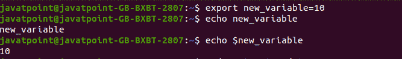
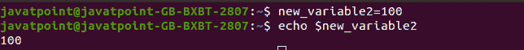

# Linux 设置环境变量

> 原文：<https://www.javatpoint.com/linux-set-environment-variable>

环境变量是存储在系统中的动态值，由外壳或子外壳中启动的应用程序使用。这些变量有一个名字和它们所尊重的值。环境变量定制系统性能和应用程序的行为。

环境是计算机应用程序与系统交互的轨迹。环境变量可以包含系统的默认应用程序、系统区域设置、可执行文件的路径和键盘布局设置等信息。环境变量使应用程序根据系统可用。

## 公共环境变量

一些标准环境变量如下:

*   **路径**

这个变量包含一个目录列表，我们的系统在其中查找文件。它用冒号(:)分隔目录。

*   **用户**

这个变量保存用户名。

*   **HOME**

该变量保存用户主目录的默认路径。

*   **编辑器**

此变量包含指定编辑器的路径。

*   **UID**

该变量包含用户唯一 id 的路径。

*   **期限**

该变量包含默认终端仿真器的路径。

*   **壳牌**

该变量包含用户正在使用的默认 shell 的路径。

*   **ENV**

该变量显示所有环境变量。

## 如何在 Linux 中设置环境变量？

[Linux](https://www.javatpoint.com/linux-tutorial) 中有多个命令允许我们设置和创建环境变量。

使用**导出**命令设置新的环境变量。

要创建新变量，请使用 export 命令，后跟变量名及其值。

**语法:**

```

export NAME=VALUE

```

要创建一个新变量，比如 **new_variable** ，执行如下命令:

```

export new_variable=10

```

**回显**命令用于显示变量:

```

echo new_variable

```

要显示变量值，在变量名前使用 **$** 符号:

```

echo $new_variable

```

**考虑以下输出:**



要设置 Java 环境变量，请执行以下命令:

```

export PATH=$PATH:/home/jdk1.8/bin/

```

我们还可以创建一个用户，通过直接在终端上声明来定义一个变量。

如果我们想创建一个变量 **new_variable2** ，我们可以如下创建:

```

new_variable2=100

```

考虑以下输出:



### 访问环境变量的值

要访问变量值，请按如下方式执行 echo 命令:

```

echo $variable name

```

#### 注意:变量区分大小写；我们不能使用任何变量名' new_variable '作为' New_variable '

### 环境命令

**env** 命令用于显示系统中所有可用的变量。

```

env 

```

**输出:**

```
SHELL=/bin/bash
SESSION_MANAGER=local/javatpoint-GB-BXBT-2807:@/tmp/.ICE-unix/1458,unix/javatpoint-GB-BXBT-2807:/tmp/.ICE-unix/1458
COLORTERM=truecolor
XDG_CONFIG_DIRS=/etc/xdg/xdg-ubuntu:/etc/xdg
XDG_MENU_PREFIX=gnome-
GNOME_DESKTOP_SESSION_ID=this-is-deprecated
GTK_IM_MODULE=ibus
LANGUAGE=en_IN:en
QT4_IM_MODULE=ibus
MANDATORY_PATH=/usr/share/gconf/ubuntu.mandatory.path
GNOME_SHELL_SESSION_MODE=ubuntu
SSH_AUTH_SOCK=/run/user/1000/keyring/ssh
[email protected]=ibus
DESKTOP_SESSION=ubuntu
SSH_AGENT_PID=1362
GTK_MODULES=gail:atk-bridge
PWD=/home/javatpoint
LOGNAME=javatpoint
XDG_SESSION_DESKTOP=ubuntu
XDG_SESSION_TYPE=x11
GPG_AGENT_INFO=/run/user/1000/gnupg/S.gpg-agent:0:1
XAUTHORITY=/run/user/1000/gdm/Xauthority
GJS_DEBUG_TOPICS=JS ERROR;JS LOG
WINDOWPATH=2
HOME=/home/javatpoint
USERNAME=javatpoint
IM_CONFIG_PHASE=1
LANG=en_IN
LS_COLORS=rs=0:di=01;34:ln=01;36:mh=00:pi=40;33:so=01;35:do=01;35:bd=40;33;01:cd=40;33;01:or=40;31;01:mi=00:su=37;41:sg=30;43:ca=30;41:tw=30;42:ow=34;42:st=37;44:ex=01;32:*.tar=01;31:*.tgz=01;31:*.arc=01;31:*.arj=01;31:*.taz=01;31:*.lha=01;31:*.lz4=01;31:*.lzh=01;31:*.lzma=01;31:*.tlz=01;31:*.txz=01;31:*.tzo=01;31:*.t7z=01;31:*.zip=01;31:*.z=01;31:*.dz=01;31:*.gz=01;31:*.lrz=01;31:*.lz=01;31:*.lzo=01;31:*.xz=01;31:*.zst=01;31:*.tzst=01;31:*.bz2=01;31:*.bz=01;31:*.tbz=01;31:*.tbz2=01;31:*.tz=01;31:*.deb=01;31:*.rpm=01;31:*.jar=01;31:*.war=01;31:*.ear=01;31:*.sar=01;31:*.rar=01;31:*.alz=01;31:*.ace=01;31:*.zoo=01;31:*.cpio=01;31:*.7z=01;31:*.rz=01;31:*.cab=01;31:*.wim=01;31:*.swm=01;31:*.dwm=01;31:*.esd=01;31:*.jpg=01;35:*.jpeg=01;35:*.mjpg=01;35:*.mjpeg=01;35:*.gif=01;35:*.bmp=01;35:*.pbm=01;35:*.pgm=01;35:*.ppm=01;35:*.tga=01;35:*.xbm=01;35:*.xpm=01;35:*.tif=01;35:*.tiff=01;35:*.png=01;35:*.svg=01;35:*.svgz=01;35:*.mng=01;35:*.pcx=01;35:*.mov=01;35:*.mpg=01;35:*.mpeg=01;35:*.m2v=01;35:*.mkv=01;35:*.webm=01;35:*.ogm=01;35:*.mp4=01;35:*.m4v=01;35:*.mp4v=01;35:*.vob=01;35:*.qt=01;35:*.nuv=01;35:*.wmv=01;35:*.asf=01;35:*.rm=01;35:*.rmvb=01;35:*.flc=01;35:*.avi=01;35:*.fli=01;35:*.flv=01;35:*.gl=01;35:*.dl=01;35:*.xcf=01;35:*.xwd=01;35:*.yuv=01;35:*.cgm=01;35:*.emf=01;35:*.ogv=01;35:*.ogx=01;35:*.aac=00;36:*.au=00;36:*.flac=00;36:*.m4a=00;36:*.mid=00;36:*.midi=00;36:*.mka=00;36:*.mp3=00;36:*.mpc=00;36:*.ogg=00;36:*.ra=00;36:*.wav=00;36:*.oga=00;36:*.opus=00;36:*.spx=00;36:*.xspf=00;36:
XDG_CURRENT_DESKTOP=ubuntu:GNOME
VTE_VERSION=5802
GNOME_TERMINAL_SCREEN=/org/gnome/Terminal/screen/dc6e48ed_7868_43d5_a086_fd6d6a90a74a
INVOCATION_ID=fadf556d1cf5422ea55b247bf57c3c99
MANAGERPID=1252
CLUTTER_IM_MODULE=ibus
GJS_DEBUG_OUTPUT=stderr
LESSCLOSE=/usr/bin/lesspipe %s %s
XDG_SESSION_CLASS=user
TERM=xterm-256color
DEFAULTS_PATH=/usr/share/gconf/ubuntu.default.path
LESSOPEN=| /usr/bin/lesspipe %s
USER=javatpoint
GNOME_TERMINAL_SERVICE=:1.216
DISPLAY=:0
SHLVL=1
QT_IM_MODULE=ibus
XDG_RUNTIME_DIR=/run/user/1000
JOURNAL_STREAM=9:35179
XDG_DATA_DIRS=/usr/share/ubuntu:/usr/local/share/:/usr/share/:/var/lib/snapd/desktop
PATH=/usr/local/sbin:/usr/local/bin:/usr/sbin:/usr/bin:/sbin:/bin:/usr/games:/usr/local/games:/snap/bin
GDMSESSION=ubuntu
DBUS_SESSION_BUS_ADDRESS=unix:path=/run/user/1000/bus
_=/usr/bin/env
[email protected]:~$ 

```

## 移除环境变量

通过移除环境变量，我们可以移除特定变量的所有现有组件。

要删除环境变量，执行**取消设置**命令，后跟变量名:

```

unset variable name

```

上述命令将从系统中删除指定的变量及其组件。

要从系统中删除变量 **new_variable** ，请执行以下命令:

```

unset new_variable

```

考虑以下输出:


* * *