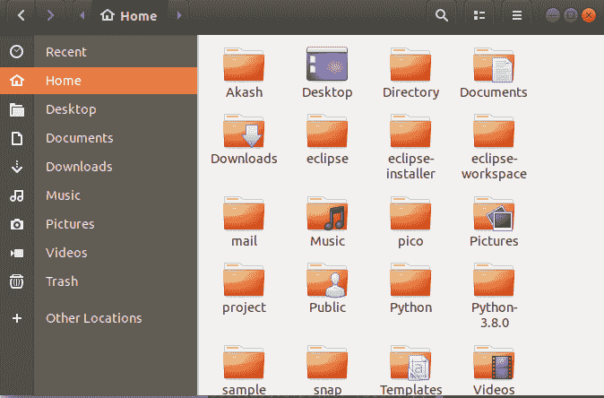
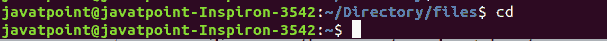
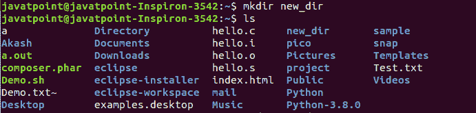
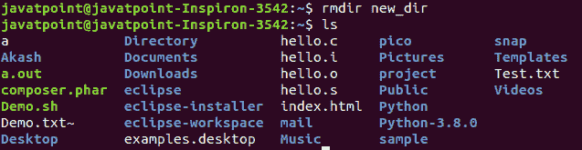

# Linux 主目录

> 原文：<https://www.javatpoint.com/linux-home-directory>

Linux 主目录是系统特定用户的目录，由单个文件组成。也称为**登录目录**。这是登录到 Linux 系统后出现的第一个地方。它会自动为目录中的每个用户创建为**“/主页”**。它是根目录的标准子目录。根目录包含系统上的所有其他目录、子目录和文件。它由正斜杠(/)表示。

主目录可以说是除了 root 之外所有用户的个人工作空间。每个用户都有一个单独的目录。例如，两个用户“jtp1”和“jtp2”将拥有像“/home/jtp1”和“/home/jtp2”这样的目录。这些用户将拥有其目录文件下的所有权限。

根(管理)用户是默认情况下主目录位于不同位置的唯一用户。根用户的路径是'/root/'，它可以控制所有的目录和文件。

### 如何找到主目录？

有多种方法可以访问和返回主目录。有些命令对目录很有帮助，比如 [cd](https://www.javatpoint.com/linux-cd) 、 [pwd](https://www.javatpoint.com/linux-pwd) 、 [mkdir](https://www.javatpoint.com/linux-mkdir) 、 [pwd](https://www.javatpoint.com/linux-pwd) 、 [ls](https://www.javatpoint.com/linux-ls) 、 [rmdir](https://www.javatpoint.com/linux-rmdir) 。要以图形方式访问主目录，请打开**文件**应用，然后单击左侧菜单中的**主目录**选项。请考虑下图:



在这里，我们可以探索我们的主目录。

通常，我们的终端会打开用户的特定目录。要将目录更改为主目录，请执行 **cd 命令**，如下所示:

```

cd /home

```

上述命令会将目录更改为 home。要列出主目录，请执行 ls 命令，如下所示:

```

ls

```

考虑以下输出:


我们可以在没有任何参数的情况下通过执行 cd 命令返回到我们的主目录。它将从我们正在处理的任何目录返回到我们的主目录。按照以下步骤执行:

```

cd

```

考虑以下输出:



从上面的输出，我们在/Directory/file 中，通过只执行 cd 命令，我们到达了我们的主目录。我们也可以使用“cd ~或 cd $HOME”命令来做同样的事情。考虑以下命令:

```

cd ~
cd $Home

```

要显示当前工作目录，请按如下方式执行 pwd 命令:

```

pwd

```

考虑以下输出:


要在目录下创建目录，执行 **mkdir 命令**如下:

```

mkdir <directory name>

```

考虑以下输出:



从上面的输出中，我们创建了一个名为“new_dir”的目录，并通过执行 ls 命令来显示它。

我们也可以删除一个目录。要删除目录，请按如下方式执行 rmdir 命令:

```

rmdir <directory name>

```

考虑以下输出:



从上面的输出中，我们删除了“new_dir”目录。

## 根目录和主目录的区别

根目录和主目录之间的一些主要区别如下:

| 根目录 | 主目录 |
| 根目录是系统驱动器的最顶层。 | 主目录是根目录的子目录。 |
| 它由斜线“/”表示。 | 用“~”表示，路径为“**/用户/用户名**”。 |
| 管理员有权对文件和设置进行任何更改。 | 根用户以外的任何用户都不能更改整个系统的设置。 |
| 管理员可以创建一个用户。 | 任何拥有主目录的用户都不能创建用户。 |
| 在 Linux 文件系统中，一切都在根目录下。 | 主目录包含特定用户的数据。 |

* * *