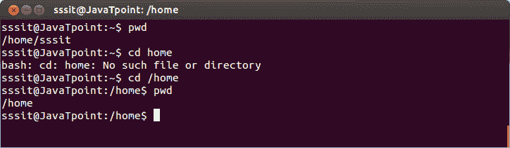
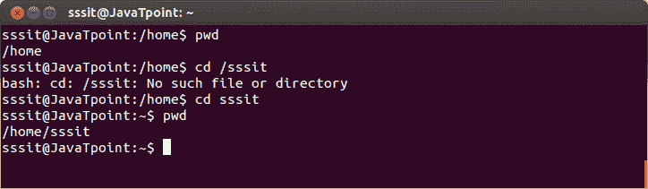
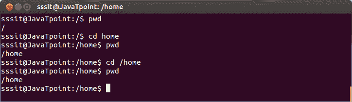

# Linux 绝对和相对路径

> 原文：<https://www.javatpoint.com/linux-absolute-relative-paths>

知道绝对路径和相对路径的区别是非常重要的。因为正确的路径只会引导您到达目标目录。

当您定义一个以斜杠('/')符号开始的路径时，则假定是文件的根目录。如果不放“/”，则当前目录被认为是起点。

在下面的例子中，我们在 **/home/sssit** 。要进入主目录，我们键入 **cd /home** 而不是 cd home。

在下面，您可以看到我们通过键入 **cd /sssit** 而不是 **cd sssit** 得到了一个错误，因为 sssit 是 home 的子目录，因此不能用根目录(“/”)访问。

如果你当前在根目录中，那么你可以给出命令 **home 或者/home** 。因为您已经在根目录中，所以这两种方式都将引导您到主目录。

