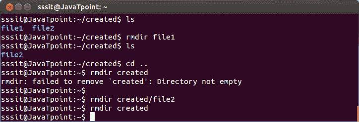
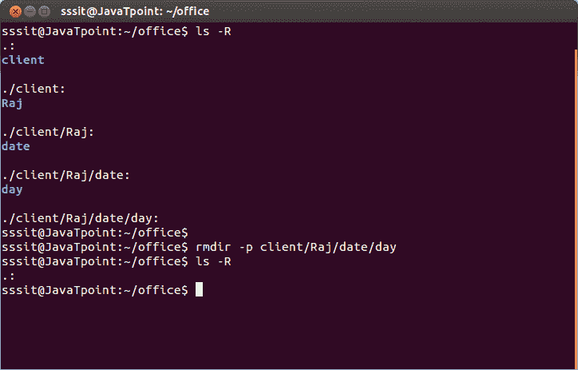

# Linux rmdir 命令

> 原文：<https://www.javatpoint.com/linux-rmdir>

此命令用于删除目录。但是不能删除包含子目录的目录。这意味着，一个目录必须是空的才能被删除。

**语法:**

```
rmdir  
```

**示例:**

```
rmdir created

```

例如，在下图中，我们已经成功地从**【信封】**中删除了目录**【文件 1】**。现在我们要删除**‘创建了’**目录。但是它显示错误，因为它包含**“文件 2”**。因此，要删除“已创建”的目录，首先我们必须删除“文件 2”。然后，我们将能够删除'创建'的目录。



* * *

## 人民币-英镑

该命令将一次性删除一个目录及其子目录。在下图中，所有的子目录都已经用' rmdir -p '命令删除了。



* * *