# 带有示例的 Linux 命令

> 原文：<https://www.javatpoint.com/linux-commands>

Linux 命令是 Linux 操作系统的一个实用程序。所有基本和高级任务都可以通过执行命令来完成。命令在 **Linux 终端**上执行。终端是与系统交互的命令行界面，类似于 Windows 操作系统中的命令提示符。*Linux 中的命令**区分大小写**。*

[与其他操作系统如](https://www.javatpoint.com/linux-tutorial) [Windows](https://www.javatpoint.com/windows) 和 MacOS 相比，Linux 提供了强大的命令行界面。我们可以通过它的终端做基础工作和高级工作。我们可以执行一些基本任务，例如创建文件、删除文件、移动文件等等。此外，我们还可以执行高级任务，如管理任务(包括软件包安装、用户管理)、网络任务(ssh 连接)、安全任务等。

Linux 终端是一个用户友好的终端，因为它提供了各种支持选项。打开 Linux 终端，同时按“ **CTRL + ALT + T** 键，按“**回车**键执行命令。

在本主题中，我们将讨论 50 个最常用的 Linux 命令及其示例。这些命令对初学者和专业人士都非常有用。我们将这些命令分为以下几个部分，以便您可以轻松识别它们的用法:

*   [Linux 目录命令](#Directory)
*   [Linux 文件命令](#File)
*   [Linux 文件内容命令](#Content)
*   [Linux 用户命令](#User)
*   [Linux 过滤命令](#Filter)
*   [Linux 实用程序命令](#Utility)
*   [Linux 联网命令](#Networking)

## Linux 50 大命令

以下是前 50 个 Linux 命令:

### Linux 目录命令

**1。pwd 命令**

[pwd](https://www.javatpoint.com/linux-pwd) 命令用于显示当前工作目录的位置。

**语法:**

```
pwd

```

**输出:**

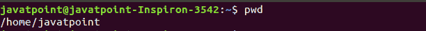

**2。mkdir 命令**

[mkdir](https://www.javatpoint.com/linux-mkdir) 命令用于在任何目录下创建一个新目录。

**语法:**

```
mkdir <directory name>

```

**输出:**


**3。rmdir 命令**

[rmdir](https://www.javatpoint.com/linux-rmdir) 命令用于删除目录。

**语法:**

```
rmdir <directory name>

```

**输出:**


**4。ls 命令**

[ls](https://www.javatpoint.com/linux-ls) 命令用于显示目录的内容列表。

**语法:**

```
ls

```

**输出:**

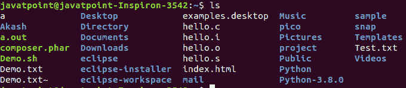

**5。cd 命令**

[cd](https://www.javatpoint.com/linux-cd) 命令用于更改当前目录。

**语法:**

```
cd <directory name>

```

**输出:**


### Linux 文件命令

**6。触摸命令**

使用[触摸](https://www.javatpoint.com/linux-touch)命令创建空文件。我们可以通过执行一次来创建多个空文件。

**语法:**

```
touch <file name>
touch <file1>  <file2> ....

```

**输出:**

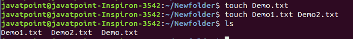

**7。卡特彼勒指令**

[cat](https://www.javatpoint.com/linux-cat) 命令是 Linux 系统中的一个多用途实用程序。它可用于创建文件、显示文件内容、将一个文件的内容复制到另一个文件等。

**语法:**

```
cat [OPTION]... [FILE]..

```

要创建文件，请按如下方式执行:

```
cat > <file name>
// Enter file content

```

按“**”CTRL+D**键保存文件。要显示文件的内容，请按如下方式执行:

```
cat <file name>

```

**输出:**

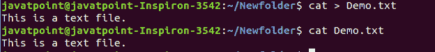

**8。rm 命令**

[rm](https://www.javatpoint.com/linux-rm) 命令用于删除文件。

**语法:**

rm

**输出:**

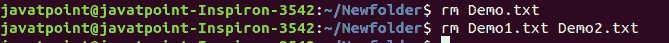

**9。cp 命令**

[cp](https://www.javatpoint.com/linux-cp) 命令用于复制文件或目录。

**语法:**

要在同一目录中复制:

```
cp <existing file name> <new file name>

```

要在不同的目录中复制:

**输出:**


**10。mv 命令**

[mv](https://www.javatpoint.com/linux-mv) 命令用于将文件或目录从一个位置移动到另一个位置。

**语法:**

```
mv <file name> <directory path>

```

**输出:**


**11 时。重命名命令**

[重命名](https://www.javatpoint.com/linux-rename)命令用于重命名文件。这对于重命名一大组文件非常有用。

**语法:**

```
rename 's/old-name/new-name/' files

```

例如，要将所有文本文件转换为 pdf 文件，请执行以下命令:

```
rename 's/\.txt$/\.pdf/' *.txt

```

**输出:**

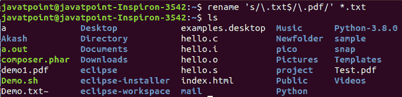

### Linux 文件内容命令

**12 时。头部命令**

[头](https://www.javatpoint.com/linux-head)命令用于显示文件内容。它显示文件的前 10 行。

**语法:**

```
head <file name>

```

**输出:**

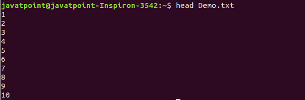

**13。尾部命令**

[尾部](https://www.javatpoint.com/linux-tail)命令类似于头部命令。这两个命令的区别在于，它显示文件内容的最后十行。这对于阅读错误信息很有用。

**语法:**

```
tail <file name>

```

**输出:**

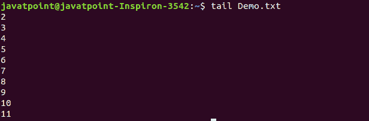

**14。战术命令**

[tac](https://www.javatpoint.com/linux-tac) 命令是 cat 命令的反义词，正如其名称所指定的那样。它以相反的顺序显示文件内容(从最后一行开始)。

**语法:**

```
tac <file name>

```

**输出:**

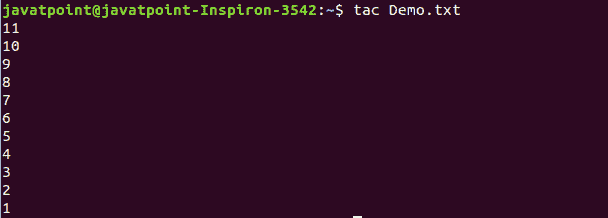

**15。更多命令**

[more](https://www.javatpoint.com/linux-more) 命令与 cat 命令非常相似，因为它与 cat 命令一样用于显示文件内容。这两个命令的唯一区别是，在文件较大的情况下，一次显示屏幕输出的命令越多。

在更多命令中，以下按键用于滚动页面:

**回车键:**逐行向下滚动。

**空格键:**移动到下一页。

**b 键:**移至上一页。

**/键:**搜索字符串。

**语法:**

```
more <file name>

```

**输出:**

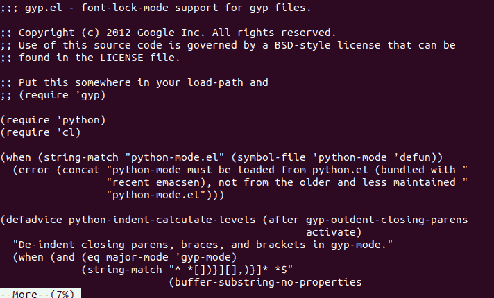

**16。少指挥**

[less](https://www.javatpoint.com/linux-less) 命令类似于 more 命令。它还包括一些额外的功能，如“调节终端的宽度和高度”相比之下，命令越多，终端的输出越窄。

**语法:**

```
less <file name>

```

**输出:**


### Linux 用户命令

**17。苏指挥**

[su](https://www.javatpoint.com/linux-su-commands) 命令为另一个用户提供管理访问。换句话说，它允许另一个用户访问 Linux 外壳。

**语法:**

```
su <user name>

```

**输出:**


**18。id 命令**

[id](https://www.javatpoint.com/linux-id-command) 命令用于显示用户 ID (UID)和组 ID (GID)。

**语法:**

```
id

```

**输出:**


**19。useradd 命令**

[useradd](https://www.javatpoint.com/linux-create-user) 命令用于在 Linux 服务器上添加或删除用户。

**语法:**

```
useradd  username

```

**输出:**


**20。密码命令**

[密码](https://www.javatpoint.com/linux-user-password)命令用于为用户创建和更改密码。

**语法:**

```
passwd <username>

```

**输出:**


**21。组添加命令**

[组添加](https://www.javatpoint.com/linux-add-user-to-group)命令用于创建用户组。

**语法:**

```
groupadd <group name>

```

**输出:**


### Linux 过滤命令

**22。卡特彼勒指令**

[cat](https://www.javatpoint.com/linux-cat-filters) 命令也用作过滤器。要过滤文件，它在管道内部使用。

**语法:**

```
cat <fileName> | cat or tac | cat or tac |. . . 

```

**输出:**

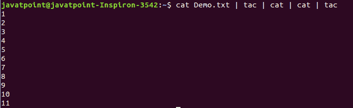

**23。切割命令**

[剪切](https://www.javatpoint.com/linux-cut)命令用于选择文件的特定列。“-d”选项用作分隔符，它可以是空格(“”)、斜杠(/)、连字符(-)或任何其他字符。“-f”选项用于指定列号。

**语法:**

```
cut -d(delimiter) -f(columnNumber) <fileName>

```

**输出:**

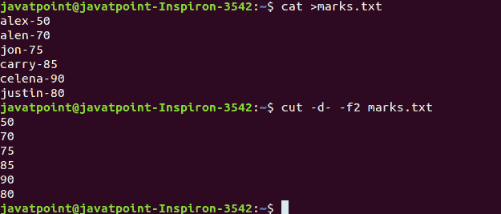

**24。grep 命令**

[grep](https://www.javatpoint.com/linux-grep) 是 Linux 系统中最强大和最常用的过滤器。“grep”代表“**全球正则表达式打印件**”它对于从文件中搜索内容非常有用。通常，它与管道一起使用。

**语法:**

```
command | grep <searchWord>

```

**输出:**


**25。通信命令**

[‘comm’](https://www.javatpoint.com/linux-comm)命令用于比较两个文件或流。默认显示三列，第一列显示第一个文件的不匹配项，第二列表示第二个文件的不匹配项，第三列显示两个文件的匹配项。

**语法:**

```
comm <file1> <file2>

```

**输出:**

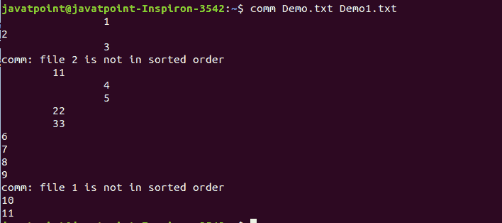

**26。sed 命令**

[sed](https://www.javatpoint.com/linux-sed) 命令也被称为**流编辑器**。它用于使用正则表达式编辑文件。它不会永久编辑文件；相反，编辑后的内容仅保留在显示屏上。它不影响实际文件。

**语法:**

```
command | sed 's/<oldWord>/<newWord>/'

```

**输出:**

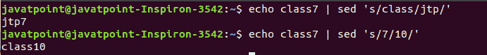

**27。三通命令**

[tee](https://www.javatpoint.com/linux-tee) 命令与 cat 命令非常相似。两个过滤器的唯一区别是，它将标准输入放在标准输出上，并将它们写入文件。

**语法:**

```
cat <fileName> | tee <newFile> |  cat or tac |.....

```

**输出:**

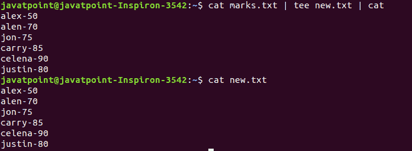

**28。tr 命令**

[tr](https://www.javatpoint.com/linux-tr) 命令用于将文件内容从小写翻译成大写。

**语法:**

```
command | tr <'old'> <'new'>

```

**输出:**

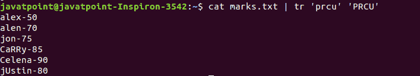

**29。uniq 命令**

[uniq](https://www.javatpoint.com/linux-uniq) 命令用于形成一个排序列表，其中每个单词只出现一次。

**语法:**

```
command <fileName> | uniq

```

**输出:**

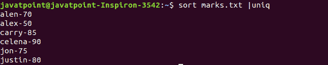

**30。wc 命令**

[wc](https://www.javatpoint.com/linux-wc) 命令用于统计文件中的行数、字数和字符数。

**语法:**

```
wc <file name>

```

**输出:**


**31。od 命令**

[od](https://www.javatpoint.com/linux-od) 命令用于以不同的 s 显示文件的内容，如十六进制、八进制和 ASCII 字符。

**语法:**

```
od -b <fileName>      // Octal format
od -t x1 <fileName>   // Hexa decimal format
od -c <fileName>     // ASCII character format

```

**输出:**

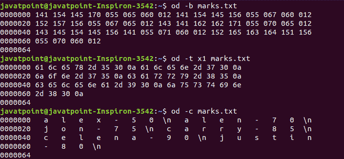

**32。排序命令**

[排序](https://www.javatpoint.com/linux-sort)命令用于按字母顺序对文件进行排序。

**语法:**

```
sort <file name>

```

**输出:**


**33。gzip 命令**

[gzip](https://www.javatpoint.com/linux-gzip) 命令用于截断文件大小。这是一个压缩工具。它用具有“”的压缩文件替换原始文件。gz '分机。

**语法:**

```
gzip <file1> <file2> <file3>...

```

**输出:**

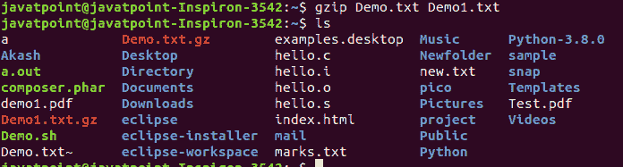

**34。炮口命令**

[gunzip](https://www.javatpoint.com/linux-gzip) 命令用于解压缩文件。这是 gzip 命令的反向操作。

**语法:**

```
gunzip <file1> <file2> <file3>. .

```

**输出:**

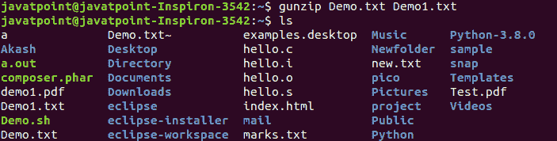

### Linux 实用程序命令

**35。查找命令**

[查找](https://www.javatpoint.com/linux-find)命令用于在目录中查找特定文件。它还支持各种查找文件的选项，如按名称、按类型、按日期等等。

“查找”命令后使用了以下符号:

(.) :对于当前目录名

(/):对于根

**语法:**

```
find . -name "*.pdf"

```

**输出:**

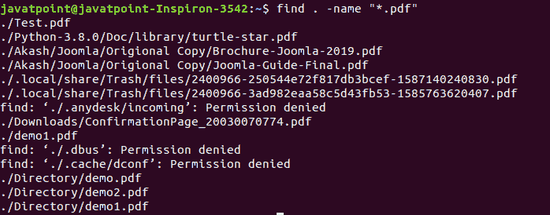

**36。定位命令**

[定位](https://www.javatpoint.com/linux-locate)命令用于按文件名搜索文件。它与 find 命令非常相似；不同的是，这是一个背景过程。它在数据库中搜索文件，而 find 命令在文件系统中搜索。它比 find 命令更快。要使用 locates 命令查找文件，请保持数据库更新。

**语法:**

```
locate <file name>

```

**输出:**

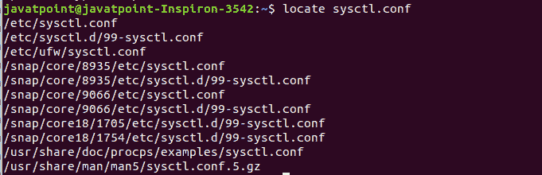

**37。日期命令**

[日期](https://www.javatpoint.com/linux-date)命令用于显示日期、时间、时区等。

**语法:**

```
date

```

**输出:**


**38。呼叫命令**

[cal](https://www.javatpoint.com/linux-cal) 命令用于显示当前月份的日历，并突出显示当前日期。

**语法:**

```
cal<

```

**输出:**


**39。睡眠命令**

[睡眠](https://www.javatpoint.com/linux-sleep)命令用于将终端保持指定的时间。默认情况下，它需要的时间以秒为单位。

**语法:**

```
sleep <time>

```

**输出:**


**40。时间命令**

[时间](https://www.javatpoint.com/linux-time)命令用于显示执行命令的时间。

**语法:**

```
time

```

**输出:**


**41。zcat 命令**

zcat 命令用于显示压缩文件。

**语法:**

```
zcat <file name>

```

**输出:**

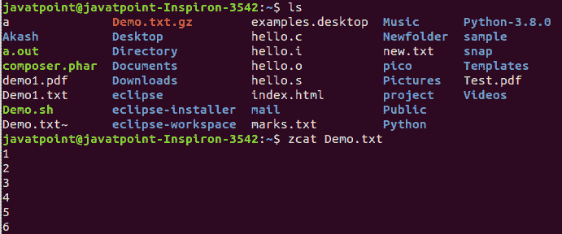

**42。测向命令**

[df](https://www.javatpoint.com/linux-df) 命令用于显示文件系统中使用的磁盘空间。它以已用块数、可用块数和装载目录的形式显示输出。

**语法:**

```
df

```

**输出:**

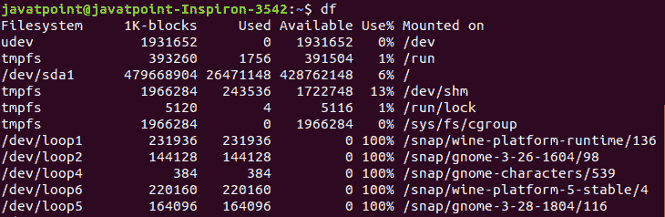

**43。挂载命令**

[mount](https://www.javatpoint.com/linux-mount) 命令用于将外部设备文件系统连接到系统的文件系统。

**语法:**

```
mount -t type <device> <directory>

```

**输出:**

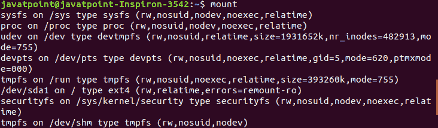

**44。退出命令**

Linux [退出](http://javatpoint.com/linux-exit-command)命令用于退出当前 shell。它将一个参数作为一个数字，并返回状态号退出 shell。

**语法:**

```
exit

```

**输出:**

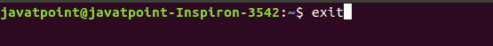

按下回车键后，将退出终端。

**45。清除命令**

Linux **清除**命令用于清除终端屏幕。

**语法:**

```
clear

```

**输出:**

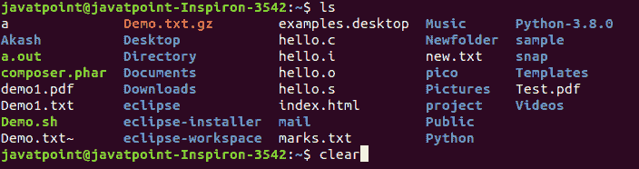

按下回车键后，将清除终端屏幕。

### Linux 网络命令

**46。ip 命令**

Linux [ip](https://www.javatpoint.com/linux-ip) 命令是 ipconfig 命令的更新版本。它用于分配一个 IP 地址，初始化一个接口，禁用一个接口。

**语法:**

```
ip a or ip addr

```

**输出:**

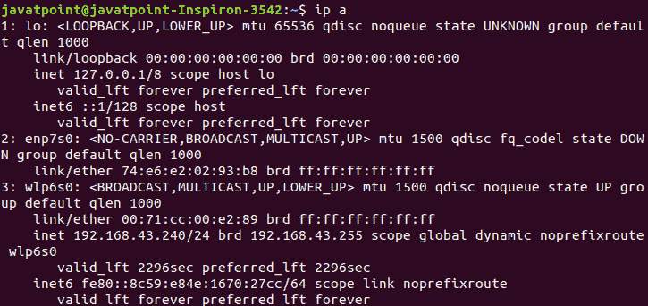

**47。宋承宪命令**

Linux [ssh](https://www.javatpoint.com/ssh-linux) 命令用于通过 ssh 协议创建远程连接。

**语法:**

```
ssh user_name@host(IP/Domain_name)

```

**48。邮件命令**

[mail](https://www.javatpoint.com/linux-mail-command) 命令用于从命令行发送电子邮件。

**语法:**

```
mail -s "Subject" <recipient address>

```

**输出:**


**49。ping 命令**

[ping](https://www.javatpoint.com/linux-ping) 命令用于检查两个节点之间的连通性，即服务器是否连接。它是“分组互联网游戏”的简称

**语法:**

```
ping <destination>

```

**输出:**

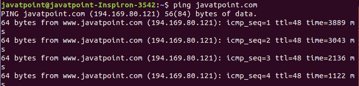

**50。主机命令**

[主机](https://www.javatpoint.com/linux-host)命令用于显示给定域名的 IP 地址，反之亦然。它为域名系统查询执行域名系统查找。

**语法:**

```
host <domain name> or <ip address>

```

**输出:**

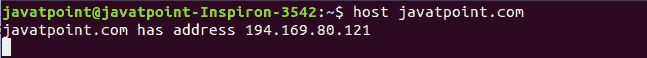

* * *