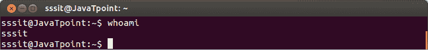
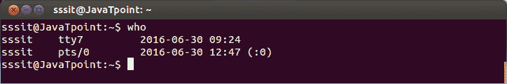
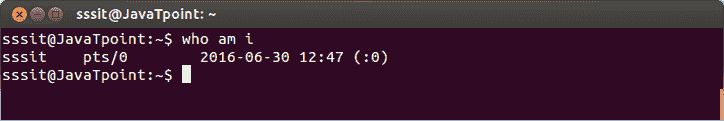
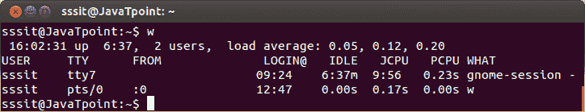
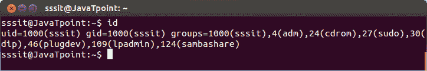

# Linux 用户介绍

> 原文：<https://www.javatpoint.com/linux-users>

本教程将告诉您如何使用诸如谁、我是谁等命令来识别系统的用户帐户。

如果不止一个人使用一个系统，那么每个人都可能有自己的用户帐户。在这里，了解用户账户的详细信息会有所帮助。

它还告诉如何创建第二个用户帐户，并在 su 和 sudo 命令的帮助下在该帐户上运行程序。

## 谁啊

它告诉你系统的用户名。

**语法:**

```

whoami

```



看上面的快照，**‘sssit’**是我们系统的用户名。

## 谁

who 命令给出登录到系统的用户的信息。

**语法:**

```

who

```



## 我是谁

此命令仅显示当前用户的信息。

**语法:**

```

who am i

```



看上面的快照，在我们系统中当前登录的用户是 **sssit** 。

## w

该命令告知登录的用户以及他们在做什么。

**语法:**

```

w

```



## 编号

该命令告诉您用户 id、主要组 id 和属于您的组列表。

**语法:**

```

id    

```



* * *