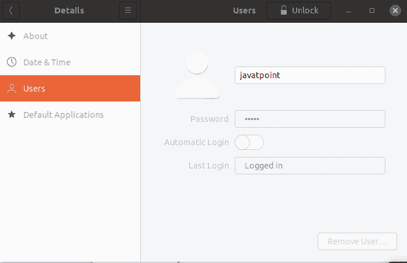
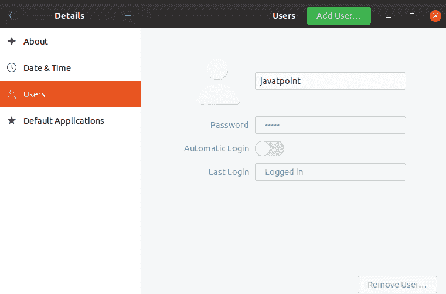
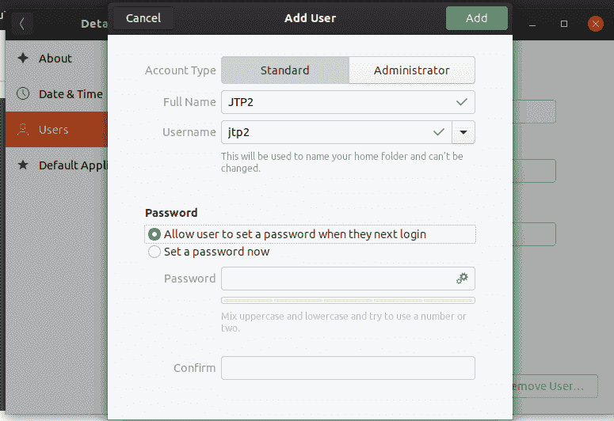
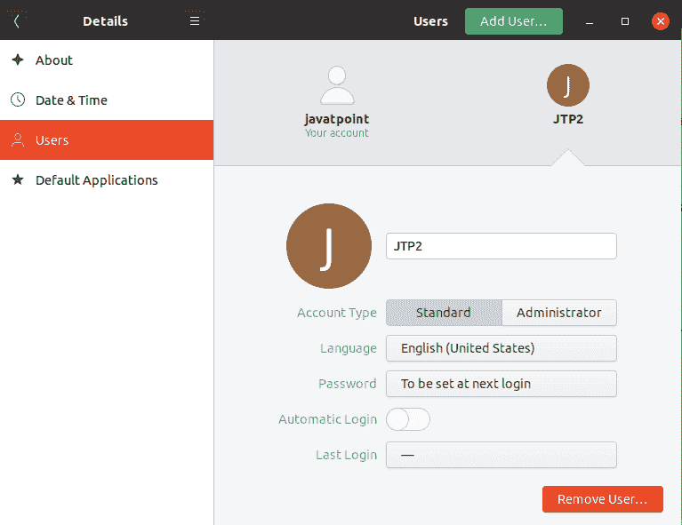
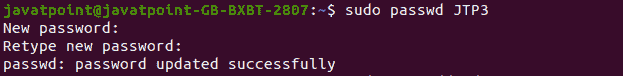
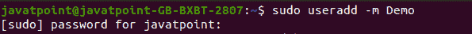
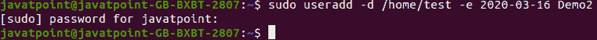

# Linux 创建用户| Linux 添加用户| Linux 用户添加命令

> 原文：<https://www.javatpoint.com/linux-create-user>

Linux 服务器允许我们在安装后创建多个用户。Linux 是一个多用户系统，这意味着多个用户可以同时在同一个系统中工作。我们可以通过安装代理这样做。

我们必须创建一个帐户才能使用 [Linux](https://www.javatpoint.com/linux-tutorial) ，因为我们不能继续使用根帐户。我们有一个行政账户；系统管理员帐户负责管理系统的用户帐户和组。

添加或删除用户是新 Linux 服务器最基本的任务之一。

新的 Linux 服务器只给我们一个根用户帐户。添加用户帐户为特定用户提供了强大的功能和可访问性。这是一个有用但不安全的 Linux 服务器实用程序。最好添加一个非特权用户来执行常见任务。但是，我们可以通过 sudo 命令行实用程序来访问管理权限。

## 在 Linux 中创建用户(Ubuntu)

向 Linux 服务器添加用户有两种最常见的方法。

*   **通过用户管理器图形化**
*   **通过用户添加命令(终端)**

### 1.通过用户管理器图形化显示

Linux [GUI](https://www.javatpoint.com/gui-full-form) 允许我们从它的功能中创建一个用户。这是一个直截了当的过程。要为您的 Linux 服务器创建用户，请执行以下步骤:

**步骤 1:** 转到系统搜索并搜索**设置**并导航至**详细信息- >关于。**

**第二步:**点击**用户**之后点击表头**解锁选项**。会要求系统安全密码输入密码，点击**确定**继续。请考虑下图:



**步骤 3:** 点击**添加用户**选项添加新用户。



**步骤 4:** 输入用户名、密码和账户类型等用户详细信息。我们可以创建两种类型的帐户，即标准帐户和管理员帐户。标准帐户不包含 sudo 权限。但是，我们可以稍后提供。



**步骤 5:** 现在，我们已经成功创建了一个名为 JTP2 的新用户。请看下图。



### 2.通过 Linux 用户添加命令

在 Linux 中， **useradd 命令**是一个命令行实用程序，用于在 Linux 服务器和基于 Unix 的操作系统上添加或删除用户。

在不同类型的 Linux 发行版中，useradd 命令可能略有不同。

useradd 命令执行以下任务:

*   为新创建的用户编辑文件，如 **/etc/passwd** 、 **/etc/shadow** 、 **/etc/group** 、**/etc/g 全图。**
*   它创建并打开一个新的主目录。
*   它允许我们设置主目录的所有权和权限。

**语法:**

```

useradd [options] username

```

为了使用 useradd 命令，我们必须以 root 或 sudo 访问权限登录。

在使用 Linux useradd 命令之前，让我们了解一下 Linux 命令行中使用的一些常用术语。

*   **用户名**:用户名是用来登录 Linux 系统的名称。当我们打开机器时，它就会显示出来。用户名长度应该在 1 到 32 个字符之间。

**密码:**密码是用于保护您的系统免受未授权访问的密码。它以加密格式存储在 etc/shadow 文件中。

**用户 ID (UID)** : Linux 给每个用户提供一个唯一的 ID；它被称为**用户识别号**或**用户识别号**或 **UID** 。默认情况下，根用户的 UID 保留为零，其余从 1 到 99 的 UID 保留给其他预定义的帐户。此外，UID 从 100-999 保留给组和系统帐户。

**组标识号(GID):**GID 或组标识号是 Linux 系统提供的组标识号。存储在 **/etc/group** 文件中。

**用户信息:**它允许我们定义一些关于用户的附加信息，比如用户全名。它是可选的。

**主目录:**是用户的绝对位置。

**Shell:** 是用户 Shell 的绝对位置，即/bin/bash。

要通过 useradd 命令创建新用户，请执行 useradd 命令，后跟用户名，如下所示:

```

sudo useradd JTP3

```

上面的命令会询问系统管理密码，输入密码。它将创建一个名为 JTP3 的用户。用户使用该用户名登录系统。用户名必须是唯一的。考虑以下输出:


要为新创建的用户设置密码，请执行以下命令:

```

sudo passwd JTP3

```

上述命令将要求输入新密码，输入密码并重新键入新密码。它将更新指定用户的密码。考虑以下输出:



### 创建具有主目录的用户

有时，新创建的用户可能会也可能不会分配主目录。要创建用户并强制为其分配主目录，请执行以下命令:

```

sudo useradd -m Demo

```

考虑下面的终端快照:



上述命令将询问系统管理密码，并为用户**演示创建目录 ***主页*/演示**。**

### 使用不同的主目录创建用户

Linux 允许我们在不同的地方创建一个主目录，而不是默认的文件夹。使用-d 选项和 useradd 命令创建一个不同的主目录。执行以下命令:

```

sudo useradd -m -d /Demo1 Demo1

```

上述命令将在用户 Demo1 的根目录下创建一个 Demo1 文件夹。考虑终端的下图:


### 创建一个有到期日期的用户

要创建一个过期日期的用户，这意味着在特定日期之后，它将被自动删除。

```

sudo useradd -d /home/test -e 2020-03-16 Demo2

```

上述命令将创建一个具有指定到期日期的用户。它将创建一个名为 Demo2 的用户，该用户将在 2020 年 3 月 16 日之后自动删除。考虑终端的下图:



当你想为短期内要离开的用户创建一个帐户时，这将是非常有用的。

* * *