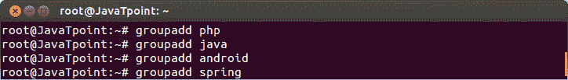
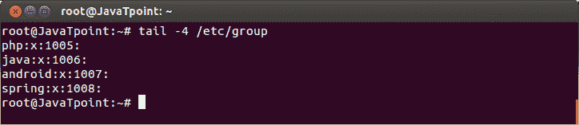
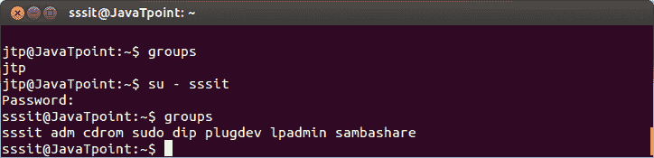
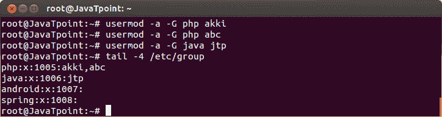
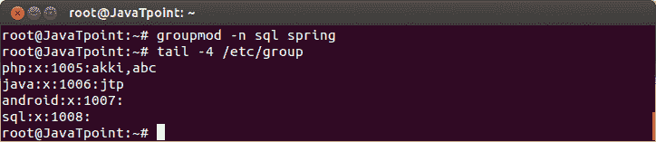
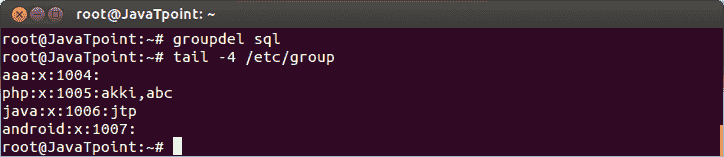
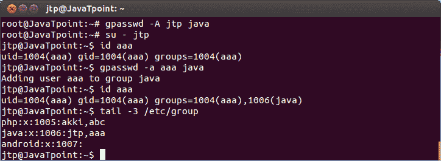
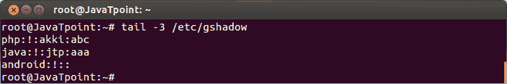
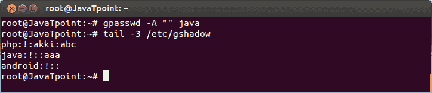

# Linux 组

> 原文：<https://www.javatpoint.com/linux-groups>

用户可以在不同的组中列出。组允许我们在组级别设置权限，而不是在个人级别设置权限。

每个 Linux 发行版都有一个图形工具来管理组。根据用户的体验，可以通过图形工具、命令行工具以及 vi 或 vigr 来管理组。只有有经验的用户才应该使用 **vi** 或 **vigr** 来管理组，因为它会对文件进行适当的锁定或更改。

**群加**

groupadd 命令在我们的系统中创建或添加一个组。

**语法:**

```

groupadd  
```

**示例:**

```

groupadd php
groupadd java
groupadd android
groupadd spring

```



看上面的快照，php、java、android 和 spring 组都是用 groupadd 命令创建的。

* * *

## 组文件

/etc/group 文件定义了组成员身份。一个用户可以是多个组的成员。

**语法:**

```

/etc/group

```



看上面的快照，**第一个**列表示组名，**第二个**是组的加密密码，也可能保持为空，**第三个**是组标识(GID)，第四个是成员列表。**第四个**列表为空，因为这些组没有成员。

## 组

group 命令告知当前用户所属的组。

**语法:**

```

groups

```



看上面的快照，用户 **jtp** 和 **sssit** 属于不同的组。

* * *

## 用户模式

可以使用**用户模式**或**用户添加**命令编辑组成员。如果一个组没有被列出，那么默认情况下，usermod 命令将从他所属的每个组中删除该用户。这里，**-一个(追加)**选项用于防止这种情况发生。

**语法:**

```

usermod -a -G <username></username> 
```

**示例:**

```

usermod -a -G php akki
usermod -a -G php abc
usermod -a -G java jtp

```



看上面的快照，我们已经显示了/etc/group 的列表。用户 **akki** 和 **abc** 被添加到组 **php 中，**用户 **jtp** 被添加到 **java** 中。

* * *

## 修改用户组

在 groupmod 命令的帮助下，您可以更改已经存在的组的名称。

**语法:**

```

groupmod -n 
```

**示例:**

```

groupmod -n sql spring

```



看上面的快照，组**弹簧**变成了 **sql** 。

* * *

## 删除组

命令 groupdel 将从系统中永久删除一个组。

**语法:**

```

groupdel 
```

**示例:**

```

groupdel sql

```



看上面的快照，组 **sql** 从系统中删除。

* * *

## gpasswd

可以使用 gpasswd 命令将对组成员资格的控制传递给另一个用户。

**语法:**

```

gpsswd -A 
```

**示例:**

```

gpasswd -A jtp java

```



看上面的快照，我们已经通过命令**“gpasswd-A jtp Java”**将 **java** 的成员资格传递给了用户。然后我们将 **su** 添加到 jtp，将 **aaa** 添加到 java。

组管理员不必是该组的成员。他们可以添加或删除不属于该组的成员。

文件 **/etc/gshadow** 保存集团管理员的信息，如下图快照所示。



要从组中删除所有管理员，请设置一个空的管理员列表。

**语法:**

```

gpasswd -A "" 
```

**示例:**

```

gpasswd -A "" java

```



看上面的快照，管理员 **jtp** 从 java 组中移除。

* * *