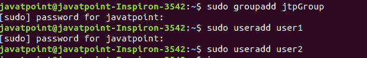
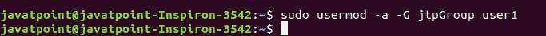
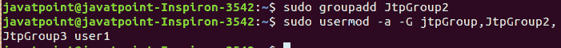

# Linux 将用户添加到组

> 原文：<https://www.javatpoint.com/linux-add-user-to-group>

Linux 允许我们将用户添加到特定的用户组中。一个用户帐户可以添加到多个组中。例如，拥有 sudo 权限的用户可以访问 sudo 命令以获得相关权限。此外，我们还可以为一个组配置文件权限和其他权限。

将用户添加到组是一个简单的过程，我们只需要执行适当的命令。我们将浏览与用户和组相关的所有场景，例如如何向组中添加、删除和移除用户。此外，我们还将学习如何列出组。首先，了解 Linux 组:

## Linux 组

Linux 组是有权管理和组织 Linux 系统中的用户和文件权限的用户社区。创建组的主要动机是定义一组权限，如读写权限或允许组的共享资源。

### Linux 组的类型

在基于 Linux 的系统中，有两种类型的组，它们是:

*   准素群
*   二级或补充组

**主组:**当我们通过特定用户帐户创建文件时，默认情况下，文件组被设置为用户的主组。它将提供与文件用户组相同的名称作为用户帐户名。主组将用户信息存储在/etc/passwd 文件中。

**次要或补充组:**创建次要组的主要动机

是允许特定的权限给有限的用户。例如，如果我们想向 sudo 组添加任何用户，添加的用户将继承 sudo 权限，并能够运行 sudo 命令。如果我们向 docker 组添加一个用户，那么它将继承 docker 组的属性，并且能够运行 docker 命令。

一个用户只能添加到一个主要组。没有必要将用户添加到辅助组，因此可以将用户添加到零个或多个辅助组。

#### 注意:只有根用户有权将用户添加到组中。

## 添加组

要在 Linux 系统上创建一个新的用户组，执行 **groupadd 命令，**后跟组名。您将需要 sudo 访问权限来获得提升的权限。按如下方式执行命令:

```

sudo groupadd jtpGroup

```

上面的命令将询问系统管理密码，键入密码。考虑以下输出:


## 如何将用户添加到组

将用户添加到组是一个简单的过程。我们可以使用 **usermod** 命令将用户添加到一个组中。要将用户添加到组中，请执行以下命令，后跟组名和用户名。组名是要在其中添加特定用户的组的名称。

让我们创建两个用户，用户 1 和用户 2，执行如下命令:

```

sudo useradd user1
sudo useradd user2

```

上面的命令将添加名为 user1 和 user2 的两个用户。考虑以下输出:



要将用户添加到组中，请执行以下命令:

```

sudo usermod -a -G jtpGroup user1

```

上面的命令将把 user1 添加到 jtpGroup 中。考虑以下输出:



用于追加组的-a 选项；建议在向组中添加新用户时使用此选项。如果不使用-a 选项，用户将从-G 选项后未指定的任何组中删除。

如果 usermod 命令成功执行，它将不会显示任何输出，但如果失败，它将会发布警告消息，如用户或组不存在。

## 将用户添加到多个组

Linux 系统允许我们将一个用户添加到不同的组中。但是，用户只能添加到一个主组，但可以添加到任意数量的辅助组。

要将用户分配到辅助组，请使用 usermod 命令，后跟组名(用逗号分隔)和用户名。

让我们创建名为 JtpGroup2 和 JtpGroup3 的辅助组:

```

sudo groupadd JtpGroup2
sudo groupadd JtpGroup3

```

现在，将 user1(已经添加到 JtpGroup，因此其主要组是 JtpGroup)添加到次要组 jtp roup 2，jtp roup 3。执行以下命令。

```

sudo usermod -a -G jtpGroup, JtpGroup2, JtpGroup3 user1

```

上面的命令将用户 1 添加到 JtpGroup2 和 JtpGroup3，而不会将其从 JtpGroup 中移除。考虑以下输出:



我们可以指定任意数量的组，在主要组后用逗号指定它们。

## 列出 Linux 中的组

Linux 中存在很多组；这些组可以是用户定义的，也可以是预定义的。我们可以使用 getent 命令列出所有可用的组。

要列出 Linux 系统中所有可用的组，请执行以下命令:

```

getent group

```

上述命令将显示预定义组和用户定义组的大列表。考虑以下输出快照:


上面的输出快照取自上一张。在输出的开始，有一个预定义组的广泛列表。

## 从组中删除用户

Linux 系统允许我们从一个组中删除一个用户。要从组中删除用户，请执行 **gpasswd 命令**，在-d 选项后接组名和用户名。考虑以下命令:

```

sudo gpasswd -d user1 jtpGroup

```

上面的命令将从 JtpGroup 中删除用户。考虑以下输出:


该组将在下次登录时被分配一个新的组配置。如果用户已登录，则无法立即看到更改。

## 更改用户的主要组

一个用户可以添加到多个组中。在这种情况下，将只有一个主要组，其他组将是次要组。文件的访问权限将分配给主组。有时我们可能需要改变主要群体；可以使用 usermod 命令进行更改。

要更改用户的主要组，请执行 usermod 命令，如下所示:

```

sudo usermod -g JtpGroup2 user1

```

考虑以下输出:


上面的命令将从 JtpGroup2 中删除用户 1，并将其添加到 JtpGroup 2 中。-g 选项用于将用户分配到主要组，而-G 选项用于将用户分配到次要组。

* * *