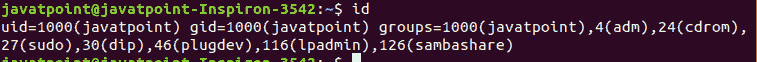
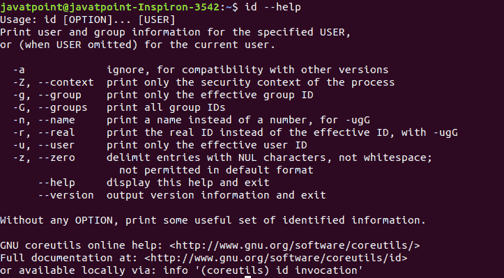
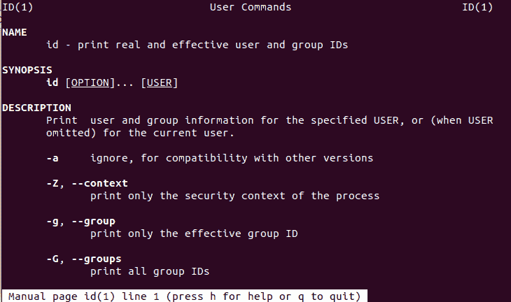

# Linux id 命令

> 原文：<https://www.javatpoint.com/linux-id-command>

Linux **id** 命令用于打印真实有效的用户 id 和组 ID。用户标识是一个特定的用户身份，而组标识可以包含多个用户身份。该命令是用户管理的有用工具。

对于新用户来说，跟踪用户和组的名称及其对应的 uid 和 GID 是一项复杂的任务。这对用户管理很重要。在这种情况下，id 命令会帮助我们。

**语法:**

```

id [option]... [user name]

```

**选项:**

id 命令支持的选项如下:

*   **-a:** 用于忽略与其他版本的兼容性。
*   **-Z，- context:** 仅用于打印流程的安全上下文。
*   **-g，- group:** 仅用于打印有效的 GID。
*   **-G，-group:**用于打印所有组 id。
*   **-n，- name:** 用于打印名称而不是数字。
*   **-r，- real:** 用于打印真实身份证而不是有效身份证，带-ugG
*   **-u、- user:** 用于只打印有效的 UID。
*   **-z，- zero:** 用于以空字符分隔条目，空白除外；
*   **-帮助:**用于显示帮助文档并退出。

## 怎么用？

id 命令是一个内置实用程序；因此，我们不需要安装任何附加工具来使用它。“id”命令可以在没有参数的情况下使用。按如下方式执行命令:

```

id

```

根据上面的命令，输出将使用活动用户。它的默认行为如下:



从上面的输出中，我们可以看到有几个字段。前两个字段是用户“javatpoint”的 UID 和 GID。而其余的是具有各自的 GID 的组，javatpoint 是其中的一部分。

让我们看看 id 命令的其他一些有用的例子。

### 查找特定用户的 UID

要查找用户的特定用户标识，请使用“-u”选项执行命令。比如说。找到用户“javatpoint”的用户标识，执行如下命令:

```

id -u javatpoint

```

考虑以下输出:


### 查找特定用户的 GID

要查找特定用户的 GID，请使用“-g”选项执行命令。例如，要查找用户“javatpoint”的 GID，请执行以下命令:

```

id -g javatpoint

```

考虑以下输出:


### 显示真实的 GID 和 UID，而不是有效的

我们可以通过使用“-r”选项执行命令来显示真实的 UID 和 GID，而不是有效的 ID。

要显示用户“javatpoint”的真实 UID 和 GID，请执行以下命令:

```

id -r -u javatpoint
id -r -g javatpoint

```

考虑以下输出:


### 显示所有不同的组标识

要显示所有不同的 GID，请使用“-G”选项执行命令，如下所示:

```

id -G

```

考虑以下输出:


### 显示有效的组标识

要仅显示有效的 GID，请使用“-g”选项执行命令，如下所示:

```

id -g

```

考虑以下输出:


## 获得帮助

如果您在使用 id 命令时遇到困难，您可以从终端获得帮助。您可以阅读手册页和帮助文档。要获得帮助，请执行以下命令:

```

id --help

```

上述命令将显示如下帮助文档:



要阅读手册，请执行以下命令:

```

man id

```

它将显示手册，如下所示:



* * *