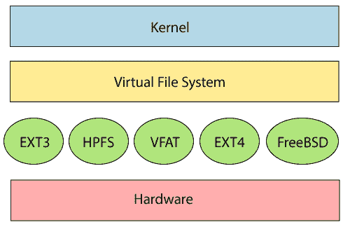
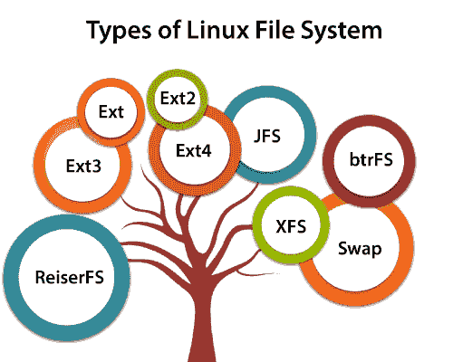

# Linux 文件系统

> 原文：<https://www.javatpoint.com/linux-file-system>

Linux 文件系统是磁盘驱动器或分区上文件的结构化集合。分区是内存的一部分，包含一些特定的数据。在我们的机器中，内存可以有不同的分区。通常，每个分区都包含一个文件系统。

通用计算机系统需要系统地存储数据，以便我们可以在更短的时间内轻松访问文件。它将数据存储在硬盘或一些等效的存储类型上。维护文件系统可能有以下原因:

*   主要是计算机将数据保存到内存中；如果关闭，它可能会丢失数据。但是，有非易失性内存(闪存和固态硬盘)可用于在电源中断后维护数据。
*   与标准内存相比，硬盘上的数据存储是首选，因为内存比磁盘空间更贵。相对于内存，硬盘成本在逐渐下降。

[Linux](https://www.javatpoint.com/linux-tutorial) 文件系统包含以下部分:

*   根目录(/)
*   特定的数据存储格式(EXT3、EXT4、BTRFS、XFS 等)
*   具有特定文件系统的分区或逻辑卷。

## 什么是 Linux 文件系统？

Linux 文件系统一般是 [Linux 操作系统](https://www.javatpoint.com/what-is-linux)的内置层，用于处理存储的数据管理。它有助于在磁盘存储器上排列文件。它管理文件名、文件大小、创建日期以及关于文件的更多信息。

如果我们的文件系统中有不支持的文件格式，我们可以下载软件来处理它。

## Linux 文件系统结构

Linux 文件系统有一个分层的文件结构，因为它包含一个根目录及其子目录。所有其他目录都可以从根目录访问。一个分区通常只有一个文件系统，但它可能有多个文件系统。

文件系统的设计方式可以管理非易失性存储数据并为其提供空间。所有文件系统都需要命名空间，这是一种命名和组织方法。命名空间定义命名过程、文件名长度或可用于文件名的字符子集。它还定义了内存段上文件的逻辑结构，例如使用目录来组织特定的文件。一旦描述了名称空间，就必须为该特定文件定义元数据描述。

数据结构需要支持分层目录结构；此结构用于描述特定数据块的可用和已用磁盘空间。它还包含有关文件的其他详细信息，如文件大小、创建日期和时间、更新和上次修改。

此外，它还存储有关磁盘部分的高级信息，如分区和卷。

高级数据及其表示的结构包含有关存储在驱动器上的文件系统的信息；它是独特的，独立于文件系统元数据。

Linux 文件系统包含两部分的文件系统软件实现架构。请考虑下图:

文件系统需要一个API来访问函数调用，以便与文件和目录等文件系统组件进行交互。 [API](https://www.javatpoint.com/api-full-form) 方便创建、删除和复制文件等任务。它简化了定义文件系统上文件排列的算法。

给定文件系统的前两部分合起来称为 **Linux 虚拟文件系统**。它为内核和开发人员提供了一组访问文件系统的命令。这个虚拟文件系统需要特定的系统驱动程序为文件系统提供接口。

## Linux 文件系统特性

在 Linux 中，文件系统创建一个树形结构。所有的文件都排列成一棵树和它的分支。最上面的目录叫做**根目录(/)目录**。Linux 中的所有其他目录都可以从根目录访问。

Linux 文件系统的一些关键[特性如下:](https://www.javatpoint.com/linux-features)

*   **指定路径:** Linux 不使用反斜杠(\)分隔组件；它使用正斜杠(/)作为替代。例如，在 Windows 中，数据可能存储在 C:\ My Documents\ Work 中，而在 Linux 中，数据可能存储在/home/My Documents/Work 中。
*   **分区、目录和驱动器:** Linux 不像 Windows 那样使用驱动器号来组织驱动器。在 Linux 中，我们无法判断我们是在寻址一个分区、一个网络设备，还是一个“普通”目录和一个驱动器。
*   **区分大小写:** Linux 文件系统区分大小写。它区分小写和大写文件名。比如，Linux 中的 test.txt 和 Test.txt 是有区别的。这个规则也适用于目录和 Linux 命令。
*   **文件扩展名:**在 Linux 中，一个文件可能有扩展名’。但是文件不一定要有文件扩展名。在使用 Shell 时，它为初学者区分文件和目录带来了一些问题。如果我们使用图形文件管理器，它象征着文件和文件夹。
*   **隐藏文件:** Linux 区分标准文件和隐藏文件，大部分配置文件都隐藏在 Linux OS 中。通常，我们不需要访问或读取隐藏的文件。Linux 中隐藏的文件用点(。)放在文件名之前(例如。忽略)。要访问这些文件，我们需要在文件管理器中更改视图，或者需要在 shell 中使用特定的命令。

## Linux 文件系统的类型

当我们安装 Linux 操作系统时，Linux 提供了许多文件系统，如 **Ext、Ext2、Ext3、Ext4、JFS、ReiserFS、XFS、btrfs、**和 **swap** 。

让我们详细了解一下这些文件系统:

### 1.Ext、Ext2、Ext3 和 Ext4 文件系统

文件系统 Ext 代表**扩展文件系统**。它主要是为 **MINIX OS** 开发的。Ext 文件系统是一个旧版本，由于某些限制不再使用。

**Ext2** 是第一个允许管理 2tb 数据的 Linux 文件系统。Ext3 是通过 Ext2 开发的；它是 Ext2 的升级版本，包含向后兼容性。Ext3 的主要缺点是不支持服务器，因为这个文件系统不支持文件恢复和磁盘快照。

**Ext4** 文件系统是所有 Ext 文件系统中速度较快的文件系统。它是固态硬盘非常兼容的选项，也是 Linux 发行版中的默认文件系统。

### 2.JFS 文件系统

JFS 代表**日志文件系统**，由 **IBM 为 AIX Unix** 开发。它是 Ext 文件系统的替代方案。它也可以用来代替 Ext4，Ext4 需要稳定性，而且资源很少。当[中央处理器](https://www.javatpoint.com/cpu-full-form)功率有限时，这是一个方便的文件系统。

### 3.ReiserFS 文件系统

ReiserFS 是 Ext3 文件系统的替代方案。它具有改进的性能和先进的功能。在早期，在 SUSE Linux 中使用 ReiserFS 作为默认文件系统，但是后来它改变了一些策略，所以 SUSE 回到了 Ext3。该文件系统动态支持文件扩展名，但在性能上有一些缺点。

### 4.XFS 文件系统

XFS 文件系统被认为是高速 JFS，是为并行输入输出处理而开发的。美国宇航局仍在使用这种文件系统及其高存储服务器(300+太字节服务器)。

### 5.文件系统

Btrfs 代表 **B 树文件系统**。它用于容错、修复系统、有趣的管理、广泛的存储配置等等。它不适合生产系统。

### 6.交换文件系统

在系统休眠期间，交换文件系统用于 Linux 操作系统中的内存分页。从未进入休眠状态的系统需要交换空间等于其[内存](https://www.javatpoint.com/ram-full-form)大小。

* * *