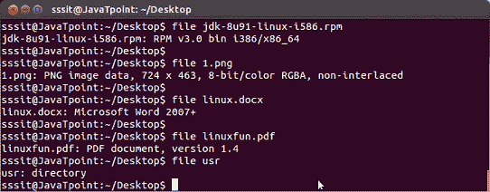

# Linux 文件命令

> 原文：<https://www.javatpoint.com/linux-file>

file 命令用于确定文件类型。它不关心文件使用的扩展名。它只是使用文件命令并告诉我们文件类型。它有几个选项。

**语法:**

```
file  
```

**示例:**

```
file 1.png

```



在上面的快照中，您可以看到 file 命令以及指定其文件类型的不同参数。

**注意:** File 命令借助一个神奇的文件告诉我们文件类型，这个文件包含了识别一个文件类型的所有模式。魔法文件的路径是/usr/share/file/magic。有关更多信息，请输入命令“人类 5 魔法”。

## Linux 文件命令选项

| [计]选项 | 功能 |
| [文件-s](linux-file-s) | 用于特殊文件。 |
| [文件*](linux-file-asterisk) | 用于列出所有文件的类型。 |
| [文件/目录名/*](linux-file-directory-name) | 用于列出上述目录中所有文件的类型。 |
| [文件[范围]*](linux-file-range) | 它将列出给定范围内从字母表开始的所有文件。 |

* * *