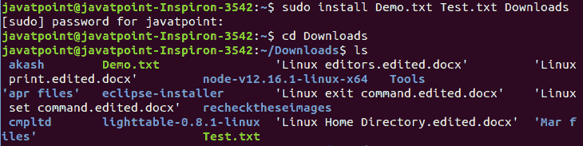

# Linux 安装命令

> 原文：<https://www.javatpoint.com/linux-install-command>

Linux **install** 命令用于将文件复制到指定的目的地并设置属性。它将文件复制到指定的目标。*它不是用来安装程序的，因为它的名字指定了*。要下载和安装一个程序，我们必须使用 **apt-get，apt，yum 和更多的实用程序，这取决于发布的类型**。

它非常类似于“cp”命令。此外，它允许我们控制目标文件的属性。它通常用于将程序复制到 makefiles 文件的目标目录中。它拒绝自己复制文件。

安装命令结合了不同命令的元素，如 [cp](https://www.javatpoint.com/linux-cp) 、chown、chmod、 [mkdir](https://www.javatpoint.com/linux-mkdir) 和剥离命令。它允许我们在一个动作中使用所有这些命令的特性。

安装命令的功能如下:

*   它用于复制文件，如 cp 命令。
*   它提供了选择是否覆盖现有文件的功能。
*   如果目标目录不存在，则用于创建目标目录。
*   它用于设置文件的用户权限标志，就像 chmod 命令一样。
*   它用于设置文件的所有者。
*   它用于从可执行文件中移除非必要的包袱。

### 语法:

```

install [OPTION]... [-T] SOURCE DEST
install [OPTION]... SOURCE... DIRECTORY
install [OPTION]... -t DIRECTORY SOURCE...
install [OPTION]... -d DIRECTORY...

```

### 选项:

install 命令支持的选项如下:

*   **-备份[=CONTROL]:** 此选项为每个现有的目标文件创建一个备份文件。
*   **-b:** 它就像一个“- backup”选项，但它不接受参数。
*   **-C、- compare:** 用于比较每对源文件和目标文件，在某些情况下，根本不修改目标。
*   **-d，- directory:** 如果指定了“-d 或- directory”选项，它会将所有参数视为目录名。
*   **-D:** 用于创建目标目录的所有组件；之后，它将源复制到目标。
*   **-g，- group=GROUP:** 用于设置集团持股。
*   **-m，- mode=MODE:** 用于设置权限模式(如在 chmod 中)，而不是 rwxr-xr-x。
*   **-o，- owner=OWNER:** 用于设置所有权。它只能由超级用户使用。
*   **-p、-preserve-时间戳:**将源文件的访问时间应用到指定文件。
*   **-s，-条带:**用于条带符号表。
*   **- strip-program=PROGRAM:** 用于剥离程序中的二进制文件。
*   **-S，-后缀=后缀:**用于覆盖通常的备份后缀。
*   **-t，-target-DIRECTORY = DIRECTORY:**用于将所有源参数复制到指定的目录中。
*   **-T、-无目标目录:**用于将目的文件视为普通文件。
*   **-v，- verbose:** 用于打印每个目录的名称。
*   **-保留上下文:**用于保留 SELinux 安全上下文。
*   **-Z:** 用于设置目的文件的 SELinux 安全上下文，将每个创建的目录设置为默认类型。
*   **-帮助:**-‘帮助’选项显示帮助手册。
*   **-版本:**用于显示版本信息。

## 如何将文件复制到目录中？

我们可以使用 install 命令根据需要自定义每个文件夹和文件。它的用法如下:

```

install -D /source/folder/*.txt /destination/folder

```

从上面的命令中，***“-D”选项会将所有文本文件从源文件夹复制到目标文件夹。*T3】**

如果需要创建新的目标文件夹，请执行以下命令:

```

install -d /destination/New_folder

```

上面的命令将在指定的目录中创建一个“新文件夹”。例如，要将两个文件“Demo.txt”和“Test.txt”复制到“Downloads”目录，请执行以下命令:

```

sudo install Demo.txt Test.txt Downloads

```

上面的命令将把给定的文件复制到“下载”文件夹。考虑以下输出:



* * *