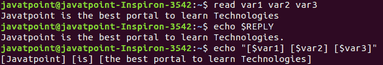
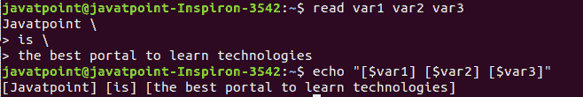
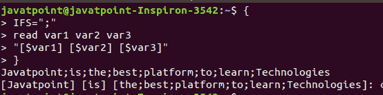
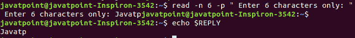
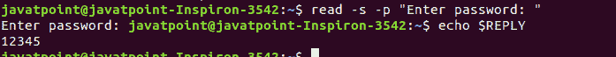

# Linux 读取命令

> 原文：<https://www.javatpoint.com/linux-read-command>

Linux **read** 命令用于将一行的内容读入一个变量。这是 [Linux 系统](https://www.javatpoint.com/linux-tutorial)的内置命令。因此，我们不需要安装任何额外的工具。这是一个在创建 bash 脚本时获取用户输入的简单工具。它是一个强大的工具，与回声命令和位置参数一样重要。它用于拆分绑定到 shell 变量的单词。它主要用于接受用户输入，但也可用于在接受输入时实现功能。

**语法:**

read 命令的基本语法如下:

```

read [options] [name...]

```

## 如何使用 read 命令？

**读取**命令可以有参数也可以无参数使用。让我们看看 read 命令的各种用法:

*   **默认行为**

如果我们在没有任何参数的情况下传递 read 命令，它会将一行作为用户输入，并将其存储在内置变量' **REPLY'** 中。按照以下方式执行命令:

```

read

```

上述命令将要求用户输入。输入用户输入并按回车键保存。要显示输入的内容，请执行以下命令:

```

echo $REPLY

```

上述命令将显示来自“回复”变量的存储输入。

**考虑以下输出:**


*   **指定变量来存储数值**

我们可以指定变量来存储输入。如果指定变量的数量少于输入的单词，默认情况下，它会将所有剩余的单词存储在最后一个变量中。考虑以下命令:

```

read var1 var2 var3
Javatpoint is the best portal to learn Technologies // Entered text

```

上面的命令将在“var1”中存储“Javatpoint”，在“var2”中存储“is”，在“var3”中存储所有剩余的单词。要验证这些值，请执行以下命令:

```

echo "[$var1] [$var2] [$var3]"

```

上述命令将显示变量值。考虑以下输出:



默认情况下，read 命令将<space>、<tab>和<newline>字符视为单词，并根据这些字符分割输入。但是我们可以使用多行来传递输入，用反斜杠“\”分隔每行。考虑以下命令:</newline></tab></space>

```

read var1 var2 var3
Javatpoint \  
> is \ 
> the best portal to learn technologies

```

上面的命令将每一行作为输入字符，并将它存储到指定的变量中。要验证这些值，请执行以下命令:

```

echo "[$var1] [$var2] [$var3]"

```

考虑以下输出:



*   **内部磁场分离器**

内部字段分隔符(IFS)用于分隔输出字段，并确定给定行中的字边界。我们可以根据自己的需要来设置。执行以下脚本:

```

{
IFS=";"
read var1 var2 var3
"[$var1] [$var2] [$var3]"
}
Javatpoint;is;the;best;platform;to;learn;Technologies // Entered text

```

从上面的脚本中，输出将由分号分隔。考虑以下输出:



### 选择

以下是与 read 命令一起使用的一些有用的参数选项:

*   **read -p**

“-p”选项用于**提示文本**。它读取数据和一些提示文本。这个提示文本帮助我们输入文本，比如输入什么。考虑以下命令:

```

read -p " Enter your name: "

```

上面的命令会询问姓名，输入姓名。该名称将存储到“REPLY”变量中。要显示变量值，请执行以下命令:

```

echo " My name is $REPLY"

```

考虑以下输出:


*   **read -n**

“-n”选项限制输入文本中字符的长度。它不会让您输入超过指定字符数的文本。达到字符限制后，自动停止读取。要将字符限制在六个以内，请执行以下命令:

```

read -n 6 -p " Enter 6 characters only: "

```

上面的命令不会让我们输入超过 6 个字符。考虑以下输出:



*   **read -s**

“-s”选项用于**安全目的**。它用于读取敏感数据。使用此选项，输入的文本不会出现在终端中。我们可以在这个选项中使用其他选项。该选项读取字符。主要用于从键盘读取密码。考虑以下命令:

```

read -s -p "Enter password: "

```

上面的命令会提示输入密码，当我们输入密码时，它不会显示在终端上。考虑以下输出:



从上面的输出来看，密码没有显示在终端上，但是值已经存储在变量中。

* * *