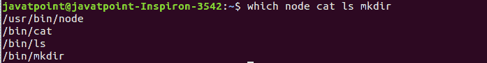
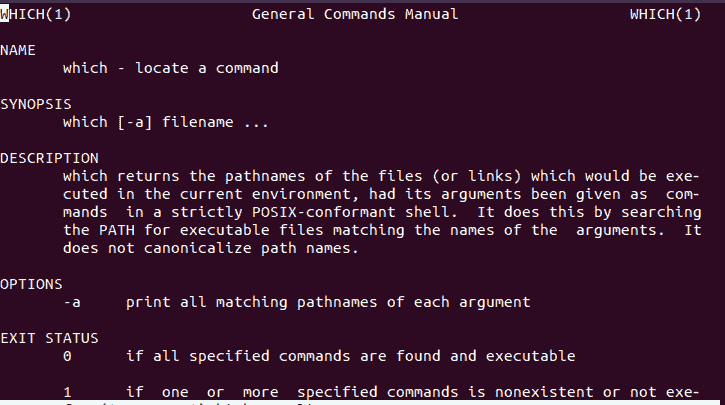

# Linux 哪个命令

> 原文：<https://www.javatpoint.com/linux-which-command>

Linux**命令用于**从文件系统中定位可执行文件**或程序的位置。它显示存储指定文件或命令的路径。**

 **如果你很想知道指定的程序存储在哪里，**哪个**命令会帮你识别路径，用起来还是挺直接的。

### 语法:

```

which <program name>

```

上述命令将显示指定文件名或命令的路径。

### 选择

该命令仅通过一个选项来实现，即“-a”选项。它用于显示指定命令的所有路径。在某些情况下，我们的机器包含同一程序的两条不同路径。比如可以是“/usr/bin/program”或者“/usr/local/bin/program”。“-a”选项将显示指定命令的两个路径。

### 语法:

```

which -a <program_name>

```

让我们探索这个命令的各种用法，以便更好地理解它:

## 怎么用哪个命令？

要显示任何可执行文件(如程序和命令)的路径，只需执行**，该**命令后面跟着程序名。

例如，要显示节点可执行文件的路径，请执行以下命令:

```

which node

```

它将显示节点可执行文件的路径。考虑以下输出:


同样，对于 Java 可执行文件，执行如下命令:

```

which java

```

它将显示 Java 可执行文件的路径。

哪个命令只显示可执行文件的路径，所以只使用机器中可用的参数来执行命令。如果我们传递任何非法参数(我们的机器不包含)，它将不会给出任何输出。

### 哪个命令有多个参数

通过在单个命令中一次提供多个参数，我们可以显示可执行文件的多条路径。要在哪个命令中传递多个参数，请用空格分隔它们。按如下方式执行命令:

```

which <command1> <command2> <command3> ...

```

例如，要显示节点、cat、ls 和 mkdir 命令的路径，请执行以下命令:

```

which node cat ls mkdir

```

上面的命令将在新的一行中显示所有指定命令的路径。考虑以下输出:



### 哪个命令的退出状态

Linux 用户处于退出状态，或者由 shell 脚本执行。如果退出状态为 0，则表示命令成功执行，没有任何错误。如果退出状态为非零数字(即 1 到 255)，则表示该命令出错并且失败。

哪个命令有以下三种退出状态:

**0:** 如果退出状态为 0，则表示找到所有参数并可执行。

**1:** 如果退出状态为 1，则表示一个或多个参数不存在或不可执行。

**2:** 如果退出状态为 2，则表示指定了无效选项。

## 寻求帮助

如果您在使用哪个命令时遇到问题，您可以通过显示哪个命令的手册从您的终端获得帮助。

要显示手册，请执行 man 命令，如下所示:

```

man which

```

上述命令将显示手册。考虑以下输出:



要退出手动模式，请按下**‘q’**键。

我们也可以执行**信息**命令来显示手册:

```

info which

```

上述命令将显示与 man 命令相同的输出。

* * ***