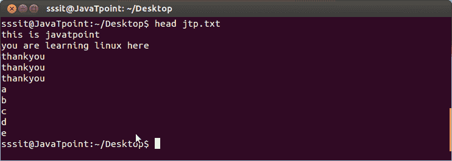
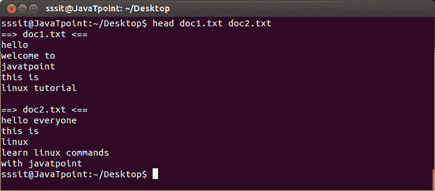
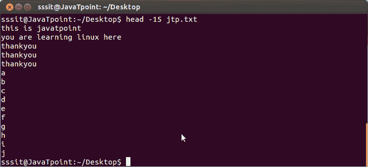
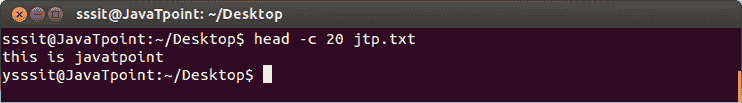

# Linux head 命令

> 原文：<https://www.javatpoint.com/linux-head>

“head”命令显示文件的开始内容。默认情况下，它显示任何文件的前 10 行。

**语法:**

```
head 
```

**示例:**

```
head jtp.txt

```



看上面的快照，命令**“head jtp . txt”**已经显示了文件的前十行**‘jtp . txt’**。

* * *

## 多个文件的 Head 命令

如果我们写两个文件名，那么它将显示由标题分隔的每个文件的前十行(在这种情况下，文件只有五行)。

**语法:**

```
head 
```

**示例:**

```
head doc1.txt doc2.txt

```



看上面的快照，借助**“head doc1 . txt doc2 . txt”**命令，两个文件的内容以单独的标题显示。

* * *

## Linux 头 n

“head -n”选项显示指定的行数。

**语法:**

```
head -n 
```

**示例:**

```
head -15 jtp.txt

```



看上面的快照，15 行由**“head-15 jtp . txt”**命令显示。

**注:**以上示例语法也可以写成**“head-n15 jtp . txt”**或**“head-n 15 jtp . txt”**。在所有情况下，结果都是一样的。

* * *

## Linux head -c

“head -c”命令计算文件的字节数。

**语法:**

```
head -c 
```

**示例:**

```
head -c 20 jtp.txt

```



看上面的快照，借助命令**“head-C20 jtp . txt”**显示文件**‘jtp . txt’**的 20 字节内容。

**注意:**字节计数与行计数不同，只有一种语法。

如果使用**head-c&ltnumber&GTK&ltfile name&gt”**，那么它将通过将数字乘以后缀来返回结果。后缀可以是“b(字节=512)、k(千字节=1024)和 m(兆字节=1048576)”。

* * *