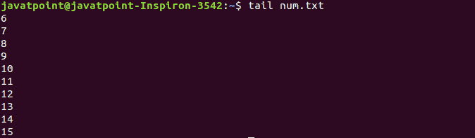
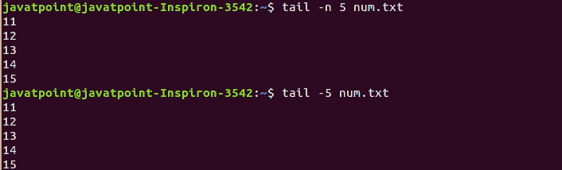
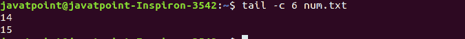
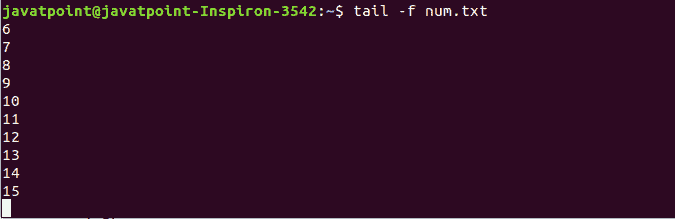
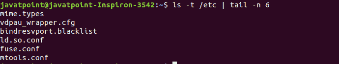

# Linux 尾命令

> 原文：<https://www.javatpoint.com/linux-tail>

Linux tail 命令用于显示一个或多个文件的最后十行。它的主要目的是读取错误信息。默认情况下，它显示文件的最后十行。此外，它还用于实时监控文件更改。是[头命令](https://www.javatpoint.com/linux-head)的补充命令。

### 语法:

```

tail <file name>

```

让我们通过一些例子来深入了解一下尾部命令。

### 默认行为

tail 命令的默认用法显示文件的最后十行。[创建一个文件](https://www.javatpoint.com/linux-create-file) ' **num.txt'** 具有数字 1 到 15(每一个数字在一个新的行中)。

让我们通过执行没有任何参数的 tail 命令来打开它，如下所示:

```

tail num.txt

```

考虑以下输出:



从上面的输出中，我们可以看到显示了‘num . txt’的最后十行。

### 显示具体的行数

**'-n'** 选项显示指定的行数。要指定行数，请执行以下命令:

```

tail -n <number> <file name>

```

它将显示从最后一行开始的指定行数。考虑下面的例子:

```

tail -n 5 num.txt

```

上面的命令将显示文件‘num . txt’的最后五行。我们也可以省略字母“n ”,我们可以使用连字符(-)和没有任何空格的数字。考虑以下输出:



从上面的输出中我们可以看到，显示了‘num . txt’的最后五行。

### 显示指定的字节数

“-c”选项显示从最后一个开始的指定字节数。要显示指定的字节数，请执行以下命令:

```

tail -c <number> <file name>

```

它将显示指定的字节数。考虑以下示例:

```

tail -c 6 num.txt

```

上面的命令将显示从最后一个开始最多 6 个字节的文件内容。考虑以下输出:



从上面的输出中，显示了文件“num.txt”的最后六个字节。

我们也可以使用带有数字如 b、kb、k、MB 等的后缀来指定字节数。这些后缀乘以指定的数字如下:

b:乘以 512。

kb:乘以 1000。

k:乘以 1024。

MB:乘以 1000000。

### 跟踪文件的更改

要跟踪文件的更改，请使用“-f”选项。在这里，'-f '代表以下内容。这对于监控日志文件很有用。执行以下命令:

```

tail -f num.txt

```

上面的命令将监控文件' num.txt '。要退出监控，请按“CTRL+C”键。考虑以下输出:



### 显示多个文件

通过执行 tail 命令，我们可以一次显示多个文件。要显示多个文件，请提供文件名作为输入。它将显示指定文件的最后十行。

例如，我们有另一个文件“alphabet.txt”，它包含新行中字母表的每个字符。要同时显示文件“num.txt”和“alphabet.txt”，请执行以下命令:

```

tail num.txt alphabet.txt

```

上述命令将显示指定文件的最后十行。考虑以下输出:


从上面的输出中，我们可以看到指定文件的最后十行同时显示。

### 跟随其他命令

tail 命令可以与其他命令一起使用。它可以通过管道传输到其他命令来过滤输出。考虑以下命令:

```

ls -t /etc | tail -n 6

```

从上面的命令中，我们已经用 ls 命令传送了 tail 命令。它将只显示最长时间前修改过的六个文件或文件夹。考虑以下输出:



让我们用 [ps 命令](https://www.javatpoint.com/linux-ps)执行尾部命令，显示顶部运行过程。按如下方式执行命令:

```

ps aux | sort -nk +3 | tail -2

```

考虑以下输出:


* * *