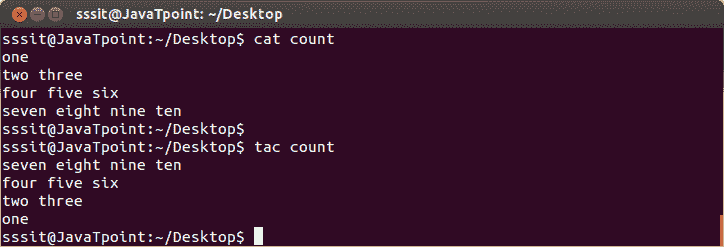
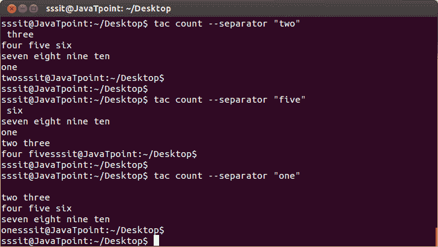

# Linux tac 命令

> 原文：<https://www.javatpoint.com/linux-tac>

“tac”命令与“cat”命令相反。它也被称为向后的‘猫’。它将以相反的顺序显示文件内容。它先打印最后一行，然后是倒数第二行，依此类推。这样，它最后打印第一行。

**语法:**

```
tac 
```

**示例:**

```
tac count

```



看上面的快照；我们已经用命令“cat”和“tac”显示了文件**“count”**，以显示两者之间的区别。

* * *

## 要分离内容

“tac - separator”命令会将上述字符串或关键字的内容与文件内容的其余部分分开。

**语法:**

```
tac --separator "<string>"</string> 
```

**示例:**

```
tac count --separator "two"
tac count --separator "five"
tac count --separator "one"

```



看上面的快照，在第一个例子中；借助**‘tac count-separator‘two’**命令，我们已经将文件‘count’的内容从字符串“two”分离到其余内容。然后，在接下来的示例中，我们将内容与字符串“五”和“一”分开。