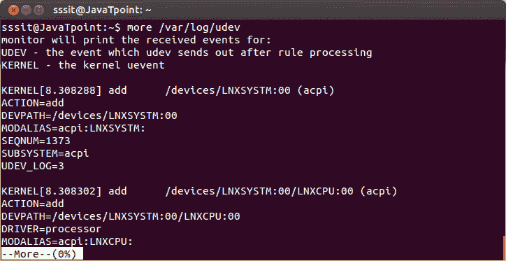

# Linux 更多命令

> 原文：<https://www.javatpoint.com/linux-more>

作为“cat”命令显示文件内容。同样,“更多”命令也显示文件的内容。唯一不同的是，在文件较大的情况下，“cat”命令输出将滚动离开您的屏幕，而“more”命令一次显示一整屏的输出。

“更多”命令中使用了以下键来滚动页面:

*   回车键:逐行向下滚动页面。
*   空格键:转到下一页。
*   b 键:转到后一页。
*   / key:用于搜索字符串。

**语法:**

```
more 
```

**示例:**

```
more /var/log/udev

```



看上面的快照，在左上角显示 0%，表示显示 0%页面。

使用**‘空格’**按钮向下滚动，将显示下一页。

如果您想逐行向下滚动页面，请使用**“回车”**键。

如果您想转到最后一页或向后一页，请使用**‘b’**键。

* * *

## Linux 更多选项

| 选择 | 功能 |
|  | 限制每页显示的行数。 |
|  | 在右上角显示用户消息。 |
|  | 挤压空行。 |
|  | 找到绳子有帮助。 |
|  | 用于显示特定行的内容。 |

**注意:**不能用‘more’命令显示二进制文件。