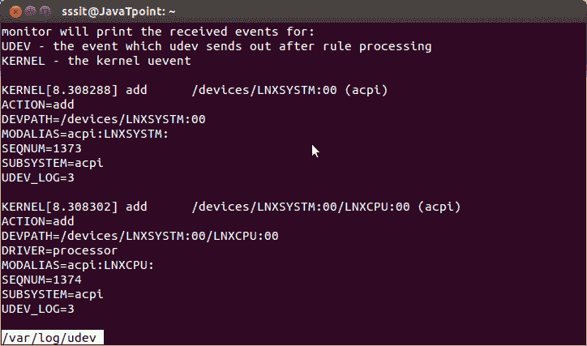
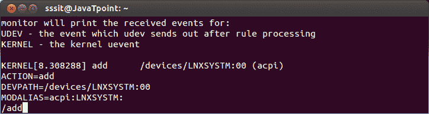
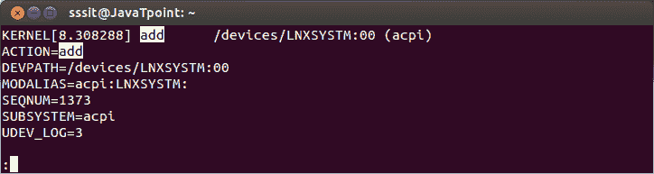

# Linux 无命令

> 原文：<https://www.javatpoint.com/linux-less>

“更少”命令与“更多”命令相同，但包含更多功能。

它会根据终端窗口的宽度和高度自动调整，而“更多”命令会随着终端窗口的宽度变短而剪切内容。

**语法:**

```
less 
```

**示例:**

```
less /var/log/udev

```



看上面的快照，我们已经给出了命令**“less/var/log/udev”**。左上角显示文件的名称。

* * *

## 寻找字符串

通过键入正斜杠(/)搜索特定的字符串，然后在接线盒左下角的文件名处键入字符串名称。

**语法:**

```
/string name

```

**示例:**

```
/add

```



看上面的快照，我们想找到字符串‘add’，因此我们在左下角输入了 **"/add"** 。

**输出:**快照下方，显示命令**/【添加】**的输出。字符串“add”将自动突出显示。



## 更少的命令导航键

“less”命令具有类似于“vim”编辑器的导航键。让我们来看看一些导航键和其他操作的少命令。

### 1.搜索导航

搜索导航键将帮助您向前和向后搜索。

**向前搜索**

*   /:搜索下一次出现的模式
*   n:搜索下一个匹配项
*   n:搜索以前的匹配

**向后搜索**

*   ？:搜索下一次出现的模式
*   n:在下一场比赛中
*   前向比赛

**搜索路径**

转发:/\/home\/sssit\/

向后:/home/sssit

### 2.屏幕导航

*   Ctrl + f:向前移动一个窗口
*   Ctrl + d:向前半窗
*   Ctrl + b:向后一个窗口
*   Ctrl + u:向后半窗

### 3.线路导航

一行一行地向前或向后移动

*   j:向前移动一行
*   k:向后一行

### 4.其他导航

*   g:用于转到文件的末尾
*   g:用于转到文件的开头
*   q 或 ZZ:退出

### 5.计数键

*   10j:向前 10 行
*   10k:向后 10 行

### 6.标记导航

*   马:用字母“a”标记当前位置
*   去标记的位置

### 7.多文件

*   通过在同一行传递参数

```
less file1 file2

```

*   查看文件 1 时，转到文件 2

```
less file1

:e file2

```

打开两个以上文件时在文件间导航

*   n:转到下一文件
*   转到上一个文件

* * *