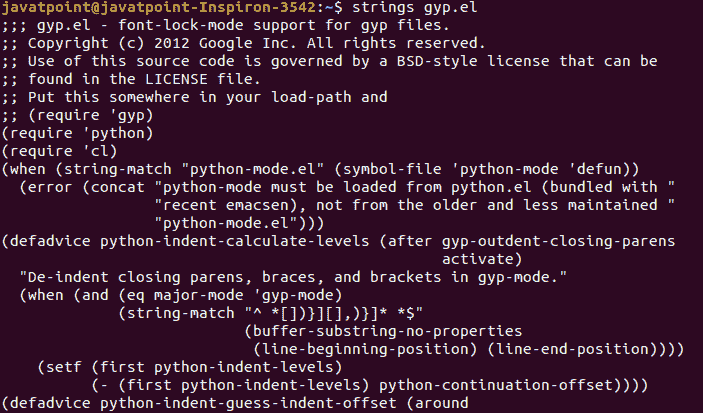
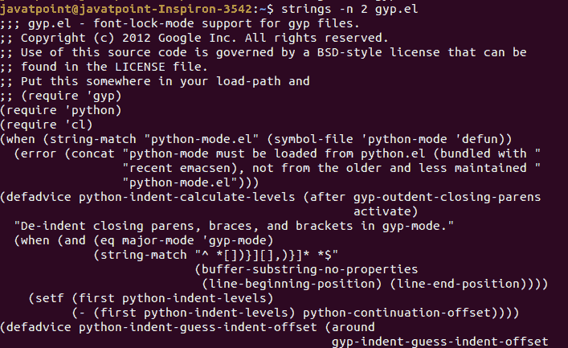
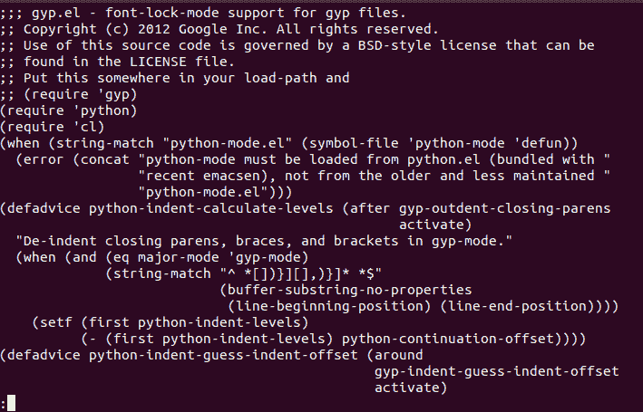
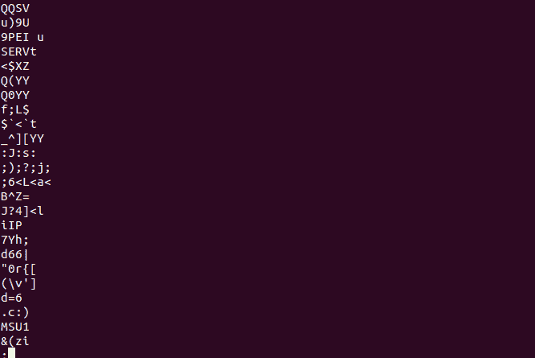
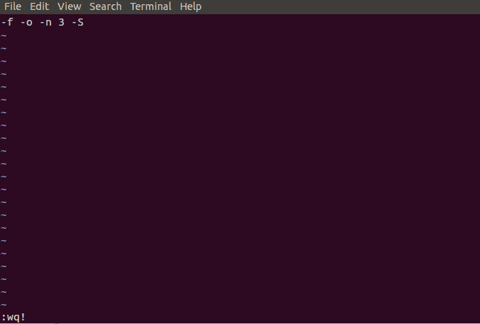
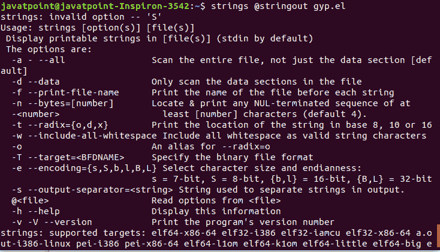
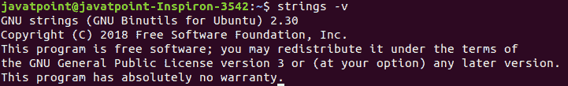

# Linux 字符串命令

> 原文：<https://www.javatpoint.com/linux-strings-command>

Linux strings 命令用于将**字符串返回到文件**中。它主要侧重于确定二进制文件(非文本文件)的内容并从中提取文本。

对于人类来说，从可执行文件中找出文本是一项复杂的任务。二进制文件，如程序文件，包含人类可读的文本。如果我们使用 cat 或更少的命令，这些文件会很大；这可能会导致终端挂断。

一个文件中可以有两种类型的字符；可打印和不可打印。字母数字字符、标点符号或空格被称为可打印字符；除了可打印字符，所有字符都称为不可打印字符。

简单来说，我们可以说*它从文件中提取可打印的字符，这样其他命令就可以使用没有不可打印字符的字符串*。

这里，问题出现了，为什么我们要把文本放在可执行文件中？部署应用程序或软件时，大多数开发人员会打包二进制文件。但是最好在二进制文件中打包一些 ASCII 文本。这将有助于用户和开发人员更多地了解可执行文件。

因此，strings 命令对于确定非文本文件的内容非常有用。

## 怎么用？

使用 strings 命令是直截了当的，只需将文件名作为参数传递并执行即可。我们用一个例子来理解。

我们有一个名为 gyp.el 的系统文件。要从该文件中提取字符串，请执行以下命令:

```

strings gyp.el

```

考虑以下输出:



## 自定义字符限制

默认情况下，strings 命令仅打印至少四个字符长的字符序列。但是，我们可以通过使用 **-n** 选项来强制更改该限制。它允许我们通过数字来表示极限。

建议使用更高的限制，因为使用的数字越短，看到的垃圾就越多。

要设置两个字符的限制，请执行以下命令:

```

strings -n 2 gyp.el

```

考虑以下输出:



虽然上面的输出包含太多的字符串，所以识别这两个字符串很复杂，但是我们可以理解 strings 命令是如何工作的。

## 管道极限

如果我们有一个包含冗长输出的文件，我们可以用较少的管道传输它。它将显示较少的输出，我们可以根据需要滚动和追加输出。

要通过更少的管道传输限制，请执行以下命令:

```

strings gyp.el | less

```

考虑以下输出:



我们可以通过向下滚动来追加上面的输出。

## 如何使用 Strings 命令查看 RAM？

strings 命令不仅仅局限于文件。它允许我们浏览计算机系统的内存。我们需要使用 Sudo 特权，因为我们正在访问 **/dev/mem，**，它保存着我们系统主内存的蓝图。按如下方式执行命令:

```

sudo strings /dev/mem | less

```

在上面的命令中，我们使用较少的来限制输出。考虑以下输出:



## 包括空白

strings 命令的默认行为包含空白作为可打印字符。因此，如果我们有一个字符串，“Javatpoint 是学习技术的最佳平台之一”，那么 strings 命令将返回整个文本。

它不会将新的行字符和回车符视为可打印字符。

要打印识别新行字符并将回车符作为可打印字符的字符串，请执行以下命令:

```

strings -w File_name

```

## 更改编码

strings 命令提供四种类型的编码选项，如下所示:

**s:** 7 位字节(用于 ASCII，ISO 8859)

**S:** 8 位字节

**b:** 16 位 bigendian

**l:** 16 位 littleendian

默认选项为**；**7 位字节。

我们可以改变编码；要更改它，请执行以下命令:

```

strings -e S file_name

```

或者

```
strings --encoding=S file_name

```

在上面的命令中，我们将编码指定为**S**，这意味着 8 位字节编码。您可以指定上述选项中的任何一个，只需用您选择的编码字母替换**。**

 **## 从文件读取选项

如果您重复使用相同的选项，则不需要每次都指定。相反，您可以创建一个文件并在该文件中指定选项。

要创建指定选项的文件，请执行以下命令:

```

vi stringout

```

上面的命令将打开 vi 编辑器。这里我们使用 vi 编辑器创建一个文件；您可以选择您选择的任何编辑器。

按下 **ESC** 和**‘I’**键进入插入模式。键入您想要指定的选项，如下所示:

```

-f -o -n -S

```

>

输入选项后，按 **ESC** 和 **:wq 保存文件！**钥匙。请考虑下图:



要使用指定的选项运行 strings 命令，请按如下方式执行该命令:

```

strings @stringsopts gyp.el

```

上面的命令将使用指定的选项执行命令。gyp.el 是我们正在使用的文件名；您可以键入您的文件名。考虑以下输出:



## 获得帮助

如果你在使用 strings 命令时卡住了。您可以使用帮助选项从终端获取帮助。要获得帮助，请执行以下命令:

```

strings -help

```

考虑以下输出:


您也可以通过执行以下命令随时阅读手册:

```

man strings

```

## 检查字符串版本

要检查正在使用的字符串版本，请执行以下命令之一:

```

strings -v
strings -V
strings -version

```

上述命令将显示字符串的安装版本。考虑以下输出:



* * ***