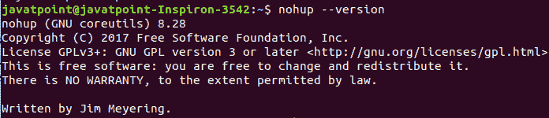
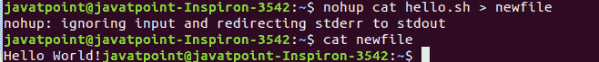
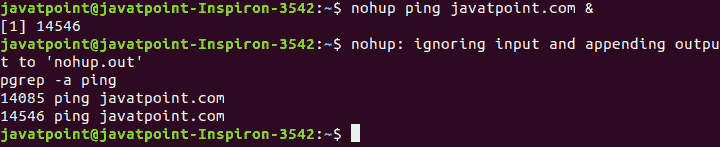

# 诺胡普命令

> 原文：<https://www.javatpoint.com/linux-nohup-command>

nohup 代表**无挂起**，它是一个 Linux 实用程序，即使在退出终端或外壳后也能保持进程运行。它防止进程获得信号暂停信号；这些信号被发送到进程以终止或结束进程。

通常，当我们退出终端时，所有正在运行的进程都会被默认终止。但是，它显示了运行进程的警告。如果一个过程比预期花费更多的时间，我们需要完成它。在这种情况下，nohup 命令是一个保持在后台运行进程的便捷工具。nohup 命令的最佳用法是在内存检查、同步、重新启动服务器等方面。当我们通过 ssh 运行程序时，这也是有利的。

在 ssh 连接的情况下，如果连接中断，所有正在运行的进程都会终止，我们可能会丢失数据。nohup 命令克服了这个问题；它会忽略所有挂断信号，并允许该过程继续。

**语法:**

nohup 命令有两种用法:

```

nohup command arguments

```

或者

```

nohup options

```

让我们通过示例了解 nohup 命令的不同用法:

## 正在检查 nohup 版本

它是 Linux 系统的默认命令行工具。因此，我们不需要安装它。我们可以通过执行以下命令来检查安装的版本:

```

nohup --version

```

上述命令将显示已安装的版本。考虑以下输出:



## 如何使用 nohup 启动进程

如果您想在退出终端后运行一个进程，请执行 nohup 命令，然后运行该进程。这是一个直截了当的过程。该进程将继续运行，不会被终止。

让我们举个例子来理解 nohup 是如何工作的。我们有一个文件**“hello . sh**”，我们将使用 nohup 命令打开它。执行以下命令:

```

nohup cat hello.sh

```

现在，即使我们关闭终端，cat 命令也会完全执行。考虑以下输出:


从上面的输出我们可以看到，它会创建一个文件**‘nohup . out’**，并将输出追加到其中。

要显示输出，请执行以下命令:

```

cat nohup.out

```

考虑以下输出:


此外，我们还可以将输出重定向到指定的文件。为此，请执行以下命令:

```

nohup cat hello.sh > newfile

```

上述命令将把输出重定向到一个指定的文件**“新文件”**要验证输出，请执行以下命令:

```

cat newfile

```

考虑以下输出:



## 开始后台进程

要在后台启动一个进程，请在命令后使用“**&”**符号。它将在后台执行我们的流程。例如，如果我们想要 ping javatpoint.com，请执行以下命令:

```

nohup ping javatpoint.com &

```

上面的命令将使用 javatpoint.com ping 我们，并将进程重定向到后台。要检查过程，执行 **pgrep 命令**如下:

```

pgrep -a ping

```

考虑以下输出:



要终止进程，请使用给定的 PID 执行终止命令。

```

Kill 14085 14546

```

上面的命令将杀死后台进程。考虑以下输出:


* * *