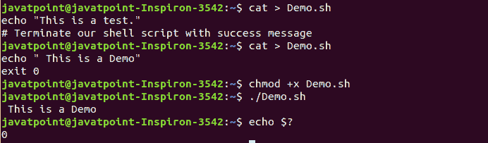
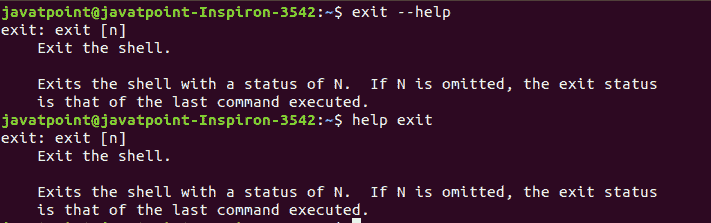

# Linux 退出命令

> 原文：<https://www.javatpoint.com/linux-exit-command>

Linux exit 命令用于从当前 shell 退出。它将一个参数作为一个数字，并返回状态号退出 shell。如果我们不提供任何参数，它将返回最后执行的命令的状态。exit 命令关闭脚本并退出 shell。

如果我们有多个 shell 选项卡，exit 命令将关闭执行它的选项卡。这是一个内置命令，我们找不到这方面的专用手册页。

### 语法:

```

exit

```

根据上述命令，按下**回车键**后，终端将关闭，终端的所有正常运行过程将结束。

退出命令是 [Linux](https://www.javatpoint.com/linux-tutorial) 中最常用的有用命令。我们可以多次通过。它使用 exit()函数终止正常进程。关于退出命令的一些要点如下:

*   它用于退出 shell 脚本，退出状态为“否”
*   它可以用来验证 shell 脚本是否成功终止。
*   其他命令可以使用退出状态来执行操作。
*   如果未指定 N 值，退出状态将是最后执行的命令。
*   N 的值设置为 0，代表正常的外壳退出。

### 选项:

exit 命令没有提供很多选项。但是，它支持以下选项:

*   **无任何参数退出:**

如果我们在没有任何参数的情况下执行它，它只会关闭终端。按照以下步骤执行:

```

exit

```


上述命令将简单地关闭终端。

*   **退出，退出状态:**

如果我们传递一个参数，它将关闭并返回相同的退出状态。例如，如果我们以退出状态 10 执行它，它将返回状态 10。考虑以下命令:

```

exit 10

```


上述命令将关闭终端并返回状态 10。返回状态很有用，因为有时可以跟踪它们来判断错误。例如，返回状态“ **0”表示程序已成功执行**，“ **1”表示程序有小错误。**

*   **显示上次退货状态:**

要显示上次执行的命令的退出状态，请执行“echo $？”命令如下:

```

echo $?

```

上述命令将显示上次返回的状态。考虑以下输出:


*   **外壳脚本的退出状态**

让我们创建一个脚本“Demo.sh”。要创建它，请执行以下命令:

```

cat > Demo.sh
echo " This is a demo."
exit 0

```

按 CTRL+D 键保存上述脚本。现在，通过执行以下命令来执行脚本:

```

chmod +x Demo.sh
./Demo.sh

```

上面的命令将执行脚本。现在，通过执行以下命令检查脚本的退出状态:

```

echo $?

```

考虑以下输出:



从上面的输出中，我们可以看到给定脚本的退出状态为 0，这意味着它被成功执行。

### 获得帮助

exit 命令是一个内置的实用程序。它没有专用的手册页。但是，它支持“-help”选项，该选项显示有关该命令的信息。要获得帮助，请执行以下命令:

```

exit --help

```

上述命令将在命令行上显示帮助。我们还可以执行帮助退出命令，如下所示:

```

help exit

```

两个命令将产生相同的输出。考虑以下输出:



* * *