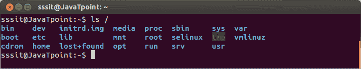

# Linux 文件系统层次标准(FHS)

> 原文：<https://www.javatpoint.com/linux-file-hierarchy-system>

文件系统层次标准描述了 Unix 和类似 Unix 的操作系统中的目录结构及其内容。它解释了文件和目录应该位于何处以及应该包含什么。

它的当前版本是 2015 年 6 月 3 日发布的 3.0，由自由标准集团维护。在 Unix 中，像操作系统一样，一切都被认为是一个文件。

只有 Linux 发行版过于部分地遵循了 FHS。因为每个发行版都有自己的策略，因此你可能会注意到不同发行版的目录树结构有所不同。

如果你想找到关于你的系统 FHS 的信息，输入命令 **man hier** 。它将显示系统的目录结构。

#### 注:GoboLinux 和 NixOS 完全不跟随 FHS，它有自己完全不同的政策。

## 根目录

Linux 系统中的所有目录都在根目录下，根目录由一个**正斜杠**T2(/)表示。系统中的所有内容都可以在这个根目录下找到，即使它们存储在不同的虚拟或物理设备中。

看上面的快照，我们已经向您展示了我们系统的根目录，即；Ubuntu 借助命令**“ls/”**。这里我们写了 **(/)** 来表示根目录。

## Linux 目录

我们已经根据文件类型对目录进行了分类，如下所示:

| 目录类型 | 存储的文件类型 |
| [二进制目录](linux-fhs-binary-directories) | 包含二进制或编译的源代码文件，例如，/bin，/sbin 等。 |
| [配置目录](linux-fhs-configuration-directory) | 包含系统的配置文件，例如，/等，/boot。 |
| [数据目录](linux-fhs-data-directory) | 存储数据文件，如/home、/root 等。 |
| [内存目录](linux-fhs-memory-directory) | 存储不占用实际硬盘空间的设备文件，例如，/dev，/proc，/sys。 |
| [Usr (Unix 系统资源)](linux-unix-system-resources) | 包含可共享的只读数据，例如，/usr/bin，/usr/lib 等。 |
| [var(变量目录)](linux-fhs-variable-directory) | 包含更大的数据，例如，/var/log，/var/cache 等。 |
| [非标准目录](linux-fhs-non-standard-directories) | 不符合 FHS 标准的目录，例如，丢失+找到，/运行等。 |

* * *