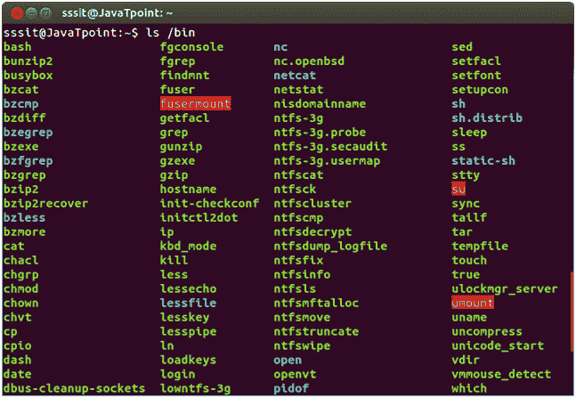
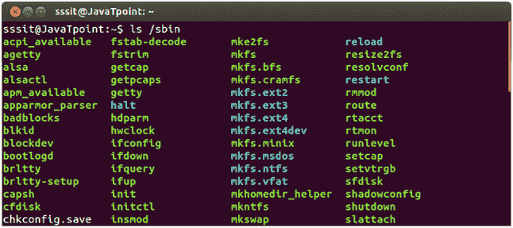
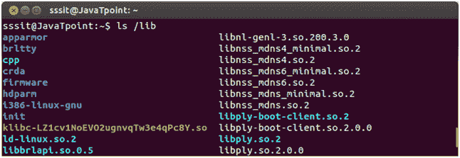

# Linux 二进制目录

> 原文：<https://www.javatpoint.com/linux-fhs-binary-directories>

二进制文件是包含编译源代码(或机器代码)的文件。它们也被称为可执行文件，因为它们可以在计算机上执行。

二进制目录包含以下目录:

*   /bin
*   /sbin
*   /lib
*   /opt

## /bin

“/bin”目录包含用户二进制文件、可执行文件、单用户模式下使用的 Linux 命令以及所有用户都使用的通用命令，如 cat、cp、cd、ls 等。

“/bin”目录不包含目录。

**示例:**

```

ls /bin

```



看上面的快照，命令**“ls/bin”**显示“/bin”目录列表。在快照中可以看到 cp、cat、less、touch 等命令。

## /sbin

“/sbin”目录也包含可执行文件，但与“/bin”不同，它只包含需要 root 权限才能执行某些任务的系统二进制文件，并且有助于系统维护。例如 fsck、root、init、ifconfig 等。

**示例:**

```

ls /sbin

```



看上面的快照，命令**“ls/sbin”**显示“/sbin”目录列表。

## /lib

“/lib”目录包含“/bin”和“/sbin”目录经常使用的**共享库**。它还包含内核模块。这些文件名可识别为 ld*或 lib * .so. *。例如，ld-linux.so.2 和 libfuse.so.2.8.6

**示例:**

```

ls /lib

```



看上面的快照，命令**“ls/lib”**显示“/lib”目录列表。

*   **/lib/modules**:/“lib/modules”存储内核模块，并为每个安装的内核都有一个目录。模块意味着使用额外的硬件支持，而不需要制造新的内核。
*   **/lib32 和/lib64** :在库的编译期间，您将通过名为“/lib32”和“/lib64”的目录遇到，这将明确要使用的寄存器大小。64 位系统可能兼容 32 位二进制。

## /opt

术语**‘opt’**是可选的缩写。其主要目的是存储可选的应用软件包。个别供应商的附加应用程序应该安装在“/opt”中。因此在某些系统中,/opt 是空的，因为它们可能没有任何附加应用程序。