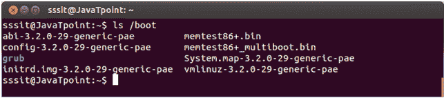
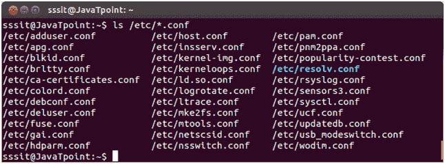

# Linux 配置目录

> 原文：<https://www.javatpoint.com/linux-fhs-configuration-directory>

配置目录包含为某些计算机程序配置参数和初始设置的配置文件。

配置目录有以下子目录:

*   **/开机**
*   **/等**

## /boot

“/boot”目录包含引导系统所必需的引导加载程序文件。换句话说，它们只包含基本 Linux 系统启动和运行所需的文件。

您可以找到包含“/boot/grub/grub.cfg”(旧系统可能有/boot/grub/grub.conf)的“/boot/grub”目录，该目录定义了在内核启动前显示的启动菜单。

**示例:**

```

ls /boot

```



看上面的快照，命令**“ls/boot”**显示“/boot”目录列表。

## /等

所有与机器相关的配置文件都保存在“/etc”中。几乎所有与系统配置相关的内容都放在这里。它还包含用于启动和停止程序的启动和关闭外壳脚本。所有文件都是静态的和基于文本的，没有二进制文件可以放在这个目录中。

“etc”的意思很有争议。早先它被称为**‘等等’**，因为它可以包含所有不属于其他地方的文件。但最近它最有可能的意思是**“可编辑文本配置”**或**“扩展工具箱”**。

配置文件的扩展名为**。conf** 。

**示例:**



ls /etc

看上面的快照，命令**“ls/etc”**显示“/etc”目录列表。

## /etc 的一些常见目录有:

*   **/etc/init.d/** :术语“init”是**初始化**的缩写。该目录包含控制系统或启动和停止守护程序(后台进程)的脚本。“init”是一个守护进程，它会继续运行，直到系统关闭。
*   **/etc/X11/**:X Window 系统配置文件存储在此目录下。图形显示的配置文件(xorg.conf)也存储在这里。
*   **/etc/skel/** :术语“skel”是**骨骼**的简称。系统中的所有东西都有一个框架，叫做隐藏文件，存储在这个目录中。它不是系统中的重要部分，可以删除，但仍有特定用途。它的目的是服务于基本的文件集，这是一个可用于创建新用户的基本框架。