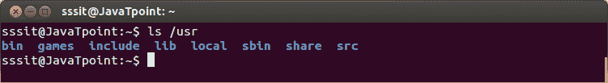

# Unix 系统资源

> 原文：<https://www.javatpoint.com/linux-unix-system-resources>

虽然它发音为用户，但实际上它代表 **Unix 系统资源**。它也被称为二级层次结构，因为它包含所有用户应用的二进制文件、库和文档。它只包含可共享的只读数据。

**示例:**

```

ls /usr

```



看上面的快照，命令**“ls/usr”**显示“/usr”目录。

我们将解释一些/usr 子目录:

*   /usr/bin
*   /usr/include
*   /usr/lib
*   /usr/share
*   /usr/local
*   /usr/src

## /usr/bin

“/usr/bin”目录包含对所有用户都不重要的二进制命令。如果在“/bin”中找不到命令，请在“/usr/bin”中搜索。它包含很多命令。

## /usr/include

“/usr/include”目录包含 c 的标准包含文件。

## /usr/lib

“/usr/lib”目录包含用户不直接执行的库。换句话说，它包含“/usr/bin”和“/usr/sbin”的二进制文件。

## /usr/share

“/usr/share”目录包含与体系结构无关的(共享)数据。

## /usr/local

“/usr/local”目录用于在本地安装软件。这意味着您将从源代码安装的所有用户程序都将安装在这里。

## /usr/src

术语“src”是**源**的缩写。它用于存储源代码，如内核源代码及其头文件。