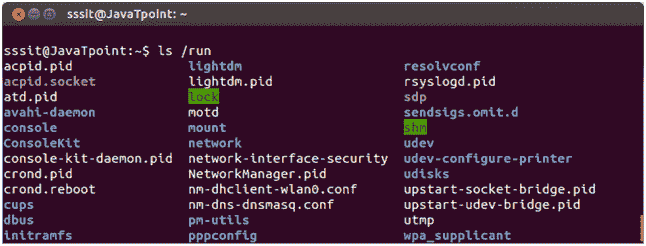

# 非标准目录

> 原文：<https://www.javatpoint.com/linux-fhs-non-standard-directories>

不属于标准 FHS 的目录称为非标准目录。

非标准目录如下:

*   /cdrom
*   /运行
*   /失物招领处

## /cdrom

“/cdrom”目录不在标准 FHS 中，但是 cdrom 可以安装在该目录中。理想情况下，根据标准，FHS 光盘应该安装在“介质”下面。

## /运行

“/run”目录存储运行时变量数据。运行时数据是指自上次引导以来有关运行系统的数据。例如，运行守护进程。

**示例:**

```
ls /run

```



看上面的快照，命令**“ls/run”**显示“/run”的内容。

## /失物招领处

在系统崩溃期间或在任何其他情况下，当 Linux 文件系统检查器(fsck)恢复丢失的数据时，该数据存储在该目录中。数据可能状况良好，也可能状况不佳。

* * *