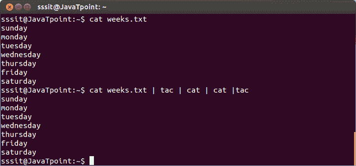

# Linux 卡特彼勒滤清器

> 原文：<https://www.javatpoint.com/linux-cat-filters>

当 cat 命令在管道中使用时，除了将 stdin 移动到 stout 之外，它什么也不做。

**语法:**

```
cat | cat or tac |  cat or tac |. . . 
```

**示例:**

```
cat weeks.txt | tac | cat | cat | tac

```



看上面的快照，一个“cat”或“tac”命令的输出作为输入传递给另一个命令。