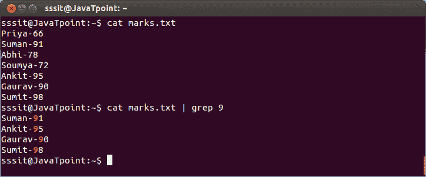
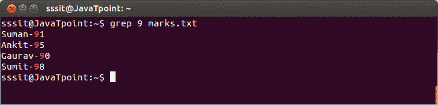
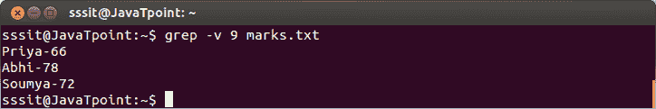
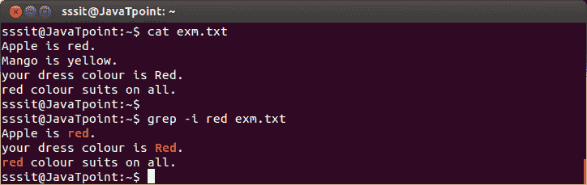
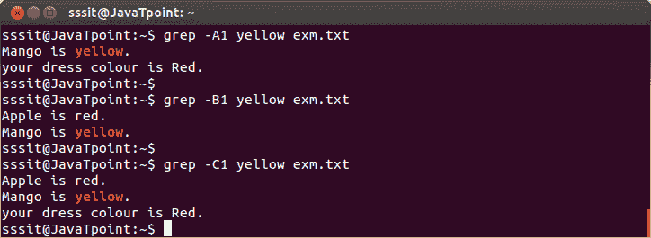

# Linux 手柄

> 原文：<https://www.javatpoint.com/linux-grep>

‘grep’命令代表**“全局正则表达式打印”**。grep 命令过滤文件内容，使我们的搜索变得容易。

**带管道的 grep】**

“grep”命令通常用于管道 **(|)** 。

**语法:**

```
command | grep  
```

**示例:**

```
cat marks.txt | grep 9

```



看上面的快照，grep 命令过滤了所有包含‘9’的数据。

* * *

## 不带管道的 grep

也可以不用管道使用。

**语法:**

```
grep  
```

**示例:**

```
grep 9 marks.txt

```



看上面的快照，grep 命令做了与前面例子相同的工作，但是没有管道。

* * *

## 握把选项

*   **grep-vM**:“grep-v”命令显示与指定单词不匹配的行。

**语法:**

```
grep -v <filename></filename> 
```

**示例:**

```
grep -v 9 marks.txt

```



看上面的快照，命令**“grep-v 9 marks . txt”**显示不包含我们的搜索词‘9’的行 hwich。

*   **grep-I**:grep-I 命令以不区分大小写的方式过滤输出。

**语法:**

```
grep -i <filename></filename> 
```

**示例:**

```
grep -i red exm.txt

```



看上面的快照，命令**“grep-I red exm . txt”**显示所有包含‘红色’的行，无论是大写还是小写。

*   **grep -A/ grep -B/ grep -C**

    grep -A 命令用于显示结果后的**行。**

    grep -B 命令用于显示结果之前的**行。**

    grep -C 命令用于显示**行之后和**行之前的结果。

    您可以使用(A1，A2，A3.....)(B3 B2 B1....)(C1、C2、C3....)来显示任意数量的行。

**语法:**

```
grep -A <searchword><filename>grep -B <linenumber><searchword><filename>grep -C <linenumber><searchword><filename></filename></searchword></linenumber></filename></searchword></linenumber></filename></searchword> 
```

**示例:**

```
grep -A1 yellow exm.txt
grep -B1 yellow exm.txt
grep -C1 yellow exm.txt

```



看上面的快照，命令**“grep-A1 黄色 exm . txt”**显示带有下一后续行的搜索行，命令**“grep-B1 黄色 exm . txt”**显示带有前一行的搜索行，命令**“grep-C1 黄色 exm . txt”**显示带有前一后续行的搜索行。