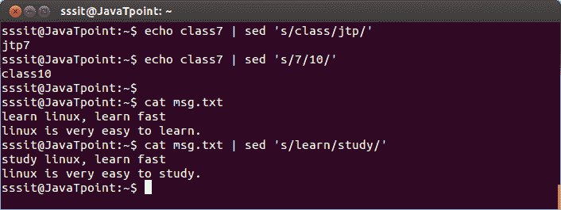
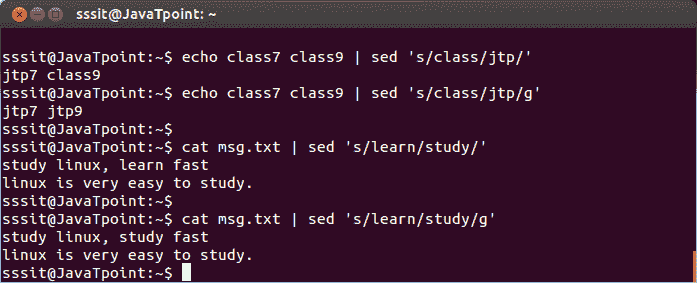
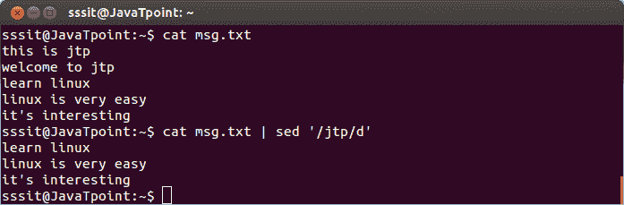
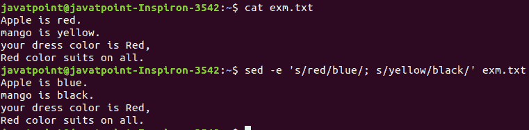
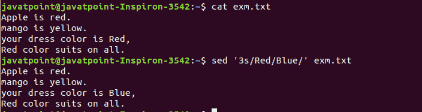
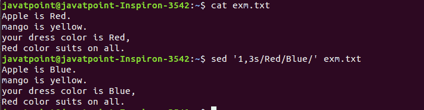
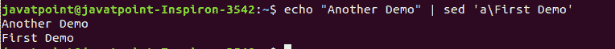
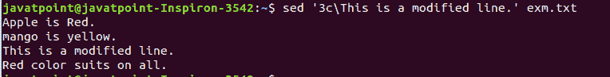
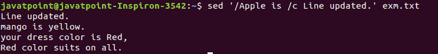
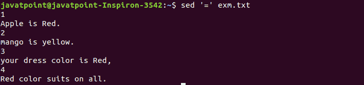

# Linux sed 命令| Linux 流编辑器

> 原文：<https://www.javatpoint.com/linux-sed>

Linux“sed”命令代表流编辑器。它用于使用正则表达式编辑流(文件)。但这种编辑不是永久的。它仅保持显示状态，但实际上，文件内容保持不变。

主要用于文本替换；此外，它还可以用于其他文本操作，如插入、删除、搜索等。sed 命令允许我们在不打开文件的情况下编辑文件。正则表达式支持使其成为更强大的文本操作工具。

### 语法:

```
sed [OPTION]... {script-only-if-no-other-script} [input-file]...

```

### 选项:

以下是 sed 命令的一些命令行选项:

**-n、- quiet、- silent:** 它有力地允许我们打印图案空间。

**-e 脚本，- expression=script:** 用于将脚本添加到要执行的命令中。

**-f 脚本-文件，-file =脚本-文件:**用于将脚本-文件的内容添加到要执行的命令中。

**-follow-symlink:**用于加工到位时跟随 symlink。

**-I[后缀]，-就地[=后缀]:** 用于就地编辑文件(如果提供了后缀选项，则创建备份)。

**-l N，-行长=N:** 用于为“l”命令指定所需的换行长度。

**- posix:** 用于禁用所有 GNU 扩展。

**-E，-r，- regexp-extended:** 它允许我们在脚本中使用扩展的正则表达式(为了可移植性，使用 POSIX -E)。

**-s，- separate:** 用于将文件视为单独的文件，而不是单个文件，并延续长流。

**-沙盒:**用于沙盒模式下操作。

**-u，-无缓冲:**用于从输入文件加载最少量的数据，并更频繁地刷新输出缓冲区。

**-z，- null-data:** 用于以 NUL 字符分隔行。

**-帮助:**用于显示帮助手册。

**-版本:**用于显示版本信息。

### sed 命令示例

让我们看看下面的例子:

*   [应用于 STDIN 目录](#Applying)
*   [全球更换](#Global)
*   [移除一条线](#Removing)
*   [使用多 sed 命令](#Using)
*   [从文件中读取命令](#Reading)
*   [替换字符](#Replacing)
*   [限制 sed](#Limiting)
*   [插入和追加文本](#Inserting)
*   [修改线条](#Modifying)
*   [字符转换](#Transformation)
*   [打印行号](#Printing)

### 应用于 STDIN 目录

sed 命令不仅仅局限于操作文件；此外，我们可以将其应用于 STDIN 目录。

```
echo class7 | sed 's/class/jtp/'  
echo class7 | sed 's/7/10/'  
 cat msg.txt | sed 's/learn/study/'  

```

上述命令将用第二个文本模式替换第一个文本。考虑以下输出:



从上面的输出中，首先，我们对字符串“class7”执行了“sed”命令，其中“class”被更改为“jtp”，7 被更改为 10。然后，我们对流“msg.txt”执行了“sed”命令，其中“learn”被转换为“study”。

### 全球替代

在前面的例子中，所有“学习”的单词都没有被编辑成“学习”。要编辑每个单词，我们必须使用全局替换“g”。它将编辑文件或字符串中的所有指定单词。

**语法:**

```
command | sed 's/<oldWord>/<newWord>/g'  

```

考虑以下示例:

```
echo class7 class9 | sed 's/class/jtp/g'  
cat msg.txt | sed 's/learn/study/g'  

```

以上命令将替换所有指定的文本模式。考虑以下输出:



从上面的输出中，通过执行命令“echo class 7 class 9 | sed ' s/class/jtp/g””，所有的“class”都被转换为“jtp”，通过命令“cat msg.txt | sed 's/learn/study/g”，所有的“learn”都被转换为“study”。

### 移除线条

“d”选项会让我们从文件中删除一整行。我们只需要用“d”选项从那一行指定一个单词，那一行就会被删除。但是，请注意，包含相同单词的所有行都将被删除。它将按如下方式执行:

```
cat <fileName> | sed '/<Word>/d'  

```

考虑以下命令:

```
cat msg.txt | sed '/jtp/d'  

```

上述命令将删除带有单词“jtp”的行。考虑以下输出:



从上面的输出中，通过执行命令“cat msg . txt | sed/“jtp/d””删除了所有包含单词“jtp”的行。

### 使用多 sed 命令

“-e”选项允许我们同时执行多个 sed 命令。我们可以通过执行以下命令来执行多个 sed 操作:

```
sed -e '<script 1> ; <script 2>' <file name>

```

考虑以下命令:

```
sed -e 's/red/blue/; s/yellow/black/' exm.txt

```

上述命令将应用文件' exm.txt '中指定的所有操作。考虑以下输出:



从上面的输出中我们可以看到，所有的“红色”单词都被替换为“蓝色”，所有的“黄色”单词都被替换为“黑色”。我们也可以像这样分离命令:

```
sed -e '
>s/red/blue/; 
>s/yellow/black/' exm.txt

```

结果将与上面的命令相同。

### 从文件中读取命令

我们可以将 sed 命令保存在一个文件中，并在任何文件中立即应用它们。可以通过指定“-f”选项来完成，如下所示:

```
sed -f <sed file> <file name>

```

从上面的命令来看，“<sed file="">”是一个包含 sed 命令列表的文件。考虑以下命令:</sed>

```
sed -f SedCommands exm.txt

```

上述命令将应用“exm.txt”上的“SedCommand”文件中的所有指定命令。考虑以下输出:


从上面的输出中，我们使用了应用于前面示例的命令。因此，输出与前面的示例相同。

### 替换字符

我们可以用感叹号(！)作为字符串分隔符。例如，我们想替换 bash shell，用“/etc/passwd”中的 csh shell 替换它。为此，请执行以下命令:

```
sed 's/\/bin\/bash/\/bin\/csh/' /etc/passwd

```

通过执行以下命令，我们可以获得相同的结果:

```
sed 's!/bin/bash!/bin/csh!' /etc/passwd

```

### 限制 sed

sed 命令的基本用途是处理整个文件。但是，我们可以限制 sed 命令并指定任何行。有两种方法可以限制 sed 命令:

*   一系列线条。
*   匹配特定线条的图案。

我们可以提供一个数字来指定一行，如下所示:

```
sed '3s/Red/Blue/' exm.txt

```

上述命令将在第三行应用指定的操作。考虑以下输出:



从上面的输出中，只修改了第三行。

我们还可以指定一系列线条。要指定一系列行，请执行以下命令:

```
sed '1,3s/Red/Blue/' exm.txt

```

上述命令将更新第 1 行和第 3 行中的指定文本。考虑以下输出:



### 插入和追加文本

“I”和“a”标志用于在文件中插入和追加文本。“I”标志将在字符串前添加文本，“a”标志用于在字符串后添加文本。考虑以下命令:

```
echo "Another Demo" | sed 'i\First Demo'

```

上述命令将在文本“另一个演示”之前插入文本。考虑以下输出:


要追加文本，请执行以下命令:

```
echo "Another Demo" | sed 'a\First Demo'

```

上面的命令将追加文本。考虑以下输出:



### 修改线条

“c”标志用于修改特定行。要修改一行，请执行以下命令:

```
sed '3c\This is a modified line.' exm.txt

```

上面的命令将更新第三行。考虑以下输出:



我们还可以使用正则表达式来更新多个具有相同模式的行。考虑以下命令:

```
sed '/Apple is /c Line updated.' exm.txt

```

上面的命令将更新所有带有字符串“苹果是”的行。考虑以下输出:



### 字符的转换

“y”标志用于转换字符。字符的转换不能局限于特定的事件。要转换字符，请执行以下命令:

```
sed 'y/abc/def/' exm.txt

```

上面的命令将把字符‘a’、‘b’、‘c’转换成‘d’、‘e’、‘f’。考虑以下输出:


### 打印行号

“=”符号用于打印行号。要打印行号，请执行以下命令:

```
sed '=' exm.txt

```

上述命令将显示文件内容的行号。考虑以下输出:



带“-n”选项的等号指定包含匹配脚本的行号。考虑以下输出:

```
sed -n '/mango/=' exm.txt

```

上面的命令将显示包含单词“mango”的行号。考虑以下输出:


从上面的输出中，我们可以看到第 2 行有“芒果”这个词。

* * *