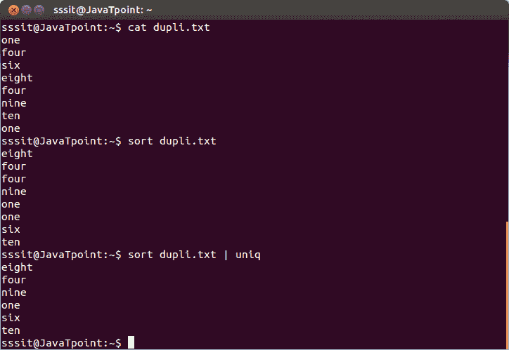
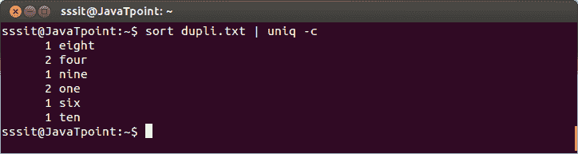
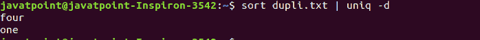
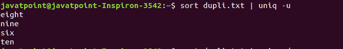
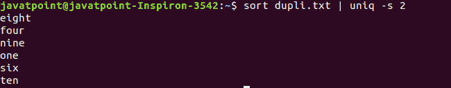
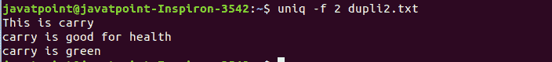

# Linux uniq 命令

> 哎哎哎:# t0]https://www . javatppoint . com/Linux-unique

Linux uniq 命令用于删除文件中所有重复的行。此外，它还可用于显示任何单词的计数、仅重复的行、忽略字符和比较特定字段。这是 Linux 系统中最常用的命令之一。它经常与[排序命令](https://www.javatpoint.com/linux-sort)一起使用，因为它比较相邻的字符。它丢弃所有相同的行并写入输出。

### 语法:

```
uniq [OPTION]... [INPUT [OUTPUT]]

```

### 选项:

uniq 命令的一些有用的命令行选项如下:

**-c，- count:** 它以出现的次数作为行的前缀。

**-d，- repeated:** 用于打印重复行，每组一行。

**-D:** 用于打印所有重复行。

**- all-repeated[=METHOD]:** 它与“-D”选项非常相似，两个选项的区别在于它允许用空行分隔组。

**-f，-skip-field = N:**用于避免前 N 个场的比较。

**- group[=METHOD]:** 用于显示所有项目，并用空行分隔各组。

**-i，- ignore-case:** 用于比较时忽略差异。

**-s，- skip-chars=N:** 用来避免前 N 个字符的比较。

**-u，- unique:** 用于打印唯一的行。

**-z，-零终止:**用于行分隔符是 NUL 而不是换行符模式。

**-w，- check-chars=N:** 用于比较不超过 N 个字符的行。

**-帮助:**用于显示帮助文档。

**-版本:**用于显示版本信息。

### uniq 命令的示例

让我们看看 uniq 命令的以下示例:

*   [删除重复行](#Remove)
*   [统计一个单词的出现次数](#occurrences)
*   [显示重复的线条](#repeated)
*   [显示独特的线条](#unique)
*   [忽略比较中的字符](#characters)
*   [忽略比较中的字段](#fields)

### 删除重复的行

要从文件中删除重复的行，请执行基本的 uniq 命令，如下所示:

```
sort dupli.txt | uniq

```

上面的命令将从文件“dupli.txt”中删除重复的行。考虑下面的输出:



从上面的输出中，重复的单词被忽略。

### 计算一个单词出现的次数

我们可以使用 uniq 命令来计算一个单词的出现次数。“-c”选项用于对单词进行计数。按照以下步骤执行:

```
sort dupli.txt | uniq -c

```

上面的命令将计算“dupli.txt”中的单词。考虑以下输出:



从上面的输出中，命令“sort dupli.txt | uniq -c”计算一个单词重复的次数。

### 显示重复的行

“-d”选项用于仅显示重复的行。它将只显示一个文件中不止一次的行，并将输出写入标准输出。考虑以下命令:

```
sort dupli.txt | uniq -d

```

上述命令将只显示重复的行。考虑以下输出:



### 显示独特的线条

“-u”选项用于仅显示唯一的行(不重复)。它将只显示只出现一次的行，并将结果写入标准输出。考虑以下命令:

```
sort dupli.txt | uniq -u

```

上面的命令将只显示文件“dupli.txt”中的唯一行。考虑以下输出:



### 忽略比较中的字符

“-s”选项用于忽略比较中的字符。它将忽略指定数量的字符，并将结果显示为标准输出。考虑以下命令:

```
sort dupli.txt | uniq -s 2

```

上面的命令将忽略文件“dupli.txt”中比较的前两个字符。考虑以下输出:



### 忽略比较中的字段

“-f”选项用于忽略字段。考虑以下命令:

```
uniq -f 2 dupli2.txt

```

上面的命令不会比较文件“dupli2.txt”中的前两个字段。考虑以下输出:



从上面的输出中，前两个字段被跳过，所有字段的其余部分从文件“dupli2.txt”中进行比较。

* * *