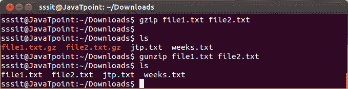
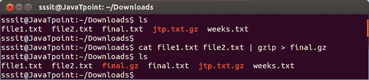
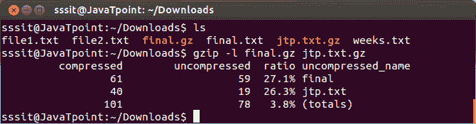

# Linux gzip 档

> 原文：<https://www.javatpoint.com/linux-gzip>

Gzip (GNU zip)是一个压缩工具，用来截断文件大小。默认情况下，原始文件将被以扩展名()结尾的压缩文件替换。gz)。

要解压缩一个文件，你可以使用 gunzip 命令，你的原始文件将被恢复。

**语法:**

```
gzip <file2><file3>. . . 
gunzip <file1><file2><file3>. . .</file3></file2></file1></file3></file2> 
```

**示例:**

```
gzip file1.txt file2.txt
gunzip file1.txt file2.txt

```



看上面的快照，gzip 命令已经压缩了文件**‘file 1 . txt’****‘file 2 . txt’**。压缩文件以扩展名()显示。gz)。而 gunzip 命令解压缩了相同的文件和扩展名(。gz)被移除。

* * *

## gzip 选项

**将多个文件压缩在一起**

如果你想压缩多个文件在一起，你可以使用'猫'和 gzip 命令与管道命令。

**语法:**

```
cat <file2>. . | gzip ></file2> 
```

**示例:**

```
cat file1.txt file2.txt | gzip > final.gz 

```



看上面的快照，文件**‘file 1 . txt’****‘file 2 . txt’**都被压缩为**‘final . gz’**。

* * *

## gzip -l(消歧义)

' gzip -l '命令告诉我们压缩率或原始文件的压缩量。

**语法:**

```
gzip -l <file2>. .</file2> 
```

**示例:**

```
gzip -l final.gz jtp.txt.gz  

```



看上面的快照，命令**“gzip-l final.gz jtp . txt . gz”**显示了两个文件的比例。

* * *

## 如何压缩目录

gzip 命令将无法压缩目录，因为它只能压缩一个文件。要压缩一个目录，你必须使用**‘tar’**命令。

连字符 **(-)** 在‘tar’命令中不是必须的。

**‘c’**是为了**创造**，

**‘v’**为详细，向**显示**输出，

**【f】**要提到输出文件的**目的地**，

**‘z’**用于指定**用 gzip 压缩**。

**语法:**

```
 tar cf - | gzip > <directoryname></directoryname> 
```

**或**

```
tar cvfz office.tar.gz office

```

**示例:**

```
 tar cf - office | gzip > office.tar.gz

```


看上面的快照，目录‘office’是用‘tar’命令压缩的。

* * *