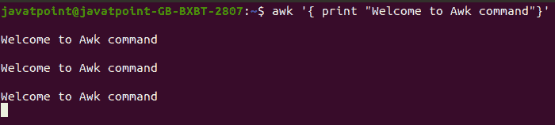
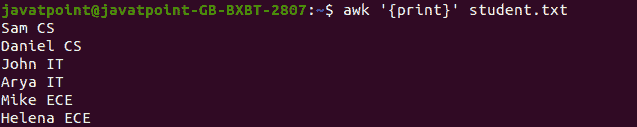
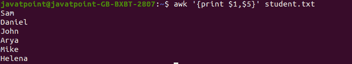
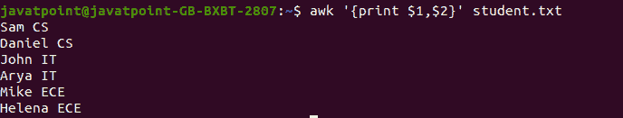
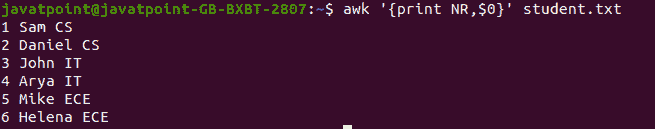
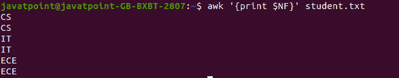
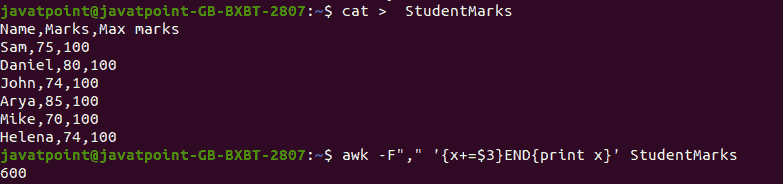
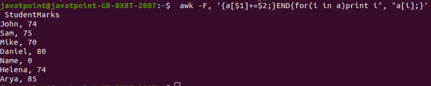
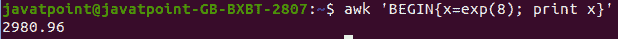

# AWK 司令部

> 原文：<https://www.javatpoint.com/linux-awk-command>

**awk 命令**在 Linux 中用于**文本处理**。虽然 sed 命令也用于文本处理，但它有一些局限性，因此 awk 命令成为文本处理的一个便捷选项。它提供了对数据的强大控制。

Awk 是一种强大的脚本语言，用于**文本脚本**。它搜索和替换文本，并对数据库进行排序、验证和索引。

它是程序员最广泛使用的工具之一，因为他们以语句的形式编写缩小的有效程序来定义文本模式和设计。

它在 Linux 中充当**过滤器。在 [Linux](https://www.javatpoint.com/linux-tutorial) 中也被称为**呆呆(GNU awk)** 。**

## 它是如何被命名为 AWK 的？

这个命令是用三个人名字的第一个字母命名的，这三个人在 1977 年写了这个命令的原始版本。他们的名字分别是**阿尔弗雷德·艾侯、彼得·温伯格、**和**布莱恩·克尼根**，他们来自 **AT & T 贝尔实验室。**

## AWK 司令部的特点

Awk 命令的各种特性如下:

*   它逐行扫描文件。
*   它将一个文件分成多个字段。
*   它比较输入文本或文本文件的一段。
*   它对文件执行各种操作，比如搜索指定的文本等等。
*   它格式化输出行。
*   它执行算术和字符串运算。
*   它对输出应用条件和循环。
*   它在指定的结构上转换文件和数据。
*   它生成格式报告。

**语法:**

Awk 命令的用法如下:

```

awk options 'selection _criteria {action }' input-file > output-file

```

选项可以是:

*   **-f 程序文件:**读取写在 awk 命令上的脚本源代码
*   **-F fs:** 用作输入字段分隔符。

## 如何定义 AWK 剧本？

要定义 awk 脚本，请使用 awk 命令，后跟用单引号“”括起来的大括号{}，如下所示:

```

awk '{ print "Welcome to Awk command"}'

```

上面的命令将在我们每次执行该命令时打印输入的字符串。按 **CTRL+D** 键终止程序。考虑以下输出:



### AWK 司令部的例子

为了更好地理解 Awk 命令，请看下面的例子:

让我们创建一个数据来应用各种 awk 操作。考虑来自不同数据流的学生数据。

要创建数据，请按如下方式执行 cat 命令:

```

cat > student.txt
Sam CS
Daniel IT
John IT
Arya IT
Mike ECE
Helena ECE

```

按 **CTRL + D** 键保存文件，按 **ESC** 键退出命令行编辑器。它将创建数据。考虑以下输出:


已经创建了一个学生数据，我们将对该数据运行 awk 命令。

**例 1:列出指定模式的学生。**

考虑以下命令:

```

awk '/ CS/ {print} ' student.txt

```

**输出:**


**示例 awk 命令的默认行为。**

如果我们不指定模式，它将显示文件的所有内容。

考虑以下命令:

```

awk '{print}' student.txt

```

我们没有在上面的命令中指定任何模式，所以它将显示文件的所有行。

**输出:**



**示例 3:打印指定的列。**

如果我们在这个命令上指定列号，它将只打印那一行。考虑以下输出:

```

awk '{print $1,$5} student.txt

```

上面的命令将打印列号 1 和 5。如果文件系统中不存在第 5 列，它将只打印第 1 列。

考虑以下输出:



考虑以下命令:

```

awk '{print $1,$2}' student.txt

```

上面的命令将列出列号 1 和 2。考虑以下输出:



## AWK 命令中的内置变量

Awk 命令支持许多内置变量，包括$1、$2 等，这些变量将文件内容分成单独的段。

**NR:** 用于显示当前的行数。awk 命令对每一行执行一次操作。这些行被称为记录。

**NF:** 用于统计当前数据库内的字段数量。

**FS:** 用于创建字段分隔符，将字段划分为输入行。

**OFS:** 用于存储输出场分隔符。它分隔输出字段。

**ORS:** 用于存储输出记录分隔符。它分离输出记录。它会自动打印 ORS 命令的内容。

**示例 4:打印输出并显示行号。**

要在输出中显示行号，请将 NR 变量与 Awk 命令一起使用，如下所示:

```

awk '{print NR,$0}' student.txt 

```

考虑以下输出:



**示例 5:打印文件的最后一个字段。**

要显示文件的最后一个字段，请使用 Awk 命令执行 NF 变量，如下所示:

```

awk '{print $NF}' student.txt

```

考虑以下输出:



**示例 6:按照指定的格式分离输出。**

要用“-”**符号或(:)分号**分隔输出，请使用 ORS 命令指定输出，如下所示:

```

awk 'BEGIN { ORS ="-"} {print $0}' student.txt

```

上面的命令将用下划线(_)符号分隔输出。考虑以下输出:

```

Sam CS -Daniel CS-John IT-Arya IT-Mike ECE-

```

**示例 7:打印从 1 到 8 的数字的平方。**

要打印从 1 到 8 的数字，请执行以下命令:

```

awk 'BEGIN { for(i=1;i<=8;i++) print "square of", i, "is",i*i; }'

```

上面的命令将打印 1 到 8 的平方。考虑以下输出:

```
square of 1 is 1
square of 2 is 4
square of 3 is 9
square of 4 is 16
square of 5 is 25
square of 6 is 36
square of 7 is 49
square of 8 is 64

```

**示例 8:计算特定列的总和。**

让我们创建一个数据来对列应用求和操作。要创建学生标记数据，请按如下方式执行 cat 命令:

```

javatpoint@javatpoint-GB-BXBT-2807:~$ cat >  StudentMarks
Name, Marks, Max marks            
Sam,75,100
Daniel,80,100
John,74,100
Arya,85,100
Mike,70,100 
Helena,74,100

```

按 **CTRL+D** 保存文件。我们已成功创建学生标记数据。我们可以通过执行 cat 命令进行检查，如下所示:

```

cat StudentMarks

```

要计算创建的数据的第三列，请执行以下命令:

```

awk -F"," '{x+=$3}END{print x}' StudentMarks

```

**输出:**

```
600

```

考虑以下输出:



**示例 9:找到一些单独的记录。**

要打印一些单独的学生成绩记录，请执行以下命令:

```

wk -F, '{a[$1]+=$2;}END{for(i in a)print i", "a[i];}' StudentMarks

```

上面的命令将打印带有学生标记文件中标记的个人姓名。考虑以下输出:



**例 10:求 exp 8 的值。**

要找到 exp 8 的值，请执行以下命令:

```

awk 'BEGIN{x=exp(8); print x}'

```

上面的命令将打印 exp 8 的值。考虑以下输出:



* * *