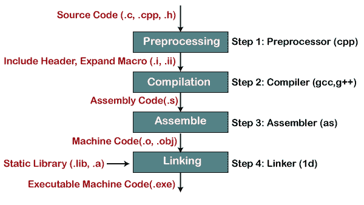
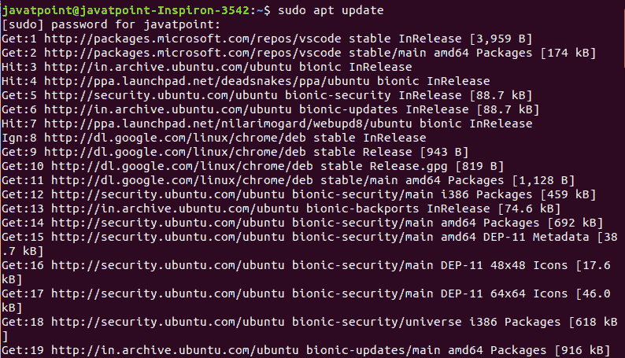
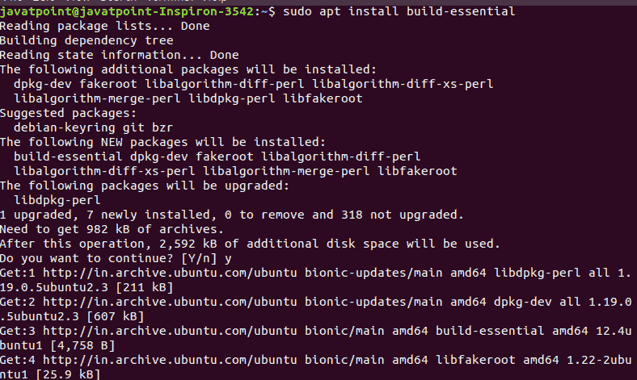
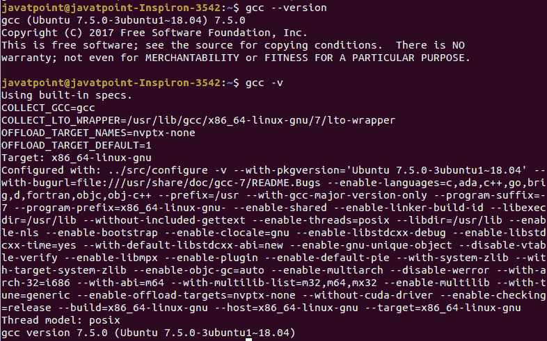
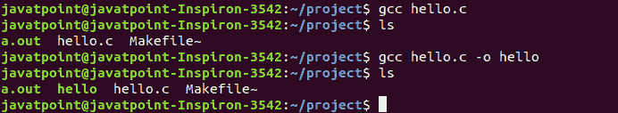
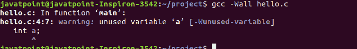
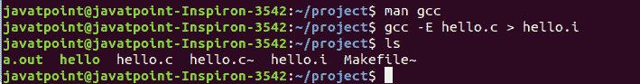
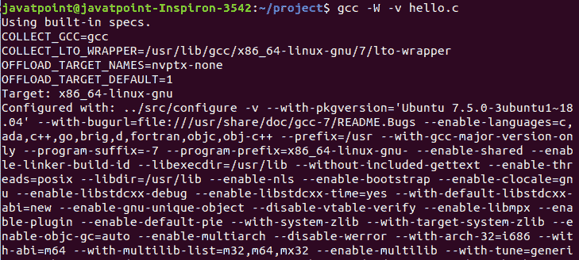
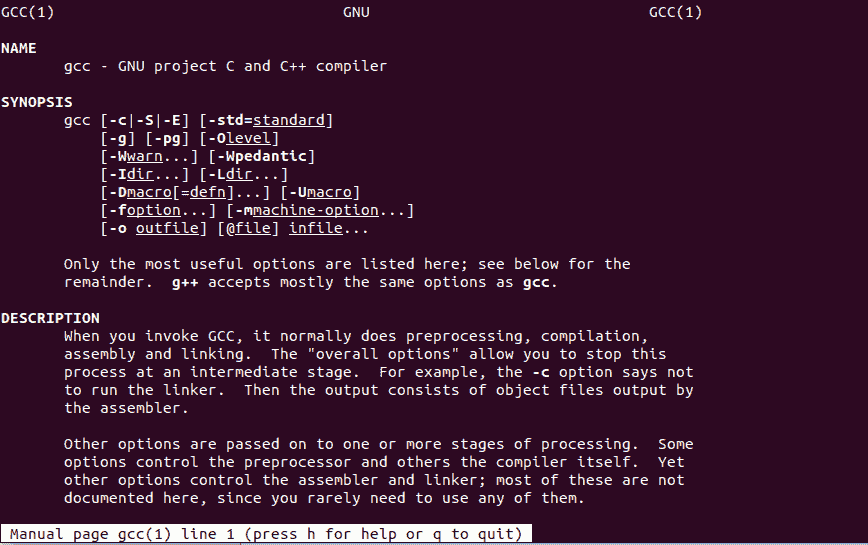

# linux

> 原文：<https://www.javatpoint.com/gcc-linux>

在 Linux 中，GCC 代表 **GNU 编译器集合**。它是各种编程语言的编译系统。它主要用于编译 C 和 C++程序。它将源程序的名称作为必要的参数；rest 参数是可选的，例如调试、警告、对象文件和链接库。

GCC 是 GNU 工具链的核心组件。各种开源项目都是用 GCC 编译的，比如 Linux 内核和 GNU 工具。

它是根据通用公共许可证分发的。第一个版本 **GCC 1.0** ，发布于 1987 年。它只针对 C 编程语言，但在同一年，它扩展到了 [C++编程语言](https://javatpoint.com/cpp-tutorial)。后来，它被开发用于其他编程语言，如 Objective-C、Objective-C++、Fortran、 [Java](https://javatpoint.com/java-tutorial) 、Ada、 [Go](https://www.javatpoint.com/go-tutorial) 等。它的最新版本已经大大改进了编程语言的实现。

是 GNU OS 的官方合作伙伴；因此，它已被采用为基于 Linux 的系统的标准编译器。

## 海湾合作委员会的组成部分

GCC 是一个可移植的工具，可以在很多操作系统上运行。也可以使用 **Cygwin、MinGW、MinGW-W64** 等工具移植到 **Windows** 上。由于它是 GNU 工具链的一个关键组件，它包含以下用于开发应用程序和操作系统的组件:

**GNU 编译器集合(GCC):** 它是一个适用于很多语言的编译器套件，比如 C/C++和 Objective-C/C++。

**GNU Make:** 它是一个自动化工具，用于编译和构建应用程序。

**GNU Binutils:** 它是一个包含二进制实用工具的套件，如**链接器**和**汇编器**。

**GNU 调试器(GDB)。**用于调试应用程序。

**GNU 自动工具:**它是一个构建系统，包含一些实用工具，如 Autoconf、Autoheader、Automake 和 Libtool。

**GNU Bison:** 和 lex、yacc 一样是解析器生成器。

## 编译过程

GCC 通过以下四个步骤编译并使程序可执行:



**预处理:**在这一步，GNU 预处理器(cpp.exe)创建一个具有源代码的中间文件。预处理器包含头文件(#include)并扩展宏(#define)。考虑以下命令:

```

cpp hello.c > hello.i

```

上面的命令将创建一个中间文件“hello.i”

**编译:**在这一步，预处理后的源代码被编译成特定处理器的汇编代码。

```

gcc -S hello.i

```

上述命令将创建一个程序集文件“hello . s”。“-s”选项用于指定生成程序集代码而不是目标代码。

**组装:**组装代码转换为机器码。它将创建一个对象文件“hello.o .”

```

as -o hello.o hello.s

```

**链接器:**链接器(ld.exe)是编译过程的最后一步。它将目标代码与库代码链接起来，并生成一个可执行文件。

```

ld -o hello.exe hello.o

```

上面的命令将创建一个可执行文件“hello.exe”

## 在 Linux 上安装 GCC

默认情况下，它附带了大多数 Linux 发行版。我们可以通过执行以下命令来验证它:

```

gcc -version

```

上面的命令将显示 GCC 工具的安装版本。如果未安装，请按照以下步骤安装:

**第一步:更新包列表。**

要更新包列表，请执行以下命令:

```

sudo apt update

```

它会询问系统管理密码，输入密码。它将开始更新系统包。考虑下面的输出快照:



**步骤 2:安装构建必备包。**

它包含各种包，如 gcc、g++、make utility。执行以下命令进行安装:

```

sudo apt install build-essential

```

上面的命令将安装 GCC 实用程序所需的包。现在，我们可以在我们的机器上使用 GCC 实用程序。考虑下面的输出快照:



**步骤 3:验证安装。**

要验证安装，请执行 gcc -version 命令，如下所示:

```

gcc --version

```

它将显示已安装的 GCC 实用程序版本。要显示版本的更多详细信息，请使用“-v”选项。考虑以下输出:



在这里，我们已经成功安装了 GCC 实用程序。让我们理解使用它。我们将使用 GCC 创建和执行一些 c 程序。

## 用 gcc 运行第一个 C 程序

创建一个基本的 [c 程序](https://javatpoint.com/c-programs)“你好世界！”。创建一个“hello.c”文件，并在其中放入以下代码:

```

#include <stdio.h>
int main() {
    printf("Hello, world!\n");
    return 0;
}

```

现在，编译 hello.c 如下:

```

gcc hello.c

```

如果我们直接运行 hello.c，它会抛出错误。使其可执行，Linux 系统的默认可执行文件是. out。要执行该文件，请按如下方式执行 chmod 命令:

```

chmod a+x a.out

```

现在，运行 c 程序如下:

```

./a.out

```

考虑以下输出:


## 海湾合作委员会司令部示例

gcc 命令的一些有用的例子如下:

*   **指定对象文件名**

默认情况下，gcc 命令将对象文件创建为**a . out**。如果要更改默认输出文件名，请使用 **'-o'** 选项。

让我们执行基本的 gcc 命令:

```

gcc hello.c

```

上述命令将生成目标文件“a.out”。要指定目标文件名，请按如下方式执行命令:

```

gcc hello.c -o hello

```

它将生成输出文件“你好”考虑以下输出:



*   **启用所有警告**

要启用输出中的所有警告，请在 gcc 命令中使用 **'-Wall'** 选项。让我们在 hello.c 的主函数中创建一个变量。考虑下面的代码:

**hello.c:**

```

#include <stdio.h>
int main() {
int a;
    printf("Hello, world!\n");
    return 0;
}

```

如果我们使用-Wall 选项编译上述代码。它会抛出警告。执行以下命令编译文件:

```

gcc -wall hello.c

```

上述命令将显示警告。考虑以下输出:



*   **产生编译过程的逐步输出**

我们只能产生编译过程的逐步输出。

**产生预处理器输出**

通过使用“-E”选项，我们只能生成预处理输出。考虑以下命令:

```

gcc -E hello.c > hello.i

```

根据上面的命令，生成了一个包含预处理输出的文件**‘hello . I’**。考虑以下输出:



**生成装配代码**

要生成程序集代码，请使用“-S”选项执行命令。考虑以下命令:

```

gcc -S hello.c > hello.s

```

上述命令将生成包含程序集代码的“hello.s”文件。考虑以下输出:


**生成编译代码**

通过使用“-C”选项，我们只能生成编译后的代码。考虑以下命令:

```

gcc -C hello.c

```

上面的命令将生成一个只有机器代码或编译代码的文件“a.out”。考虑以下输出:


**生成编译过程的所有中间文件**

我们可以使用“-save-temp”选项生成编译过程的所有中间文件。考虑以下输出:

```

gcc -save-temps hello.c

```

上述命令将一次生成所有中间文件以及可执行文件。考虑以下输出:


*   **口头打印输出。**

我们可以显示 gcc 命令执行的每一步的详细信息。为此，请使用“-v”选项执行命令。

```

gcc -W -v hello.c

```

考虑下面的输出快照:



我们已经讨论了一些最有用的 gcc 命令的例子。因为 gcc 命令提供了大量的选项，所以在使用它时，你可能会被卡在任何地方。让我们看看如何从终端获得自己的帮助。

## GCC 手册

如果你在使用 gcc 命令时被卡在任何地方，你可以从你的终端获得帮助。要从命令行访问手册，请执行 man 命令，如下所示:

```

man gcc

```

上述命令将显示手册，其中包含支持选项的说明和列表，并附有简要说明。考虑下面的输出快照:



您可以滚动输出来阅读更多内容。按“h”键获取帮助，按 q 键退出手册并返回终端。

* * *