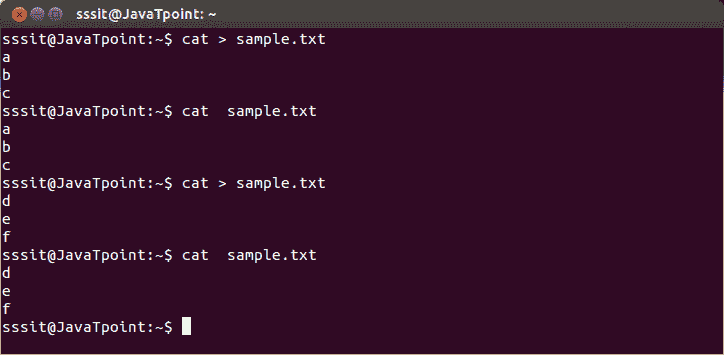
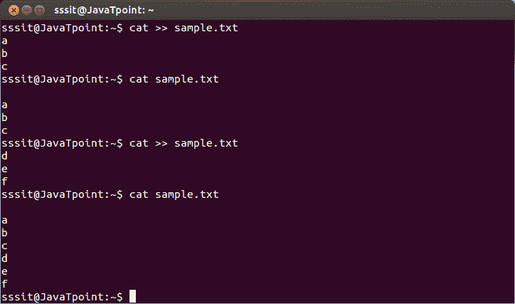
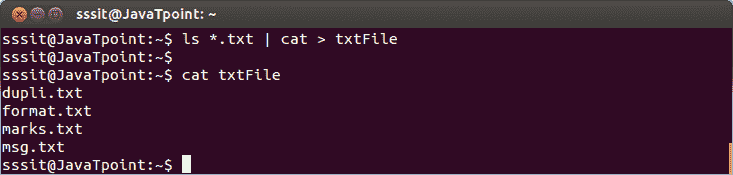

# Linux 输入输出重定向

> 原文：<https://www.javatpoint.com/linux-input-output-redirection>

重定向可以定义为将命令读取输入的方式更改为命令发送输出的方式。您可以重定向命令的输入和输出。

对于重定向，使用元字符。重定向可以进入一个**文件** (shell 元字符是尖括号**<>)或者一个**程序** ( shell 元字符是**管道**符号“|”)。**

 *** * *

## 输入/输出重定向中的标准流

bash shell 在输入/输出重定向中有三个标准流:

*   **标准输入(stdin):**stdin 流被编号为 stdin (0)。bash shell 从 stdin 获取输入。默认情况下，键盘用作输入。
*   **标准输出(标准输出):**标准输出流被编号为标准输出(1)。bash shell 将输出发送到 stdout。输出显示。
*   **标准错误(stderr):**stderr 流被编号为 stderr (2)。bash shell 向 stderr 发送错误消息。将显示错误消息。

* * *

## 重定向到文件

每个流都使用重定向命令。单括号“>”或双括号“> >”可用于重定向标准输出。如果目标文件不存在，将创建一个同名的新文件。

**覆盖**

带有单个括号**“>”的命令覆盖**现有文件内容。

*   > :标准输出
*   < :标准输入
*   2 >:标准误差

注:写**1>**或**>**和**0<**或**<**是一回事。但是对于 stderr，你必须写**2>**。

**语法:**

```
cat >  
```

**示例:**

```
cat > sample.txt

```



看上面的快照，命令“cat > sample.txt”已经创建了内容为‘a，b，c’的‘sample . txt’。使用命令**“cat>sample . txt”**再次创建相同的文件‘sample . txt’，这一次它会覆盖较早的文件内容，并且只显示‘d，e，f’。

* * *

## 附加

带双括号的命令 **' > >'不覆盖**现有文件内容。

*   > >-标准输出
*   <
*   2>> -标准误差

**语法:**

```
cat >>  
```

**示例:**

```
cat >> sample.txt

```



看看上面的快照，这里我们再次使用命令**“cat>>sample . txt”**中的“> >”创建了两个同名的文件。但这一次，内容不会覆盖，一切都会显示出来。

* * *

## 重定向到程序中

管道将一个流从一个**程序**重定向到另一个。当使用管道将一个程序的标准输出发送到另一个程序时，第一个程序的数据不会显示在终端上，只会显示第二个程序的数据。

虽然 pipe 的功能看起来类似于“>”和“> >”的功能，但是有显著的区别。管道将数据从一个程序重定向到另一个程序，而括号仅用于文件重定向。

**示例:**

```
ls *.txt | cat > txtFile

```



看上面的快照，命令**“ls *”。txt | cat>txt file“**已经放了所有的了’。“txt”文件放入新创建的文件“txtFile”中。

* * ***