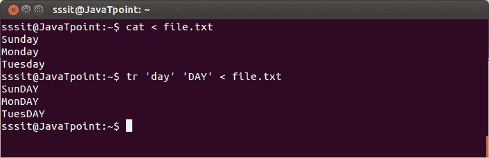
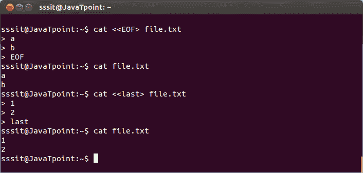
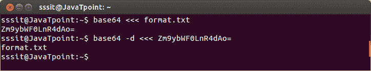

# Linux 输入重定向

> 原文：<https://www.javatpoint.com/linux-input-redirection>

**< 标准**

bash shell 使用 stdin 获取输入。在输入重定向中，一个文件被输入到命令中，这个重定向是在“

**语法:**

```

cat <  
```

**示例:**

```

cat < file.txt

```



看上面的快照，命令**“cat<file . txt”**已经将‘file . txt’作为输入并显示了其内容。

* * *

## <

这里的文档(有时也称为这里是文档)是一种输入方式，您可以输入直到键入某个序列(通常是 **EOF** )。EOF(文件结束)可以键入或按(ctrl + d)键调用。

任何单词都可以代替“e of”，就像我们使用“last”一样。

**语法:**

```

cat < <filename></filename> 
```

**示例:**

```

cat < file.txt 
```



看上面的快照，在第一个例子中，当我们在第二个例子中输入**【EOF】****【最后】**时，file.txt 结束。

**< < <这里串**

此处的字符串用于将字符串直接传递给命令。

**示例:**

```

base64 <<< format.txt

```



看上面的快照，在这个例子中我们使用了 base64，我们将在后面学习。命令**“base64<<<format . txt”**已经解码了文件‘format . txt’，然后通过使用命令‘base64-d’我们找回了我们的文件‘format . txt’。