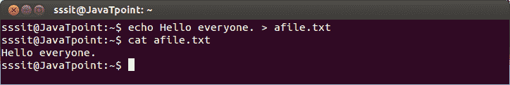
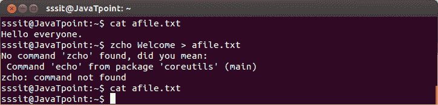
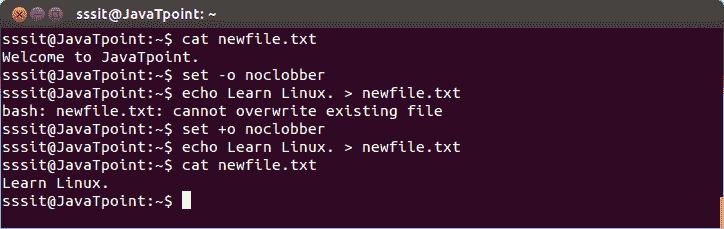
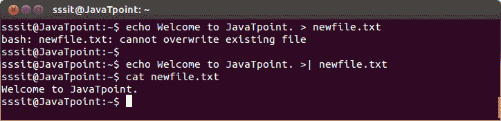
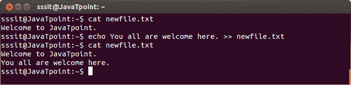

# Linux 输出重定向

> 原文：<https://www.javatpoint.com/linux-output-redirection>

输出重定向用于将一个命令的输出放入文件或另一个命令。

## >标准输出

stdout 用一个大于符号“>”重定向。当 shell 遇到“>”符号时，它将清除文件(正如您已经知道的)。

**示例:**

```

echo Hello everyone. > afile.txt 

```



看看上面的快照，大于号“>”将命令“echo”的输出重定向到文件“afile.txt”中。

## 输出文件被擦除

在输出重定向中，在扫描命令行时，shell 会遇到通过 **' > '** 的符号，并将文件清除。

**示例:**

```

zcho Welcome > afile.txt

```



看上面的快照，命令**“zcho Welcome>afile . txt”**是错误的，但是文件‘afile . txt’还是被清除了。

## 不必通过重新定向重写文件

在 noclobber 选项的帮助下，我们可以在使用“>”符号时防止文件删除。

**语法:**

```

set -o noclobber	(To prevent overwrite)
set +o noclobber	(To overwrite)

```

**示例:**

```

echo Learn Linux. > newfile.txt

```



看上面的快照，命令**“set-o no clober”**防止文件被覆盖。

但是命令**“set+o no clober”**可以覆盖现有文件。

* * *

## 否决 noclobber

覆盖 no clober 意味着您可以在使用“> |”符号设置 no clober 时覆盖现有文件。

**语法:**

```

command >|  
```

**示例:**

```

echo Welcome to JavaTpoint. >| newfile.txt

```



看上面的快照，用大于'>'符号，bash 不允许覆盖文件' newfile.txt '。但是带有“> |”符号的文件被覆盖。

* * *

## > >追加

附加“> >”符号不会让文件内容被覆盖，因此会显示新的和旧的文件内容。

**语法:**

```

command >>  
```

**示例:**

```

echo You all are welcome here. >> newfile.txt

```



看上面的快照，文件' newfile.txt '没有被 append 命令覆盖。新内容与旧内容不兼容。