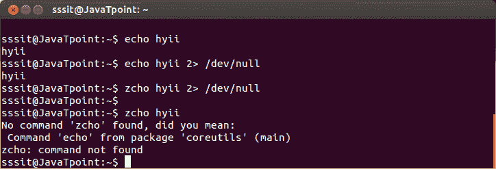
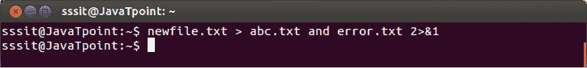

# Linux 错误重定向

> 原文：<https://www.javatpoint.com/linux-error-redirection>

## 2 >标准误差

命令“2 >”重定向输出的错误。它通过重定向错误消息来帮助我们减少显示混乱。

**示例:**

```

zcho hyii 2> /dev/null

```



看上面的快照，通过使用命令**“zcho hyii 2”>/dev/null”**(这里 echo 命令是错误的)，我们没有得到任何错误消息。但是当我们使用命令**“zcho hyii”**时，终端中会显示错误信息。因此，“2 >”重定向所述目录中的错误消息，保持您的终端错误消息自由。

* * *

## 2>&1

该命令有助于重定向同一**文件中的 stdout 和 stderr。**

 ****示例:**

```

newfile.txt > abc.txt and error.txt 2>&1

```



看上面的快照，abc.txt 和 error . txt’指向同一个文件‘new file . txt’。

**注意:**重定向的顺序真的很重要。

如果你要写:

```

ls > dirlist 2>&1

```

然后，stdout 和 stderr 都将指向文件目录列表。

但是如果你写道:

```

ls 2>&1 > dirlist

```

然后，只有 stdout 将被重定向到 dirlist。这是因为，在 stdout 被重定向到 dirlist 之前，stderr 已经复制了 stdout。**