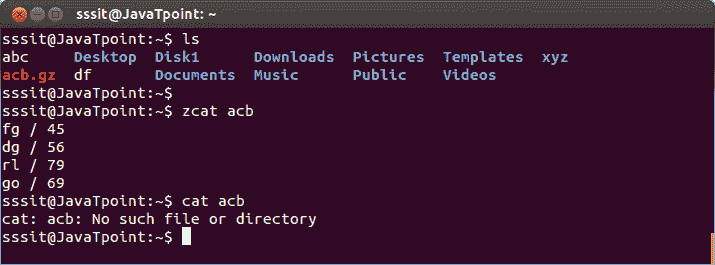

# linux cat

> 原文：<https://www.javatpoint.com/linux-zcat-zmore>

压缩文件或压缩文件可以在“zcat”命令的帮助下查看。

**语法:**

```

zcat  
```

**示例:**

```

zcat acb

```



看上面的快照，命令**“zcat ACB”**显示文件‘ACB’，而 cat 命令显示错误。

**注意:**命令 **zmore** 和 **zless** 对压缩文件的作用与对解压缩文件的作用一样。