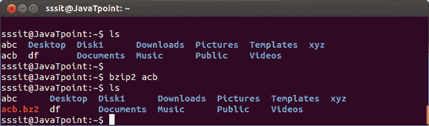
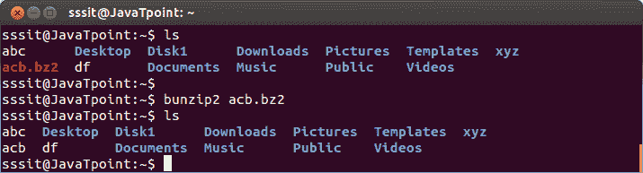

# Linux bzip2

> 原文：<https://www.javatpoint.com/linux-bzip2-bunzip2>

命令 bzip2 也用于压缩文件，就像 gzip 命令一样，但是时间稍长，但压缩效果更好。其分机将为 **(.bz2)** 。

**语法:**

```

bzip2  
```

**示例:**

```

bzip2 acb

```



看上面的快照，bzip2 命令有扩展名为 **(.bz2)** 的压缩文件**‘ACB’**。

* * *

## 布 zip2

命令 bunzip2 像 gunzip 命令一样解压缩文件。

**语法:**

```

bunzip2  
```

**示例:**

```

bunzip2 acb.bz2

```



看上面的快照，bunzip2 命令已经解压缩了文件 **'acb.bz2'** 。