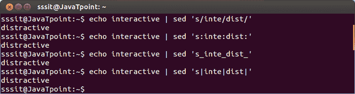
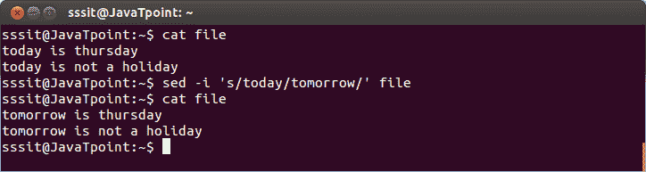
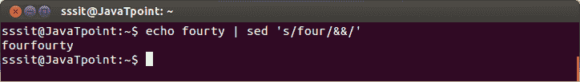
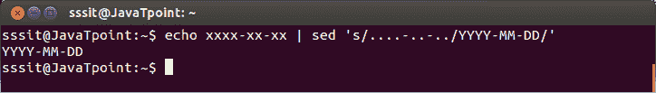
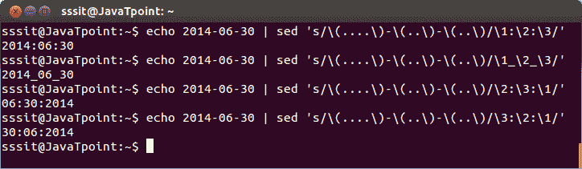
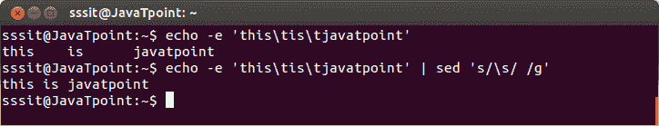
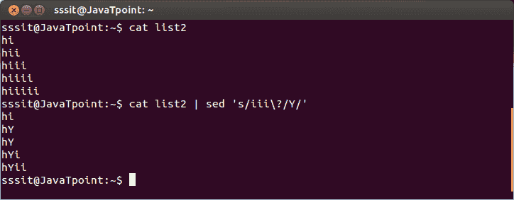
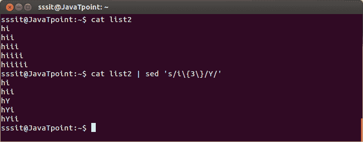

# Linux Sed 正则表达式

> 原文：<https://www.javatpoint.com/linux-sed-regular-expression>

* * *

## 流编辑器

sed 命令用于流编辑。

**示例:**

```
echo interactive | sed 's/inte/dist/'
echo interactive | sed 's:inte:dist:'
echo interactive | sed 's_inte_dist_'
echo interactive | sed 's|inte|dist|'

```



看上面的快照，字符串**“交互”**用 sed 命令改为“干扰”。不管是正斜杠 **(/)** 、冒号 **(:)** 、下划线 **(_)** 还是管道 **(|)** 都可以。

* * *

## 交互式编辑器

sed 命令意味着流编辑器，同时它也可以用作文件的交互式编辑器。对于交互式编辑器，使用选项“I”。

**示例:**

```
sed -i 's/today/tomorrow/' file

```



看上面的快照，流‘今天’被转换成‘明天’中的‘文件’。

* * *

## 简单反向引用

双&符号用于搜索和查找指定的字符串。它将使用 sed 命令打印找到的字符串。

**示例:**

```
echo fourty | sed 's/four/&&/'

```



看上面的快照，&符号已经搜索了字符串“四”，并将其打印为“四十四”。

* * *

## 任何字符的点

在正则表达式中，一个简单的点可以表示任何字符。，/p >

**示例:**

```
echo xxxx-xx-xx | sed 's/....-..-../YYYY-MM-DD/'

```



看上面的快照，点被日期格式代替了。

* * *

## 多次反向引用

当使用一对以上的括号时，称为分组。这里，它们中的每一个都可以作为三个连续的数字单独引用。

**示例:**

```
echo 2014-06-30 | sed 's/\(....\)-\(..\)-\(..\)/\1:\2:\3/'
echo 2014-06-30 | sed 's/\(....\)-\(..\)-\(..\)/\1_\2_\3/'
echo 2014-06-30 | sed 's/\(....\)-\(..\)-\(..\)/\2:\3:\1/'
echo 2014-06-30 | sed 's/\(....\)-\(..\)-\(..\)/\3:\2:\1/'

```



看上面的快照，日期是以不同的格式打印的。这里，2014 被称为(1)，06 被称为(2)，30 被称为(3)。

* * *

## 空格

空格语法为' \s '，制表符语法为' \t '。

**示例:**

```
echo -e 'this\tis\tjavatpoint' | sed 's/\s/ /g'

```



看上面的快照，\ ' s '用于单个空间。

* * *

## 可选事件

您可以通过用**(？)**问号。

**示例:**

```
cat list2 | sed 's/iii\?/Y/'

```



看上面的快照，我们已经将第三个“I”设为可选。两个“我”必须转换成“你”。

* * *

## 精确 n 次出现

出现的准确时间由**“{ times }”**指定。

**示例:**

```
cat list2 | sed 's/i\{3\}/Y/'

```


看上面的快照，我们已经精确地指定了三次“I”的出现。

* * *

## 范围内出现

我们也可以用范围来表示出现的次数。例如，如果我们将范围指定为{m，n}，那么“m”表示最小出现次数，“n”表示最大出现次数。

**示例:**

```
cat list2 | sed 's/i\{3,4\}/Y/'

```



看看上面的快照，我们已经指定最小范围为 3，最大范围为 4。

* * *