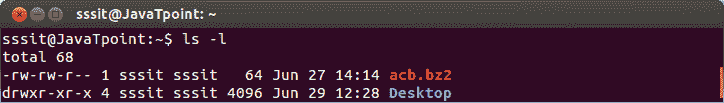
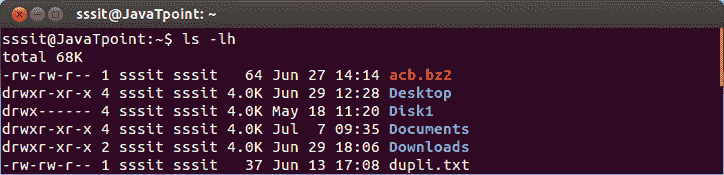
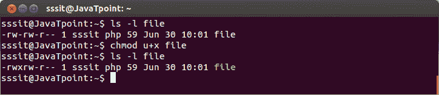
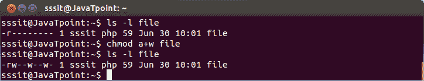
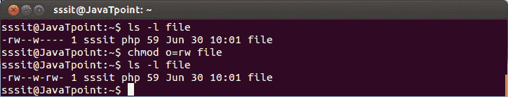
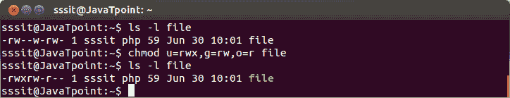
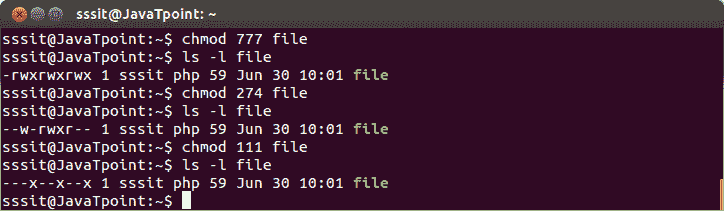
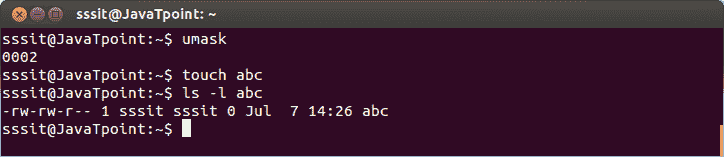
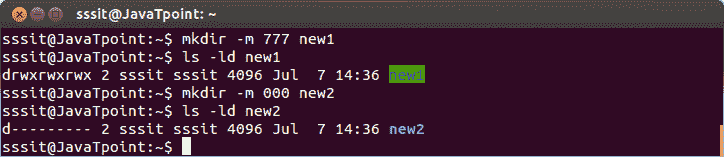
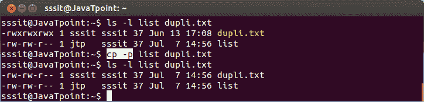

# 文件权限

> 原文：<https://www.javatpoint.com/linux-file-permissions>

Linux 系统中的所有三个所有者(用户所有者、组所有者、其他所有者)都定义了三种类型的权限。九个字符表示三种类型的权限。

1.  **Read (r) :** 读取权限允许您打开和读取文件的内容。但是您不能对文件进行任何编辑或修改。
2.  **Write (w) :** 写权限允许您编辑、删除或重命名文件。例如，如果一个文件存在于一个目录中，并且对该文件设置了写权限，但不在该目录中，那么您可以编辑该文件的内容，但不能删除或重命名它。
3.  **Execute (x):** 在 Unix 类型系统中，除非设置了 Execute 权限，否则不能运行或执行程序。但是在 Windows 中，没有这样的权限。

**权限如下:**

| 同意 | 存档 | 在目录上 |
| r(已读) | 读取文件内容(cat) | 读取目录内容 |
| w(写) | 更改文件内容(vi) | 在目录中创建文件(触摸) |
| x(执行) | 执行文件 | 输入目录(光盘) |

## 权限集



看上面的快照，用户所有者前面有十个字符(-rw-rw-r -)。我们将在这里描述这十个角色。

**文件权限为(-rw-rw-r - )**

| 位置 | 特性 | 所有权 |
| one | - | 降级文件类型 |
| 2-4 | 读写 | 用户权限 |
| 5-7 | 读写 | 组权限 |
| 8-10 | r - | 其他人的许可 |

当您是**用户所有者**时，则用户所有者权限适用于您。其他权限与您无关。

当你是**组**时，该组权限适用于你。其他权限与您无关。

当你是**其他，**则其他权限适用于你。用户和组权限与您无关。

**权限示例**

现在，我们将展示一些如何查看文件或目录权限的示例。



看上面的快照，不同的目录和文件有不同的权限。

首字母(-)或 **d** 分别代表文件和目录。

Now, from remaining nine letters, **first** triplet represents the permission for **user owner.** Second triplet represents the permission for **group owner. Third** triplet represents the permission for **other** .

## 使用 chmod 设置权限

您可以根据需要使用 chmod 命令更改权限。以下是更改不同组权限的一些示例。

向组添加权限。

**语法:**

```

chmod + <permissionname><filename></filename></permissionname> 
```

**示例:**

```

chmod u+x file

```



看上面的快照，执行权限被添加到用户所有者组。

从组中删除权限

**语法:**

```

chmod - <permissionname><filename></filename></permissionname> 
```

**示例:**

```

chmod g-x file
chmod u-w file

```


看看上面的快照，执行权限从组中删除，写入权限从用户所有者中删除。

向所有组一起添加权限

**语法:**

```

chmod a+ <filename></filename> 
```

**示例:**

```

chmod a+w file

```



看看上面的快照，我们已经为所有组授予了写入权限。

#### 注意:同样，您也可以删除所有组的权限。

若要向所有组添加权限而不键入

**语法:**

```

chmod + <filename></filename> 
```

**示例:**

```

chmod +w file

```


看上面的快照，这个例子和前面的一个一样，唯一的区别是我们没有在这个里面输入 **a** 。

设置显式权限

**语法:**

```

chmod = <permissions><filename></filename></permissions> 
```

**示例:**

```

chmod o=rw file

```



看看上面的快照，我们已经为其他人设置了显式的读写权限。

为不同的组设置显式权限

**语法:**

```

 chmod = <permissions><filename></filename></permissions> 
```

**示例:**

```

chmod u=rwx,g=rw,o=r file

```



看看上面的快照，我们已经为所有三个组设置了权限。

## 设置八进制权限

也可以为组设置八进制权限。

比如设置 **r** 八进制为 **4，**设置 **w** 八进制为 **2，**设置 **x** 八进制为 **1。**

**八进制表:**

| 二进制的 | 八进制的 | 许可 |
| 000 | Zero | - |
| 001 | one | ［加在以-u 结尾的法语词源的名词之后构成复数］ |
| 010 | Two | -w- |
| 011 | three | -wx |
| 100
 | four | r -
 |
| One hundred and one | five | 读和执行 |
| One hundred and ten | six | 读写 |
| One hundred and eleven | seven | 读写执行 |

由此我们可以得出结论，

```

777 = rwxrwxrwx
765 = rwxrw-r-x
654 = rw-r-xr--

```

等等。



看上面的快照，我们已经展示了一些随机的八进制例子，数字 **777，274** 和 **111。**

## 默认属性

创建文件或目录时，默认情况下会应用一组权限。这些默认权限通过 **umask** 命令查看。

出于安全原因，所有的 Unix 系统都不为新创建的文件提供执行权限。

添加执行权限由您决定。



**mkdir -m**

“mkdir -m”命令可用于设置模式。

**语法:**

```

mkdir -m <filename></filename> 
```

**示例:**

```

mkdir -m 777 new1
mkdir -m 000 new2

```



看上面的快照，我们分别用模式 **777** 和 **000** 创建了两个文件 **new1** 和 **new2** 。

**cp -p**

“cp -p”命令保留源文件中的权限和时间戳。

**语法:**

```

cp -p <destinationfile></destinationfile> 
```

**示例:**

```

cp -p list dupli.txt

```



看看上面的快照，早期的文件权限列表和 dupli.txt 是不同的。但传递**“CP-p list dupli . txt”**命令后，两个文件权限相同。

* * *