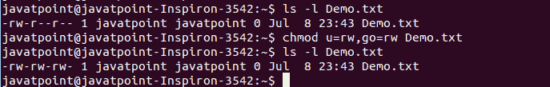
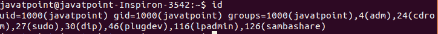
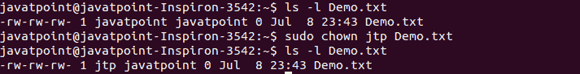
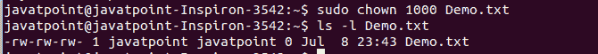
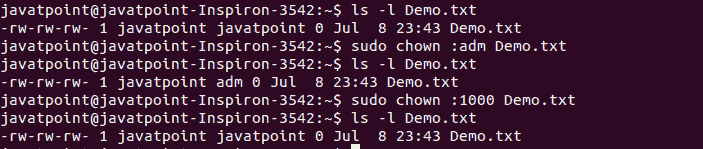
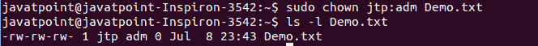

# Linux chown 命令

> 原文：<https://www.javatpoint.com/linux-chown-command>

Linux chown 命令用于为[用户](https://www.javatpoint.com/linux-users)或[组](https://www.javatpoint.com/linux-groups)更改文件的所有权、目录或符号链接。chown 代表零钱所有者。在 [Linux](https://www.javatpoint.com/linux-tutorial) 中，每个文件都与相应的所有者或组相关联。

Linux 系统可能有多个用户。每个用户都有唯一的名称和用户标识。如果系统中只有一个用户可用，该用户将是每个文件的所有者。

Linux 系统可能有多个用户。每个用户都有一个唯一的名字和用户 [ID](https://www.javatpoint.com/id) 。如果系统中只有一个用户可用，该用户将是每个文件的所有者。

用户可以在不同的组中列出。组允许我们在组级别设置权限，而不是在个人级别设置权限。

**语法:**

以下是 chown 命令的一般语法:

```

chown [OPTION]... [OWNER][:[GROUP]] FILE...

```

**选项:**

以下是 chown 命令的命令行选项:

**-c、- changes:** 用来显示详细的输出，像 verbose 一样，但是只做了一个更改就报告。

**-f、- silent、- quiet:** 用于抑制错误信息。

**-v，- verbose:** 用于显示每个已处理文件的诊断。

**-取消引用:**用于影响每个符号链接的引用对象。

**-h，-no-取消引用:**用于影响符号链接，而不是任何被引用的文件。

**-from = CURRENT _ OWNER:CURRENT _ GROUP:**用于更改具体的所有者和组。

**- no-preserve-root:** 特别用于不处理反斜杠('/')。

**- preserve-root:** 如果 chown 对反斜杠(“/”)递归操作失败。

**- reference=RFILE:** 用于指定 RFILE 的所有者和组，而不是它们的值。

**-R，-递归:**用于对文件和目录递归执行操作。

**-帮助:**用于显示帮助手册，简要说明用法和选项。

**-版本:**用于显示版本信息。

### 显示 UID、GID 和组

要显示所有组，请按如下方式执行 group 命令:

```

groups

```

上面的命令将列出您的 Linux 系统中的所有现有组。考虑以下输出:



要列出 UID 和 GID，请执行 ID 命令，如下所示:

```

id

```

上面的命令将列出它们对应的用户和组的所有 UID 和 GID。考虑以下输出:



### 显示文件的用户和组所有权

要显示文件的用户和组所有者，请使用特定的文件名执行“ls -l”命令。考虑以下命令:

```

ls -l Demo.txt

```

上面的命令将显示“Demo.txt”的用户和组所有权。考虑下面的输出:


### 更改文件的所有者(使用用户名)

要更改文件的所有者，请使用 chown 命令传递用户名(新所有者)，如下所示:

```

sudo chown <username> <File name>

```

考虑以下命令:

```

sudo chown jtp Demo.txt

```

上述命令将把 **jtp** 设置为文件‘demo . txt’的所有者。考虑以下输出:



从上面的输出来看，给定文件的所有者已经改变。

### 更改文件的所有者(使用 UID)

我们可以使用用户的 UID 来更改文件或目录的所有者。要使用 UID 更改所有权，请使用 chown 命令传递 UID，如下所示:

```

sudo chown 1000 Demo.txt

```

上述命令将改变“Demo.txt”的所有权。考虑以下输出:



### 更改文件的组

要更改文件的组，请使用 chown 命令指定组名或 GID。它表示与 chgrp 命令类似的行为。执行 chown 命令，指定由冒号分隔的组名，如下所示:

```

sudo chown :groupname Demo.txt 

```

或者

```

sudo chown :GID Demo.txt

```

考虑以下命令:

```

sudo chown :adm Demo.txt

```

上面的命令将改变“Demo.txt”组。考虑下面的输出:



从上面的输出中，我们已经使用第一个命令中的组名更改了组。在第二个命令中，我们使用 GID 更改了组名。

### 更改用户名和组名

我们可以一起更改用户名和组名。要立即更改用户名和组名，请执行 chown 命令，如下所示:

```

sudo chown <User name/UID>:<Group name/GID> <File name>

```

考虑以下命令:

```

sudo chown jtp:adm Demo.txt

```

上述命令将一起更改指定的用户名和组名。考虑以下输出:



* * *