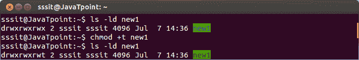
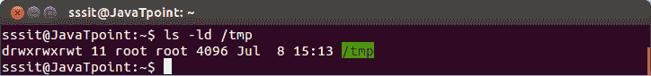
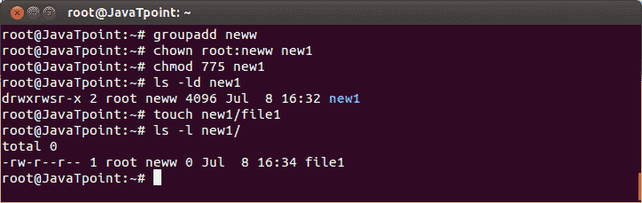
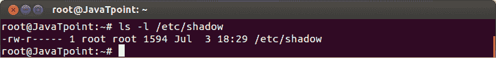

# 高级文件权限

> 原文：<https://www.javatpoint.com/linux-advanced-file-permission>

## 目录上的粘性位

通过使用**粘性位**防止目录中的文件被其他不拥有它的用户删除，可以保护目录中的文件。显示在与 **x** 相同的位置，供**其他人使用。**

它由一个 **t** (x 也在那里)或一个 **T** (没有 x 在那里)表示。

**示例:**

```

chmod +t new1

```



看上面的快照，文件 **new1** 的权限在 **x** 处更改为 **t** 其他人的权限。

一般粘性位在 **/tmp** 目录下。



* * *

## 目录上的设置位

为了确保目录中的所有文件都属于目录的组所有者，可以使用 setgid。显示在与**组**的 **x** 权限相同的位置。用一个 **s** (x 也在)或者一个 **S** (没有 x 在)。



看上面的快照，组所有者变成了目录**新 1 的**新**。组**权限在 **x** 处变为 **s** 权限为**组**。可以看到目录**“new 1”**里面的**文件 1** 组名为**“new”**。

* * *

## 常规文件上的 setgid 和 setuid

借助这两个权限，以**文件所有者**的权限而不是**执行所有者**的权限访问可执行文件。这意味着，如果一个程序有 root 用户，并且设置了 setuid 权限，那么用户将以 root 用户身份运行该程序。这可能很危险，但对安全也有好处。

例如，存储在 **/etc/shadow** 中的密码只有 root 才能读取，如下所示。



当用户运行 **passwd** 命令时，它使用根凭据执行。

* * *