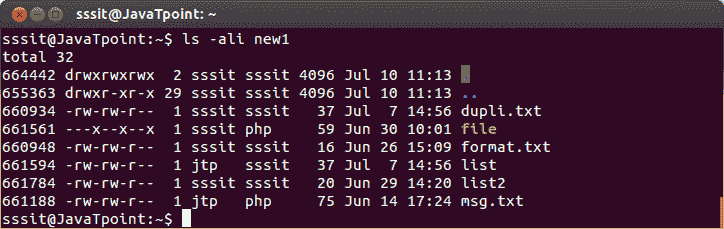

# 目录

> 原文：<https://www.javatpoint.com/linux-file-links-directories>

* * *

## 什么是目录

目录是一个包含其所有文件的索引节点号并将其连接到文件系统的表。

**示例:**

```

ls -ali new1 

```



看上面的快照，命令**“ls-Ali new1”**显示目录 new 1 的所有文件。

## 点(。)和 DotDot(..)

通过查看早期的快照，您可以注意到有两个文件名为 dot()的文件。)和 dotdot(。)

点(。)是自身和 dotdot()的映射。)是到父目录的映射。