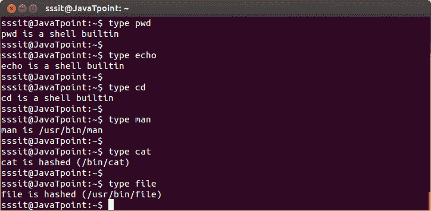
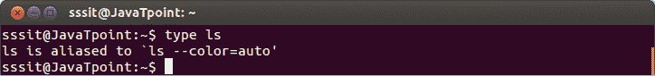
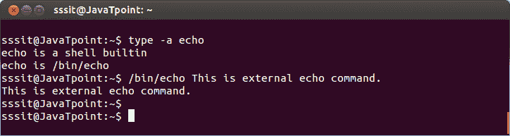
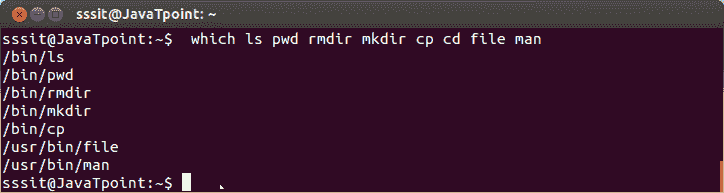

# Linux 外壳命令

> 原文：<https://www.javatpoint.com/linux-shell-commands>

在 Linux 中，命令是一种方式或指令，通过它你可以指示你的系统做一些动作。命令在命令行中执行。

**语法:**

```
command [option] [argument]

```

有些命令没有任何选项或不接受任何参数，如“clear”和“pwd”。

**清除**

“清除”命令从终端显示中清除所有先前的命令和输出。

**pwd**

“pwd”命令代表“打印工作目录”。它不接受任何选项或参数，并显示当前工作目录的详细信息。

* * *

## 命令的类型

**外部或内置命令**

**内置**命令是内置在外壳中的内部命令。内置命令从外壳调用，并直接在外壳内执行。您可以在“help”和“compgen -b”命令的帮助下列出所有内置命令。一些内置命令例子有“pwd”、“help”、“type”、“set”、“unset”等。

**外部**命令不是内置命令。这些命令是程序，它们有自己的二进制文件，并且位于文件系统中。这些是您的系统提供的命令，完全独立于外壳。这些命令大多位于/bin、/sbin、/usr/sbin 中。

* * *

## 键入命令

Linux 的“类型”命令告诉我们给 shell 的命令是内置命令还是外部命令。

**语法:**

```
type 

```

**示例:**

```
type pwd
type cd
type man
type cat
type file

```



看上面的快照，像“pwd”和“cd”这样的命令是内置命令，而命令“man”、“cat”和“file”是外部命令。

Linux 的“类型”命令也告诉一个命令是否是**别名**。

**示例:**

```
type ls

```



看看上面的快照，‘type’命令显示‘ls’是一个别名命令。

* * *

## a 型

“type -a”选项说明所有类型的命令，无论是内置的、外部的还是别名的。有些命令既是外部命令，也是内置命令。但是内置命令总是优先，除非提到外部命令的路径。

**语法:**

```
type -a 

```

**示例:**

```
type -a echo

```



看看上面的快照，‘echo’命令既是内部的，也是外部的。要使用外部‘回声’命令，提到路径 **"/bin/echo"** 。

* * *

## 哪个

Linux“哪个”命令定位命令的路径。

**语法:**

```
which <command2><command3>....</command3></command2> 
```

**示例:**

```
which ls pwd rmdir mkdir cp cd file man

```



看看上面的快照，除了' cd '命令，所有其他命令都是外部命令，因为 bash 已经显示了它们的外部路径。